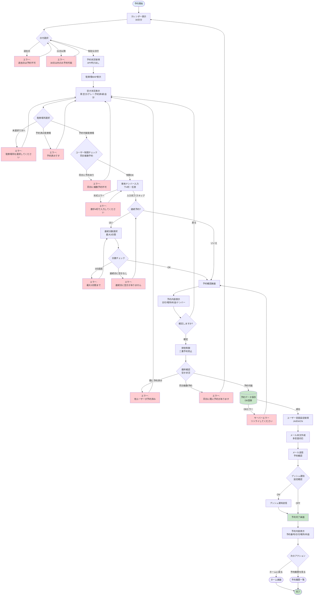
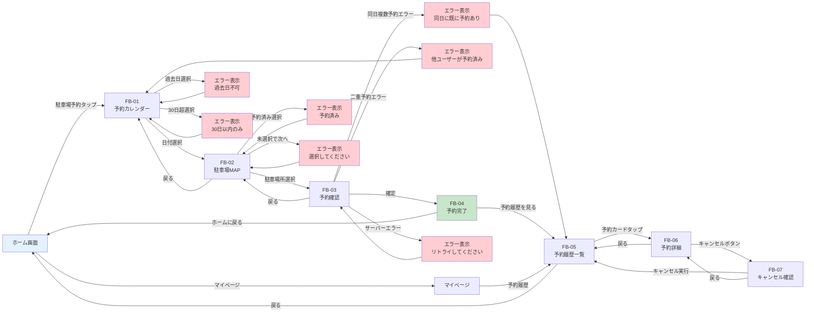

# 施設予約機能 詳細設計書 Chapter 03: 予約フロー・画面構成

**HarmoNet スマートコミュニケーションアプリ**

**文書ID**: HARMONET-FACILITY-BOOKING-DESIGN-001-CH03  
**バージョン**: v1.0  
**最終更新**: 2025年10月29日  
**ステータス**: 承認待ち

---

## 📚 目次

- [3.1 予約フロー全体像](#31-予約フロー全体像)
  - [3.1.1 MVPフロー概要（ゲスト駐車場）](#311-mvpフロー概要ゲスト駐車場)
  - [3.1.2 フローチャート](#312-フローチャート)
- [3.2 画面構成](#32-画面構成)
  - [3.2.1 画面一覧](#321-画面一覧)
  - [3.2.2 画面遷移図](#322-画面遷移図)
- [3.3 各画面の詳細設計](#33-各画面の詳細設計)
  - [3.3.1 FB-01: 予約カレンダー画面](#331-fb-01-予約カレンダー画面)
  - [3.3.2 FB-02: 駐車場MAP画面](#332-fb-02-駐車場map画面)
  - [3.3.3 FB-03: 予約確認画面](#333-fb-03-予約確認画面)
  - [3.3.4 FB-04: 予約完了画面](#334-fb-04-予約完了画面)
  - [3.3.5 FB-05: 予約履歴一覧画面](#335-fb-05-予約履歴一覧画面)
  - [3.3.6 FB-06: 予約詳細画面](#336-fb-06-予約詳細画面)
  - [3.3.7 FB-07: 予約キャンセル確認画面](#337-fb-07-予約キャンセル確認画面)
- [3.4 UI/UXガイドライン](#34-uiuxガイドライン)
  - [3.4.1 レスポンシブ対応](#341-レスポンシブ対応)
  - [3.4.2 カラーパレット](#342-カラーパレット)
  - [3.4.3 タイポグラフィ](#343-タイポグラフィ)
  - [3.4.4 アクセシビリティ](#344-アクセシビリティ)
- [3.5 エラーハンドリング](#35-エラーハンドリング)
  - [3.5.1 クライアント側バリデーションエラー](#351-クライアント側バリデーションエラー)
  - [3.5.2 サーバー側エラー](#352-サーバー側エラー)
  - [3.5.3 ネットワークエラー](#353-ネットワークエラー)
- [3.6 パフォーマンス要件](#36-パフォーマンス要件)
  - [3.6.1 ページロード時間](#361-ページロード時間)
  - [3.6.2 最適化施策](#362-最適化施策)

---

## 3.1 予約フロー全体像

### 3.1.1 MVPフロー概要（ゲスト駐車場）

施設予約機能（MVP版：ゲスト駐車場）の予約フローは、以下の9つのステップで構成されます。

#### STEP 1: カレンダー表示

**目的**  
予約可能日を確認し、希望日を選択する起点となる画面を提供します。

**主要な処理**
- 当月および翌月のカレンダーを表示
- 各日付の予約可能状況を色分けで視覚的に表示
- 過去日、30日以降の日付は選択不可として表示
- ユーザー自身の予約日は緑色でハイライト表示

**表示ルール**
- **白色**: 予約可能（空きあり）
- **グレー**: 満車（12台すべて予約済み）
- **緑色**: 自分の予約（ユーザー自身が予約済み）
- **赤色/薄灰色**: 過去日（選択不可）

---

#### STEP 2: 日付選択

**目的**  
ユーザーが希望する予約日を選択します。

**主要な処理**
- カレンダー上の日付セルをタップして選択
- 選択日のバリデーション実施
  - 過去日の選択を防止
  - 30日超の未来日の選択を防止
- 選択日の予約可能状況を取得
- 次画面（駐車場MAP画面）への遷移

**バリデーション**
- 過去日選択時: エラーメッセージ表示、再選択を促す
- 30日超選択時: エラーメッセージ表示、再選択を促す
- 選択可能日: 駐車場MAP画面へ遷移

---

#### STEP 3: 駐車場MAP表示

**目的**  
選択した日付における各駐車場所の空き状況を視覚的に表示し、希望駐車場所を選択可能にします。

**主要な処理**
- 選択日付の表示（画面上部に明示）
- 表側MAP（F1〜F6）の表示
- 裏側MAP（B1〜B6）の表示
- 各駐車場所の予約状況を色分けで表示
- リアルタイムで最新の予約状況を反映

**表示ルール**
- **青色**: 予約可能（空き）
- **グレー**: 予約済み（他ユーザーの予約）
- **緑色**: 自分の予約（ユーザー自身の予約）

**凡例表示**
画面下部に色分けの意味を明示し、ユーザーの理解を促進します。

---

#### STEP 4: 駐車場所選択

**目的**  
MAP上で希望する駐車場所を選択します。

**主要な処理**
- 駐車場所のタップによる選択
- 選択状態の視覚的フィードバック（枠線強調）
- 予約済み駐車場所のタップを無効化
- 選択後、「次へ」ボタンを活性化

**インタラクション**
- 予約可能な駐車場所: タップ可能、選択時に枠線が青色で強調
- 予約済みの駐車場所: タップ不可、グレーアウト表示
- 自分の予約: タップ可能、選択時に枠線が緑色で強調

**バリデーション**
- 駐車場所未選択で「次へ」ボタンを押した場合: エラーメッセージ表示

---

#### STEP 5: 車両ナンバー入力（任意）

**目的**  
車両ナンバープレートの下4桁を入力できるようにします（任意項目）。

**主要な処理**
- 車両ナンバー入力フィールドの表示
- プレースホルダー: 「下4桁を入力（任意）」
- 数字のみ入力可能、最大4桁
- 入力なしでもスキップ可能

**バリデーション**
- 入力値: 数字のみ、4桁まで
- 任意項目のため、未入力でも次ステップへ進行可能
- 形式不正の場合: インラインエラーメッセージ表示

---

#### STEP 6: 連続予約の選択（任意）

**目的**  
連続する複数日の予約を一度に行えるようにします（最大3日間）。

**主要な処理**
- 連続予約オプションの表示
- 連続日数の選択（1日/2日間/3日間）
- 選択した日数分の料金計算
- 連続予約の可否チェック（同一駐車場所の空き状況確認）

**表示形式**
- チェックボックスまたはドロップダウン形式
- 選択肢: 「1日のみ」「2日間連続」「3日間連続」

**バリデーション**
- 連続予約可能期間: 最大3日間
- 選択した駐車場所が連続日で空いているかを確認
- 連続日に空きがない場合: エラーメッセージ表示、単日予約を推奨

---

#### STEP 7: 予約確認画面

**目的**  
予約内容を最終確認し、確定する前に修正機会を提供します。

**主要な処理**
- 予約内容のサマリー表示
  - 予約日
  - 駐車場所（F1, B2など）
  - 車両ナンバー（入力した場合）
  - 連続予約日数
  - 合計料金
- 「予約を確定する」ボタンの表示
- 「戻る」ボタンで前画面に戻る

**料金計算**
- 計算式: 予約日数 × 100円
- 例: 3日間連続予約の場合、300円

**確認事項**
- 予約内容に誤りがないか
- 連続予約の日数が正しいか
- 料金が妥当か

---

#### STEP 8: 予約確定処理

**目的**  
予約データをデータベースに保存し、確認メールと通知を送信します。

**主要な処理**
1. **排他制御による二重予約チェック**
   - データベースレベルでロックを取得
   - 選択した駐車場所・日付が空いているか最終確認
   - 同時に複数ユーザーが同じ駐車場所を予約しようとした場合の防止
2. **同日複数予約チェック**
   - 同一ユーザーが同日に複数の駐車場所を予約していないか確認
   - 制限ルールに違反する場合はエラーを返す
3. **データベースへ保存**
   - 予約データをbookingsテーブルに登録
   - 予約ID（UUID）を生成
   - 予約ステータスを「予約済み」に設定
4. **確認メール送信**
   - ユーザーの言語設定（JA/EN/CN）に応じた多言語メール送信
   - メール内容: 予約日時、駐車場所、利用料金、車両ナンバー、注意事項
5. **プッシュ通知送信（設定ON時）**
   - 通知設定でプッシュ通知がONの場合のみ送信
   - 通知内容: 「駐車場予約が完了しました」

**エラーハンドリング**
- 二重予約発生時: エラーメッセージ表示、カレンダー画面に戻る
- 同日複数予約時: エラーメッセージ表示、予約履歴を表示
- データベースエラー: サーバーエラーメッセージ表示、リトライ案内

---

#### STEP 9: 予約完了画面

**目的**  
予約完了を通知し、次のアクションを案内します。

**主要な処理**
- 成功メッセージの表示
  - 「予約が完了しました」
- 予約内容サマリーの表示
  - 予約日
  - 駐車場所
  - 車両ナンバー（入力した場合）
  - 合計料金
- 確認メール送信通知
  - 「予約確認メールを送信しました」
- アクションボタンの表示
  - 「ホームに戻る」ボタン
  - 「予約履歴を見る」ボタン

**次のアクション**
- ホーム画面に戻る
- 予約履歴一覧画面に遷移して予約内容を確認

---

### 3.1.2 フローチャート

以下は、施設予約機能の予約フローをMermaid形式のフローチャートで表現したものです。エラーハンドリングの分岐も含めた詳細なフローを示します。



**フローチャートの特徴**
- **エラー分岐の明示**: 各ステップで発生しうるエラーを赤色で表示
- **バリデーション**: クライアント側とサーバー側の両方でチェック
- **排他制御**: 二重予約を防ぐためのロック機構
- **多言語対応**: ユーザーの言語設定に応じたメール送信
- **通知の分岐**: プッシュ通知設定の確認

---

## 3.2 画面構成

### 3.2.1 画面一覧

施設予約機能で必要な全画面をリスト化します。MVP版では、以下の7画面を実装します。

| 画面ID | 画面名 | 画面パス | MVP対象 | 備考 |
|--------|--------|----------|---------|------|
| FB-01 | 予約カレンダー画面 | `/booking/calendar` | ✅ | カレンダー表示、日付選択 |
| FB-02 | 駐車場MAP画面 | `/booking/map` | ✅ | 駐車場所選択、空き状況表示 |
| FB-03 | 予約確認画面 | `/booking/confirm` | ✅ | 入力内容確認、料金表示 |
| FB-04 | 予約完了画面 | `/booking/complete` | ✅ | 完了メッセージ、予約サマリー |
| FB-05 | 予約履歴一覧画面 | `/booking/history` | ✅ | 自分の予約一覧、未来/過去タブ |
| FB-06 | 予約詳細画面 | `/booking/detail/:id` | ✅ | 予約詳細表示、キャンセルボタン |
| FB-07 | 予約キャンセル確認画面 | `/booking/cancel/:id` | ✅ | キャンセル確認、注意事項表示 |

**画面パスの命名規則**
- ベースパス: `/booking`
- リソース名: 小文字、複数形
- パラメータ: `:id` 形式でURLパラメータを表現

**将来実装（MVP対象外）**
- FB-08: 管理者向け予約管理画面（代理予約、ブロック設定、統計レポート）
- FB-09: 予約変更画面（予約日または駐車場所の変更）
- FB-10: 予約リマインダー設定画面

---

### 3.2.2 画面遷移図

以下は、施設予約機能の画面遷移をMermaid形式で表現したものです。正常系とエラー系の遷移を含みます。



**画面遷移の特徴**
- **正常系フロー**: 青色の矢印で表現
- **エラー系フロー**: 赤色のエラーノードで表現
- **戻るボタン**: 前画面に戻る遷移を明示
- **ホームへの帰還**: 予約完了後、ホーム画面に戻る
- **予約履歴への誘導**: 予約完了後、履歴確認を促す

---

## 3.3 各画面の詳細設計

### 3.3.1 FB-01: 予約カレンダー画面

#### 画面目的

予約可能日を確認し、希望日を選択する起点となる画面です。ユーザーは当月および翌月のカレンダーから予約したい日付を選択できます。

---

#### 表示要素

**ヘッダー**
- アプリ名: 「HarmoNet」（左端）
- 通知アイコン: ベルアイコン（右上、未読件数バッジ）
- 言語切替ボタン: 「JA」「EN」「CN」（右上）

**画面タイトル**
- 「駐車場予約」（多言語対応）
- サブタイトル: 「予約したい日を選択してください」

**カレンダー表示**
- 当月カレンダー: 月全体を表示
- 翌月カレンダー: 月全体を表示
- 月切替ボタン: 前月/次月への切替（ただし、過去月は非表示、翌々月以降は非表示）

**日付セルの色分け**
- **白色（背景）**: 予約可能（空きあり）
- **グレー色（背景）**: 満車（12台すべて予約済み）
- **緑色（背景）**: 自分の予約（ユーザー自身が予約済み）
- **薄灰色（背景）**: 過去日（選択不可）
- **枠線**: 選択中の日付は青色の太枠線で強調

**凡例表示**
カレンダー下部に色分けの意味を表示：
- 白色: 「予約可能」
- グレー: 「満車」
- 緑色: 「あなたの予約」
- 薄灰色: 「予約不可」

**ボタン**
- 「次へ」ボタン: 日付選択後に活性化、駐車場MAP画面へ遷移
- 「戻る」ボタン: ホーム画面へ戻る

**フッターナビゲーション**
- 固定フッター（ホーム、お知らせ、掲示板、予約、マイページ）

---

#### API呼び出し

**エンドポイント**
```
GET /api/bookings/availability
```

**クエリパラメータ**
```
?year=2025&month=11
```

**リクエスト例**
```http
GET /api/bookings/availability?year=2025&month=11 HTTP/1.1
Host: harmonet-api.example.com
Authorization: Bearer {access_token}
Accept: application/json
```

**レスポンス例（成功時: 200 OK）**
```json
{
  "year": 2025,
  "month": 11,
  "availability": [
    {
      "date": "2025-11-01",
      "total_spaces": 12,
      "available_spaces": 8,
      "status": "available",
      "user_has_booking": false
    },
    {
      "date": "2025-11-02",
      "total_spaces": 12,
      "available_spaces": 0,
      "status": "full",
      "user_has_booking": false
    },
    {
      "date": "2025-11-03",
      "total_spaces": 12,
      "available_spaces": 5,
      "status": "available",
      "user_has_booking": true
    }
  ]
}
```

**レスポンスフィールド**
- `year`: 年（数値）
- `month`: 月（数値、1-12）
- `availability`: 各日付の予約状況配列
  - `date`: 日付（YYYY-MM-DD形式）
  - `total_spaces`: 総駐車場数（12）
  - `available_spaces`: 空き駐車場数（0-12）
  - `status`: ステータス（`available`, `full`, `unavailable`）
  - `user_has_booking`: ユーザー自身が予約しているか（boolean）

---

#### バリデーション

**クライアント側バリデーション**

1. **過去日の選択防止**
   - 条件: 選択日 < 当日
   - エラーメッセージ: 「過去の日付は予約できません」
   - 対応: インラインエラー表示、日付選択をリセット

2. **30日超の未来日の選択防止**
   - 条件: 選択日 > 当日 + 30日
   - エラーメッセージ: 「予約は30日先までです」
   - 対応: インラインエラー表示、日付選択をリセット

3. **満車日の選択防止**
   - 条件: `available_spaces === 0`
   - エラーメッセージ: 「この日は満車です」
   - 対応: インラインエラー表示、別の日付を推奨

**サーバー側バリデーション**
- 予約可能期間のチェック（当日〜30日先）
- 過去日の予約拒否

---

#### インタラクション

1. **日付セルのタップ**
   - アクション: 日付を選択
   - フィードバック: 選択日に青色の太枠線を表示
   - 次のステップ: 「次へ」ボタンが活性化

2. **「次へ」ボタンのタップ**
   - 条件: 日付が選択済み、かつバリデーション成功
   - アクション: 駐車場MAP画面へ遷移
   - 遷移時のデータ受け渡し: 選択日付（YYYY-MM-DD形式）

3. **「戻る」ボタンのタップ**
   - アクション: ホーム画面へ戻る

4. **月切替ボタンのタップ**
   - アクション: 前月/次月のカレンダーを表示
   - API再呼び出し: 新しい月の予約状況を取得

---

#### エラーハンドリング

**APIエラー時（500 Internal Server Error）**
- エラーメッセージ: 「サーバーエラーが発生しました。しばらくしてから再度お試しください。」
- 対応: モーダルダイアログ表示、「再試行」ボタンを提供

**ネットワークエラー時**
- エラーメッセージ: 「通信エラーが発生しました。インターネット接続を確認してください。」
- 対応: モーダルダイアログ表示、「再試行」ボタンを提供

---

#### 画面イメージ参考

**参照**: セキュレアシティのスマートコミュニケーションアプリの画面イメージと画面遷移図.pdf - 駐車場予約画面

---

### 3.3.2 FB-02: 駐車場MAP画面

#### 画面目的

選択した日付における各駐車場所の空き状況を視覚的に確認し、希望する駐車場所を選択します。

---

#### 表示要素

**ヘッダー**
- アプリ名: 「HarmoNet」
- 通知アイコン
- 言語切替ボタン

**画面タイトル**
- 「駐車場を選択」（多言語対応）
- サブタイトル: 選択日付を表示（例: 「2025年11月15日」）

**表側MAP（F1〜F6）**
- 見出し: 「表側駐車場」
- 駐車場所: F1, F2, F3, F4, F5, F6
- レイアウト: 2列×3行のグリッド形式
- 各駐車場所のボックス:
  - 駐車場所番号: 「F1」などの表示
  - 状態に応じた色分け（青/グレー/緑）
  - タップ可能/不可の視覚的表現

**裏側MAP（B1〜B6）**
- 見出し: 「裏側駐車場」
- 駐車場所: B1, B2, B3, B4, B5, B6
- レイアウト: 2列×3行のグリッド形式
- 各駐車場所のボックス: 表側と同様

**色分けルール**
- **青色（背景）**: 予約可能（空き）
- **グレー色（背景）**: 予約済み（他ユーザー）
- **緑色（背景）**: 自分の予約（ユーザー自身）
- **太枠線（青色）**: 選択中の駐車場所

**凡例表示**
MAP下部に色分けの意味を表示：
- 青色: 「予約可能」
- グレー: 「予約済み」
- 緑色: 「あなたの予約」

**ボタン**
- 「戻る」ボタン: カレンダー画面へ戻る
- 「次へ」ボタン: 駐車場所選択後に活性化、予約確認画面へ遷移

**フッターナビゲーション**
- 固定フッター

---

#### API呼び出し

**エンドポイント**
```
GET /api/bookings/availability/{date}
```

**パスパラメータ**
- `date`: 予約日（YYYY-MM-DD形式）

**リクエスト例**
```http
GET /api/bookings/availability/2025-11-15 HTTP/1.1
Host: harmonet-api.example.com
Authorization: Bearer {access_token}
Accept: application/json
```

**レスポンス例（成功時: 200 OK）**
```json
{
  "date": "2025-11-15",
  "total_spaces": 12,
  "available_spaces": 7,
  "parking_spaces": [
    {
      "space_id": "F1",
      "location": "front",
      "status": "available",
      "booked_by_user": false
    },
    {
      "space_id": "F2",
      "location": "front",
      "status": "booked",
      "booked_by_user": false
    },
    {
      "space_id": "F3",
      "location": "front",
      "status": "available",
      "booked_by_user": true
    },
    {
      "space_id": "B1",
      "location": "back",
      "status": "available",
      "booked_by_user": false
    }
  ]
}
```

**レスポンスフィールド**
- `date`: 予約日
- `total_spaces`: 総駐車場数
- `available_spaces`: 空き駐車場数
- `parking_spaces`: 各駐車場所の詳細配列
  - `space_id`: 駐車場所ID（F1, F2, ..., B6）
  - `location`: 配置（`front`, `back`）
  - `status`: ステータス（`available`, `booked`）
  - `booked_by_user`: ユーザー自身が予約しているか（boolean）

---

#### インタラクション

1. **駐車場所のタップ（予約可能）**
   - アクション: 駐車場所を選択
   - フィードバック: 選択した駐車場所に青色の太枠線を表示
   - 次のステップ: 「次へ」ボタンが活性化

2. **駐車場所のタップ（予約済み）**
   - アクション: タップ不可（無効化）
   - フィードバック: グレーアウト表示、カーソルが変わらない
   - エラーメッセージ: 「この駐車場所は予約済みです」

3. **「次へ」ボタンのタップ**
   - 条件: 駐車場所が選択済み
   - アクション: 予約確認画面へ遷移
   - 遷移時のデータ受け渡し: 選択日付、駐車場所ID

4. **「戻る」ボタンのタップ**
   - アクション: カレンダー画面へ戻る

---

#### バリデーション

**クライアント側バリデーション**

1. **駐車場所未選択で「次へ」ボタンを押した場合**
   - エラーメッセージ: 「駐車場所を選択してください」
   - 対応: インラインエラー表示、「次へ」ボタンは非活性のまま

2. **予約済み駐車場所の選択防止**
   - 条件: `status === "booked"` かつ `booked_by_user === false`
   - エラーメッセージ: 「この駐車場所は予約済みです」
   - 対応: タップ不可、グレーアウト表示

---

#### エラーハンドリング

**APIエラー時（404 Not Found）**
- エラーメッセージ: 「予約情報が見つかりません」
- 対応: モーダルダイアログ表示、カレンダー画面に戻る

**APIエラー時（500 Internal Server Error）**
- エラーメッセージ: 「サーバーエラーが発生しました。しばらくしてから再度お試しください。」
- 対応: モーダルダイアログ表示、「再試行」ボタンを提供

---

#### 画面イメージ参考

**参照**: セキュレアシティのスマートコミュニケーションアプリの画面イメージと画面遷移図.pdf - 駐車場MAP画面

---

### 3.3.3 FB-03: 予約確認画面

#### 画面目的

予約内容を最終確認し、確定する前に修正機会を提供します。車両ナンバー入力と連続予約選択もこの画面で行います。

---

#### 表示要素

**ヘッダー**
- アプリ名: 「HarmoNet」
- 通知アイコン
- 言語切替ボタン

**画面タイトル**
- 「予約内容の確認」（多言語対応）

**予約サマリー**
- **予約日**: 選択した日付を表示（例: 「2025年11月15日」）
- **駐車場所**: 選択した駐車場所を表示（例: 「表側 F3」）

**車両ナンバー入力フィールド**
- ラベル: 「車両ナンバー（下4桁）」
- プレースホルダー: 「1234」
- 入力タイプ: 数字のみ、最大4桁
- 必須/任意: **任意項目**
- 補足説明: 「※任意項目です。入力しなくても予約できます。」

**連続予約選択**
- ラベル: 「連続予約」
- 選択形式: ドロップダウンまたはラジオボタン
- 選択肢:
  - 「1日のみ」（デフォルト選択）
  - 「2日間連続」
  - 「3日間連続」
- 補足説明: 「※最大3日間まで連続予約できます。」

**料金表示**
- ラベル: 「合計料金」
- 計算式: 予約日数 × 100円
- 表示例:
  - 1日のみ: 「100円」
  - 2日間連続: 「200円」
  - 3日間連続: 「300円」
- スタイル: 大きく強調表示

**ボタン**
- 「予約を確定する」ボタン: 緑色、目立つ配置
- 「戻る」ボタン: 駐車場MAP画面へ戻る

**フッターナビゲーション**
- 固定フッター

---

#### API呼び出し

**エンドポイント**
```
POST /api/bookings
```

**リクエストヘッダー**
```http
POST /api/bookings HTTP/1.1
Host: harmonet-api.example.com
Authorization: Bearer {access_token}
Content-Type: application/json
Accept: application/json
```

**リクエストボディ例**
```json
{
  "facility_id": 3,
  "booking_date": "2025-11-15",
  "space_id": "F3",
  "booking_units": 2,
  "vehicle_number": "1234",
  "consecutive_dates": [
    "2025-11-15",
    "2025-11-16"
  ]
}
```

**リクエストフィールド**
- `facility_id`: 施設ID（3: ゲスト駐車場）
- `booking_date`: 予約開始日（YYYY-MM-DD形式）
- `space_id`: 駐車場所ID（F1, F2, ..., B6）
- `booking_units`: 予約日数（1-3）
- `vehicle_number`: 車両ナンバー下4桁（任意、数字4桁）
- `consecutive_dates`: 連続予約の日付配列

**レスポンス例（成功時: 201 Created）**
```json
{
  "booking_id": "550e8400-e29b-41d4-a716-446655440000",
  "facility_id": 3,
  "booking_date": "2025-11-15",
  "space_id": "F3",
  "booking_units": 2,
  "vehicle_number": "1234",
  "total_amount": 200,
  "status": "confirmed",
  "consecutive_dates": [
    "2025-11-15",
    "2025-11-16"
  ],
  "created_at": "2025-10-29T10:30:00Z"
}
```

**レスポンスフィールド**
- `booking_id`: 予約ID（UUID）
- `facility_id`: 施設ID
- `booking_date`: 予約開始日
- `space_id`: 駐車場所ID
- `booking_units`: 予約日数
- `vehicle_number`: 車両ナンバー
- `total_amount`: 合計料金（円）
- `status`: 予約ステータス（`confirmed`, `cancelled`）
- `consecutive_dates`: 連続予約の日付配列
- `created_at`: 予約作成日時（ISO 8601形式）

---

#### バリデーション

**クライアント側バリデーション**

1. **車両ナンバーの形式チェック**
   - 条件: 入力値が空でない場合
   - ルール: 数字のみ、4桁まで
   - エラーメッセージ: 「数字4桁で入力してください」
   - 対応: インラインエラー表示、入力フィールド下に赤字で表示

2. **連続予約日数のチェック**
   - 条件: 連続予約を選択した場合
   - ルール: 最大3日間
   - エラーメッセージ: 「連続予約は最大3日間までです」
   - 対応: ドロップダウンで3日を超える選択肢を非表示

**サーバー側バリデーション**

1. **二重予約チェック**
   - 条件: 選択した駐車場所・日付が既に予約されていないか
   - エラーコード: 409 Conflict
   - エラーメッセージ: 「既に予約されています」
   - 対応: モーダルダイアログ表示、カレンダー画面に戻る

2. **同日複数予約チェック**
   - 条件: 同一ユーザーが同日に複数の駐車場所を予約していないか
   - エラーコード: 422 Unprocessable Entity
   - エラーメッセージ: 「同日に既に予約があります」
   - 対応: モーダルダイアログ表示、予約履歴画面に遷移して既存予約を表示

3. **連続予約の可否チェック**
   - 条件: 連続予約を選択した場合、各日付で選択した駐車場所が空いているか
   - エラーコード: 422 Unprocessable Entity
   - エラーメッセージ: 「連続日に空きがありません」
   - 対応: モーダルダイアログ表示、単日予約を推奨

4. **予約可能期間チェック**
   - 条件: 予約日が当日〜30日先の範囲内か
   - エラーコード: 422 Unprocessable Entity
   - エラーメッセージ: 「予約可能期間を超えています」
   - 対応: モーダルダイアログ表示、カレンダー画面に戻る

---

#### インタラクション

1. **車両ナンバー入力フィールド**
   - アクション: 数字を入力
   - フィードバック: リアルタイムバリデーション、4桁を超えると入力不可
   - エラー表示: 数字以外を入力した場合、インラインエラー表示

2. **連続予約ドロップダウン**
   - アクション: 連続日数を選択
   - フィードバック: 料金表示がリアルタイムで更新
   - 例: 「2日間連続」選択時、料金が「200円」に更新

3. **「予約を確定する」ボタンのタップ**
   - 条件: バリデーション成功
   - アクション: API呼び出し、予約データを送信
   - フィードバック: ローディングインジケーター表示
   - 成功時: 予約完了画面へ遷移
   - エラー時: エラーメッセージ表示、適切な画面に遷移

4. **「戻る」ボタンのタップ**
   - アクション: 駐車場MAP画面へ戻る
   - 入力データ: 保持されない（再入力が必要）

---

#### エラーハンドリング

**409 Conflict（二重予約エラー）**
- エラーメッセージ: 「申し訳ございません。他のユーザーが既にこの駐車場所を予約しました。別の駐車場所を選択してください。」
- 対応: モーダルダイアログ表示、カレンダー画面に戻る

**422 Unprocessable Entity（同日複数予約エラー）**
- エラーメッセージ: 「同日に既に予約があります。予約履歴を確認してください。」
- 対応: モーダルダイアログ表示、予約履歴画面に遷移

**422 Unprocessable Entity（連続予約不可エラー）**
- エラーメッセージ: 「連続日に空きがありません。単日予約をお試しください。」
- 対応: モーダルダイアログ表示、確認画面に戻る（連続予約選択を「1日のみ」に変更）

**500 Internal Server Error（サーバーエラー）**
- エラーメッセージ: 「サーバーエラーが発生しました。しばらくしてから再度お試しください。」
- 対応: モーダルダイアログ表示、「再試行」ボタンを提供

---

#### 画面イメージ参考

**参照**: プロダクト開発用_機能要件定義書_v1_1.txt - 3.4.3 予約フロー STEP 7

---

### 3.3.4 FB-04: 予約完了画面

#### 画面目的

予約完了を通知し、次のアクションを案内します。予約内容のサマリーを表示し、ユーザーが安心できるようにします。

---

#### 表示要素

**ヘッダー**
- アプリ名: 「HarmoNet」
- 通知アイコン
- 言語切替ボタン

**成功メッセージ**
- アイコン: チェックマーク（緑色、大きく表示）
- メッセージ: 「予約が完了しました」（多言語対応）
- サブメッセージ: 「ご利用をお待ちしております」

**予約内容サマリー**
- **予約ID**: 予約ID（UUID）を表示（例: 「予約番号: 550e8400-e29b-41d4-a716-446655440000」）
- **予約日**: 予約日を表示（例: 「2025年11月15日〜11月16日」）
- **駐車場所**: 駐車場所を表示（例: 「表側 F3」）
- **車両ナンバー**: 入力した場合のみ表示（例: 「下4桁: 1234」）
- **合計料金**: 料金を表示（例: 「200円」）

**確認メール送信通知**
- アイコン: 封筒アイコン
- メッセージ: 「予約確認メールを送信しました」
- 補足説明: 「メールが届かない場合は、迷惑メールフォルダをご確認ください。」

**注意事項**
- メッセージ: 「利用当日は、駐車場MAPを参考に該当の駐車場所をご利用ください。」
- キャンセルポリシー: 「キャンセルは予約履歴から行えます。」

**ボタン**
- 「ホームに戻る」ボタン: ホーム画面へ遷移
- 「予約履歴を見る」ボタン: 予約履歴一覧画面へ遷移

**フッターナビゲーション**
- 固定フッター

---

#### API呼び出し

なし（完了画面のみ、APIの追加呼び出しは不要）

---

#### インタラクション

1. **「ホームに戻る」ボタンのタップ**
   - アクション: ホーム画面へ遷移
   - 遷移方法: 画面スタックをクリアして、ホーム画面を表示

2. **「予約履歴を見る」ボタンのタップ**
   - アクション: 予約履歴一覧画面へ遷移
   - 初期表示: 「今後の予約」タブを表示

---

#### 画面イメージ参考

**参照**: プロダクト開発用_機能要件定義書_v1_1.txt - 3.4.3 予約フロー STEP 9

---

### 3.3.5 FB-05: 予約履歴一覧画面

#### 画面目的

自分の予約履歴（未来・過去）を一覧表示し、予約詳細の確認やキャンセル操作への導線を提供します。

---

#### 表示要素

**ヘッダー**
- アプリ名: 「HarmoNet」
- 通知アイコン
- 言語切替ボタン

**画面タイトル**
- 「予約履歴」（多言語対応）

**タブ切替**
- 「今後の予約」タブ: 未来の予約を表示（デフォルト選択）
- 「過去の予約」タブ: 過去の予約を表示

**予約カード（リスト形式）**

各予約をカード形式で表示：
- **予約日**: 予約日を表示（例: 「2025年11月15日」）
- **駐車場所**: 駐車場所を表示（例: 「表側 F3」）
- **ステータス**: ステータスバッジを表示
  - 「予約済み」（緑色）: 未来の予約
  - 「利用完了」（青色）: 過去の予約
  - 「キャンセル済み」（グレー色）: キャンセルされた予約
- **料金**: 料金を表示（例: 「200円」）
- **「詳細を見る」ボタン**: 予約詳細画面へ遷移

**予約がない場合の表示**
- アイコン: 空のボックスアイコン
- メッセージ: 「予約がありません」
- サブメッセージ: 「駐車場を予約してみましょう」
- 「予約する」ボタン: カレンダー画面へ遷移

**フッターナビゲーション**
- 固定フッター

---

#### API呼び出し

**エンドポイント（今後の予約）**
```
GET /api/bookings/my?status=upcoming
```

**エンドポイント（過去の予約）**
```
GET /api/bookings/my?status=past
```

**クエリパラメータ**
- `status`: ステータスフィルター（`upcoming`, `past`）
- `page`: ページ番号（任意、デフォルト: 1）
- `limit`: 1ページあたりの件数（任意、デフォルト: 20）

**リクエスト例**
```http
GET /api/bookings/my?status=upcoming&page=1&limit=20 HTTP/1.1
Host: harmonet-api.example.com
Authorization: Bearer {access_token}
Accept: application/json
```

**レスポンス例（成功時: 200 OK）**
```json
{
  "bookings": [
    {
      "booking_id": "550e8400-e29b-41d4-a716-446655440000",
      "facility_id": 3,
      "booking_date": "2025-11-15",
      "space_id": "F3",
      "booking_units": 2,
      "vehicle_number": "1234",
      "total_amount": 200,
      "status": "confirmed",
      "consecutive_dates": [
        "2025-11-15",
        "2025-11-16"
      ],
      "created_at": "2025-10-29T10:30:00Z"
    },
    {
      "booking_id": "660e8400-e29b-41d4-a716-446655440001",
      "facility_id": 3,
      "booking_date": "2025-11-20",
      "space_id": "B2",
      "booking_units": 1,
      "vehicle_number": null,
      "total_amount": 100,
      "status": "confirmed",
      "consecutive_dates": [
        "2025-11-20"
      ],
      "created_at": "2025-10-28T15:20:00Z"
    }
  ],
  "pagination": {
    "current_page": 1,
    "total_pages": 1,
    "total_count": 2,
    "limit": 20
  }
}
```

**レスポンスフィールド**
- `bookings`: 予約配列
  - `booking_id`: 予約ID
  - `facility_id`: 施設ID
  - `booking_date`: 予約開始日
  - `space_id`: 駐車場所ID
  - `booking_units`: 予約日数
  - `vehicle_number`: 車両ナンバー（null可）
  - `total_amount`: 合計料金
  - `status`: ステータス（`confirmed`, `cancelled`, `completed`）
  - `consecutive_dates`: 連続予約の日付配列
  - `created_at`: 予約作成日時
- `pagination`: ページネーション情報
  - `current_page`: 現在のページ番号
  - `total_pages`: 総ページ数
  - `total_count`: 総予約件数
  - `limit`: 1ページあたりの件数

---

#### ソート

**今後の予約**
- ソート順: 予約日（昇順）
- 最も近い予約が上部に表示

**過去の予約**
- ソート順: 予約日（降順）
- 最も新しい予約が上部に表示

---

#### インタラクション

1. **タブ切替**
   - アクション: 「今後の予約」または「過去の予約」タブをタップ
   - フィードバック: タブがハイライト、対応する予約リストを表示
   - API再呼び出し: 選択したタブに応じたAPIを呼び出し

2. **予約カードのタップ**
   - アクション: 予約詳細画面へ遷移
   - 遷移時のデータ受け渡し: 予約ID

3. **「詳細を見る」ボタンのタップ**
   - アクション: 予約詳細画面へ遷移

4. **「予約する」ボタンのタップ（予約がない場合）**
   - アクション: カレンダー画面へ遷移

---

#### エラーハンドリング

**APIエラー時（500 Internal Server Error）**
- エラーメッセージ: 「サーバーエラーが発生しました。しばらくしてから再度お試しください。」
- 対応: エラーメッセージ表示、「再試行」ボタンを提供

---

#### 画面イメージ参考

**参照**: プロダクト開発用_機能要件定義書_v1_1.txt - 3.4.4 予約管理（住民側）

---

### 3.3.6 FB-06: 予約詳細画面

#### 画面目的

予約の詳細情報を表示し、キャンセル操作を提供します。過去の予約の場合は、キャンセルボタンを非表示にします。

---

#### 表示要素

**ヘッダー**
- アプリ名: 「HarmoNet」
- 通知アイコン
- 言語切替ボタン

**画面タイトル**
- 「予約詳細」（多言語対応）

**予約詳細情報**
- **予約ID**: 予約IDを表示（例: 「予約番号: 550e8400-e29b-41d4-a716-446655440000」）
- **予約日**: 予約日を表示（例: 「2025年11月15日〜11月16日」）
- **駐車場所**: 駐車場所を表示（例: 「表側 F3」）
- **車両ナンバー**: 入力した場合のみ表示（例: 「下4桁: 1234」）
- **利用料金**: 料金を表示（例: 「200円」）
- **ステータス**: ステータスバッジを表示
  - 「予約済み」（緑色）
  - 「利用完了」（青色）
  - 「キャンセル済み」（グレー色）
- **予約日時**: 予約を作成した日時を表示（例: 「2025年10月29日 10:30」）

**注意事項**
- メッセージ: 「利用当日は、駐車場MAPを参考に該当の駐車場所をご利用ください。」

**ボタン**
- 「キャンセル」ボタン: 未来の予約のみ表示（赤色）
- 「戻る」ボタン: 予約履歴一覧画面へ戻る

**条件分岐**
- **過去の予約の場合**: 「キャンセル」ボタンを非表示
- **キャンセル済みの場合**: 「キャンセル」ボタンを非表示

**フッターナビゲーション**
- 固定フッター

---

#### API呼び出し

**エンドポイント**
```
GET /api/bookings/{bookingId}
```

**パスパラメータ**
- `bookingId`: 予約ID（UUID）

**リクエスト例**
```http
GET /api/bookings/550e8400-e29b-41d4-a716-446655440000 HTTP/1.1
Host: harmonet-api.example.com
Authorization: Bearer {access_token}
Accept: application/json
```

**レスポンス例（成功時: 200 OK）**
```json
{
  "booking_id": "550e8400-e29b-41d4-a716-446655440000",
  "facility_id": 3,
  "facility_name": "ゲスト駐車場",
  "booking_date": "2025-11-15",
  "space_id": "F3",
  "space_location": "front",
  "booking_units": 2,
  "vehicle_number": "1234",
  "total_amount": 200,
  "status": "confirmed",
  "consecutive_dates": [
    "2025-11-15",
    "2025-11-16"
  ],
  "created_at": "2025-10-29T10:30:00Z",
  "updated_at": "2025-10-29T10:30:00Z"
}
```

**レスポンスフィールド**
- `booking_id`: 予約ID
- `facility_id`: 施設ID
- `facility_name`: 施設名（多言語対応）
- `booking_date`: 予約開始日
- `space_id`: 駐車場所ID
- `space_location`: 駐車場所の配置（`front`, `back`）
- `booking_units`: 予約日数
- `vehicle_number`: 車両ナンバー（null可）
- `total_amount`: 合計料金
- `status`: ステータス（`confirmed`, `cancelled`, `completed`）
- `consecutive_dates`: 連続予約の日付配列
- `created_at`: 予約作成日時
- `updated_at`: 予約更新日時

---

#### インタラクション

1. **「キャンセル」ボタンのタップ**
   - 条件: ステータスが「予約済み」かつ予約日が未来
   - アクション: 予約キャンセル確認画面へ遷移
   - 遷移時のデータ受け渡し: 予約ID、予約サマリー

2. **「戻る」ボタンのタップ**
   - アクション: 予約履歴一覧画面へ戻る

---

#### エラーハンドリング

**APIエラー時（404 Not Found）**
- エラーメッセージ: 「予約情報が見つかりません」
- 対応: エラーメッセージ表示、予約履歴一覧画面に戻る

**APIエラー時（500 Internal Server Error）**
- エラーメッセージ: 「サーバーエラーが発生しました。しばらくしてから再度お試しください。」
- 対応: エラーメッセージ表示、「再試行」ボタンを提供

---

#### 画面イメージ参考

**参照**: プロダクト開発用_機能要件定義書_v1_1.txt - 3.4.4 予約管理（住民側）

---

### 3.3.7 FB-07: 予約キャンセル確認画面

#### 画面目的

予約キャンセル操作の最終確認を行い、誤操作を防止します。

---

#### 表示要素

**ヘッダー**
- アプリ名: 「HarmoNet」
- 通知アイコン
- 言語切替ボタン

**画面タイトル**
- 「予約キャンセル」（多言語対応）

**確認メッセージ**
- アイコン: 警告アイコン（黄色）
- メッセージ: 「予約をキャンセルしますか?」
- サブメッセージ: 「この操作は取り消せません」

**予約内容サマリー**
- **予約日**: 予約日を表示（例: 「2025年11月15日〜11月16日」）
- **駐車場所**: 駐車場所を表示（例: 「表側 F3」）
- **料金**: 料金を表示（例: 「200円」）

**注意事項**
- メッセージ: 「キャンセル後は、再度予約が必要です。」
- 補足: 「キャンセル確認メールが送信されます。」

**ボタン**
- 「キャンセルする」ボタン: 赤色、目立つ配置
- 「戻る」ボタン: 予約詳細画面へ戻る

**フッターナビゲーション**
- 固定フッター

---

#### API呼び出し

**エンドポイント**
```
DELETE /api/bookings/{bookingId}
```

**パスパラメータ**
- `bookingId`: 予約ID（UUID）

**リクエスト例**
```http
DELETE /api/bookings/550e8400-e29b-41d4-a716-446655440000 HTTP/1.1
Host: harmonet-api.example.com
Authorization: Bearer {access_token}
Accept: application/json
```

**レスポンス例（成功時: 200 OK）**
```json
{
  "booking_id": "550e8400-e29b-41d4-a716-446655440000",
  "status": "cancelled",
  "cancelled_at": "2025-10-29T11:00:00Z",
  "message": "予約がキャンセルされました"
}
```

**レスポンスフィールド**
- `booking_id`: 予約ID
- `status`: ステータス（`cancelled`）
- `cancelled_at`: キャンセル日時
- `message`: メッセージ

---

#### インタラクション

1. **「キャンセルする」ボタンのタップ**
   - アクション: API呼び出し、予約をキャンセル
   - フィードバック: ローディングインジケーター表示
   - 成功時: 予約履歴一覧画面へ遷移、トーストメッセージ「キャンセルしました」を表示
   - エラー時: エラーメッセージ表示

2. **「戻る」ボタンのタップ**
   - アクション: 予約詳細画面へ戻る

---

#### エラーハンドリング

**APIエラー時（404 Not Found）**
- エラーメッセージ: 「予約情報が見つかりません」
- 対応: エラーメッセージ表示、予約履歴一覧画面に戻る

**APIエラー時（422 Unprocessable Entity）**
- エラーメッセージ: 「この予約はキャンセルできません」
- 対応: エラーメッセージ表示、予約詳細画面に戻る

**APIエラー時（500 Internal Server Error）**
- エラーメッセージ: 「サーバーエラーが発生しました。しばらくしてから再度お試しください。」
- 対応: エラーメッセージ表示、「再試行」ボタンを提供

---

#### 成功時の挙動

**遷移先**: 予約履歴一覧画面（「今後の予約」タブ）

**トーストメッセージ**
- メッセージ: 「予約をキャンセルしました」
- 表示時間: 3秒間
- 表示位置: 画面下部

**確認メール送信**
- ユーザーの言語設定に応じた多言語メール送信
- メール内容:
  - 件名: 「[HarmoNet] 駐車場予約キャンセルのお知らせ」
  - 本文: キャンセルされた予約内容、今後の利用案内

---

#### 画面イメージ参考

**参照**: プロダクト開発用_機能要件定義書_v1_1.txt - 3.4.4 予約管理（住民側）

---

## 3.4 UI/UXガイドライン

### 3.4.1 レスポンシブ対応

施設予約機能は、モバイルファースト設計を採用し、スマートフォン、タブレット、PCの各デバイスで最適な表示を実現します。

#### ブレークポイント定義

| デバイス | 画面幅 | レイアウト |
|----------|--------|-----------|
| モバイル（スマートフォン） | 〜767px | 1カラム、縦スクロール |
| タブレット | 768px〜1023px | 2カラム、グリッド表示 |
| PC（デスクトップ） | 1024px〜 | 最大幅1024px、中央配置 |

#### デバイス別レイアウト

**モバイル（〜767px）**
- カレンダー: 1ヶ月表示、縦スクロール
- 駐車場MAP: 縦並び（表側 → 裏側）
- ボタン: 画面幅いっぱいに配置
- フォントサイズ: 基本16px

**タブレット（768px〜1023px）**
- カレンダー: 2ヶ月表示、横並び
- 駐車場MAP: 横並び（表側 | 裏側）
- ボタン: 適度な幅で配置
- フォントサイズ: 基本16px

**PC（1024px〜）**
- カレンダー: 2ヶ月表示、横並び
- 駐車場MAP: 横並び（表側 | 裏側）
- コンテンツ: 最大幅1024pxで中央配置
- ボタン: 適度な幅で配置
- フォントサイズ: 基本18px

---

### 3.4.2 カラーパレット

施設予約機能で使用するカラーを定義します。アクセシビリティを考慮し、十分なコントラスト比を確保します。

| 用途 | カラー名 | カラーコード | 説明 |
|------|---------|------------|------|
| プライマリ | Blue | `#3B82F6` | ボタン、リンク、選択状態 |
| 成功 | Green | `#10B981` | 予約完了、自分の予約 |
| 警告 | Yellow | `#F59E0B` | 注意メッセージ、警告アイコン |
| エラー | Red | `#EF4444` | エラーメッセージ、キャンセルボタン |
| 空き | Light Blue | `#DBEAFE` | 予約可能な駐車場所 |
| 予約済み | Gray | `#E5E7EB` | 他ユーザーの予約 |
| 自分の予約 | Light Green | `#D1FAE5` | ユーザー自身の予約 |
| 背景 | White | `#FFFFFF` | 画面背景 |
| 背景（副） | Light Gray | `#F9FAFB` | カード背景 |
| テキスト | Dark Gray | `#1F2937` | 本文テキスト |
| テキスト（副） | Medium Gray | `#6B7280` | 補足テキスト |

**カラーパレットの使用例**
- プライマリ（Blue）: 「次へ」ボタン、選択中の日付枠線
- 成功（Green）: 予約完了アイコン、「予約済み」ステータス
- エラー（Red）: 「キャンセル」ボタン、エラーメッセージ
- 空き（Light Blue）: 予約可能な駐車場所の背景
- 予約済み（Gray）: 他ユーザーの予約駐車場所の背景
- 自分の予約（Light Green）: 自分の予約駐車場所の背景

---

### 3.4.3 タイポグラフィ

施設予約機能で使用するフォントサイズとウェイトを定義します。

#### フォントファミリー

```css
font-family: -apple-system, BlinkMacSystemFont, "Segoe UI", Roboto, "Helvetica Neue", Arial, "Noto Sans", sans-serif, "Apple Color Emoji", "Segoe UI Emoji", "Segoe UI Symbol", "Noto Color Emoji";
```

システムフォントを使用することで、各デバイスで最適な表示を実現します。

#### フォントサイズとウェイト

| 用途 | フォントサイズ | フォントウェイト | 説明 |
|------|-------------|---------------|------|
| 見出し（H1） | 24px | 700（Bold） | 画面タイトル |
| 見出し（H2） | 20px | 700（Bold） | セクション見出し |
| 見出し（H3） | 18px | 600（Semi-Bold） | サブセクション見出し |
| 本文 | 16px | 400（Regular） | 通常テキスト |
| キャプション | 14px | 400（Regular） | 補足説明、注意事項 |
| ボタンテキスト | 16px | 600（Semi-Bold） | ボタン内テキスト |
| ラベル | 14px | 500（Medium） | フォームラベル |

**行間（line-height）**
- 見出し: 1.2
- 本文: 1.5
- キャプション: 1.4

**使用例**
```css
/* 見出し（H1） */
.heading-1 {
  font-size: 24px;
  font-weight: 700;
  line-height: 1.2;
  color: #1F2937;
}

/* 本文 */
.body-text {
  font-size: 16px;
  font-weight: 400;
  line-height: 1.5;
  color: #1F2937;
}

/* キャプション */
.caption {
  font-size: 14px;
  font-weight: 400;
  line-height: 1.4;
  color: #6B7280;
}
```

---

### 3.4.4 アクセシビリティ

施設予約機能は、すべてのユーザーが快適に利用できるよう、アクセシビリティに配慮した設計を行います。

#### カラーコントラスト比

**WCAG 2.1 レベルAA準拠**
- 通常テキスト（18px未満）: 4.5:1以上
- 大きなテキスト（18px以上、または14px太字以上）: 3:1以上

**コントラスト比チェック例**
- テキスト（#1F2937）× 背景（#FFFFFF）: 16.1:1 ✅
- テキスト（#6B7280）× 背景（#FFFFFF）: 5.7:1 ✅
- ボタンテキスト（#FFFFFF）× ボタン背景（#3B82F6）: 4.9:1 ✅

#### タップターゲットサイズ

**最小サイズ: 44px × 44px**
- ボタン、リンク、フォーム要素のタップ可能領域を確保
- 隣接する要素との間隔を8px以上確保

**例**
```css
.button {
  min-height: 44px;
  min-width: 44px;
  padding: 12px 24px;
}

.calendar-date {
  width: 48px;
  height: 48px;
  display: flex;
  align-items: center;
  justify-content: center;
}
```

#### フォーカスインジケーター

**キーボード操作時のフォーカス表示**
- フォーカス可能な要素に明確な枠線を表示
- 色: プライマリカラー（Blue `#3B82F6`）
- 枠線: 2px solid

**例**
```css
.button:focus,
.input:focus,
.link:focus {
  outline: 2px solid #3B82F6;
  outline-offset: 2px;
}
```

#### スクリーンリーダー対応

**ARIAラベルの適切な使用**
- ボタン、リンクには`aria-label`を設定
- フォーム要素には`<label>`を使用
- ステータス変更時は`aria-live`で通知

**例**
```html
<!-- ボタン -->
<button aria-label="次へ進む">次へ</button>

<!-- 駐車場所 -->
<div 
  role="button" 
  aria-label="表側 F1 予約可能" 
  tabindex="0">
  F1
</div>

<!-- ステータス通知 -->
<div aria-live="polite" aria-atomic="true">
  予約が完了しました
</div>
```

#### 多言語対応

**言語属性の適切な設定**
- HTMLの`lang`属性を使用
- ユーザーの言語設定に応じて動的に変更

**例**
```html
<!-- 日本語 -->
<html lang="ja">

<!-- 英語 -->
<html lang="en">

<!-- 中国語 -->
<html lang="zh-CN">
```

---

## 3.5 エラーハンドリング

### 3.5.1 クライアント側バリデーションエラー

クライアント側でのバリデーションエラーは、ユーザーが入力を修正できるよう、インラインでエラーメッセージを表示します。

| エラーケース | エラーメッセージ（日本語） | 対応 |
|------------|----------------------|------|
| 過去日を選択 | 過去の日付は予約できません | インラインエラー表示、日付選択をリセット |
| 30日超の未来日を選択 | 予約は30日先までです | インラインエラー表示、日付選択をリセット |
| 満車日を選択 | この日は満車です | インラインエラー表示、別の日付を推奨 |
| 駐車場所未選択 | 駐車場所を選択してください | インラインエラー表示、「次へ」ボタン非活性 |
| 予約済み駐車場所を選択 | この駐車場所は予約済みです | インラインエラー表示、別の駐車場所を推奨 |
| 車両ナンバー形式エラー | 数字4桁で入力してください | インラインエラー表示、入力フィールド下に赤字 |
| 連続予約日数超過 | 連続予約は最大3日間までです | インラインエラー表示、ドロップダウンで3日を超える選択肢を非表示 |

**エラー表示方法**
- **インラインエラー**: 該当フィールドの下に赤字でエラーメッセージを表示
- **フィールドハイライト**: エラーのあるフィールドの枠線を赤色に変更
- **アイコン**: エラーアイコン（!）を表示

**例**
```html
<!-- 車両ナンバー入力エラー -->
<div class="form-field error">
  <label for="vehicle-number">車両ナンバー（下4桁）</label>
  <input 
    type="text" 
    id="vehicle-number" 
    class="input-error"
    value="abcd"
    aria-invalid="true"
    aria-describedby="vehicle-number-error">
  <span id="vehicle-number-error" class="error-message">
    数字4桁で入力してください
  </span>
</div>
```

---

### 3.5.2 サーバー側エラー

サーバー側でのエラーは、モーダルダイアログで表示し、適切な対応方法を案内します。

| エラーコード | エラーメッセージ（日本語） | 対応 |
|-----------|----------------------|------|
| 400 Bad Request | 入力内容に誤りがあります | モーダル表示、入力内容を確認して再試行 |
| 401 Unauthorized | 認証エラーが発生しました。再度ログインしてください。 | モーダル表示、ログイン画面へリダイレクト |
| 403 Forbidden | この操作を実行する権限がありません | モーダル表示、ホーム画面へ戻る |
| 404 Not Found | 予約情報が見つかりません | モーダル表示、予約履歴画面へ戻る |
| 409 Conflict | 既に予約されています | モーダル表示、カレンダー画面に戻る |
| 422 Unprocessable Entity - 同日複数予約 | 同日に既に予約があります | モーダル表示、予約履歴を表示 |
| 422 Unprocessable Entity - 連続予約不可 | 連続日に空きがありません | モーダル表示、単日予約を推奨 |
| 422 Unprocessable Entity - 予約期間外 | 予約可能期間を超えています | モーダル表示、カレンダー画面に戻る |
| 429 Too Many Requests | リクエストが多すぎます。しばらくしてから再度お試しください。 | モーダル表示、待機後に再試行 |
| 500 Internal Server Error | サーバーエラーが発生しました。しばらくしてから再度お試しください。 | モーダル表示、「再試行」ボタンを提供 |
| 503 Service Unavailable | サービスが一時的に利用できません。しばらくしてから再度お試しください。 | モーダル表示、「再試行」ボタンを提供 |

**エラーレスポンス例**
```json
{
  "error": {
    "code": "BOOKING_CONFLICT",
    "message": "既に予約されています",
    "details": {
      "date": "2025-11-15",
      "space_id": "F3"
    }
  }
}
```

**モーダルダイアログ表示例**
```html
<!-- エラーモーダル -->
<div class="modal" role="dialog" aria-labelledby="error-title">
  <div class="modal-content">
    <div class="modal-header">
      <span class="error-icon">⚠️</span>
      <h2 id="error-title">エラー</h2>
    </div>
    <div class="modal-body">
      <p>申し訳ございません。他のユーザーが既にこの駐車場所を予約しました。別の駐車場所を選択してください。</p>
    </div>
    <div class="modal-footer">
      <button class="button-primary" onclick="closeModal()">戻る</button>
    </div>
  </div>
</div>
```

---

### 3.5.3 ネットワークエラー

ネットワーク接続に問題がある場合のエラーハンドリングを定義します。

#### タイムアウト設定

- **APIリクエストタイムアウト**: 30秒
- タイムアウト後: エラーメッセージ表示、リトライ案内

#### リトライ設定

- **最大リトライ回数**: 3回
- **リトライ間隔**: 指数バックオフ（1秒、2秒、4秒）
- リトライ失敗後: エラーメッセージ表示、手動リトライボタンを提供

#### エラーメッセージ

| エラーケース | エラーメッセージ（日本語） | 対応 |
|------------|----------------------|------|
| ネットワーク接続エラー | 通信エラーが発生しました。インターネット接続を確認してください。 | モーダル表示、「再試行」ボタンを提供 |
| タイムアウト | 通信がタイムアウトしました。しばらくしてから再度お試しください。 | モーダル表示、「再試行」ボタンを提供 |
| オフライン | インターネットに接続されていません。接続を確認してください。 | モーダル表示、オンライン復帰時に自動リトライ |

**ネットワークエラーの検出**
```javascript
// オンライン/オフライン状態の監視
window.addEventListener('online', () => {
  console.log('オンラインに復帰しました');
  // 自動リトライ
});

window.addEventListener('offline', () => {
  console.log('オフラインになりました');
  // オフラインエラー表示
});

// Fetch API でのエラーハンドリング
fetch('/api/bookings/availability', { timeout: 30000 })
  .then(response => {
    if (!response.ok) {
      throw new Error('APIエラー');
    }
    return response.json();
  })
  .catch(error => {
    if (error.name === 'AbortError') {
      // タイムアウトエラー
      showError('通信がタイムアウトしました');
    } else {
      // ネットワークエラー
      showError('通信エラーが発生しました');
    }
  });
```

---

## 3.6 パフォーマンス要件

### 3.6.1 ページロード時間

施設予約機能の各画面は、以下のページロード時間目標を達成します。

| 画面 | 初回ロード（目標） | 画面遷移（目標） | API レスポンス（95パーセンタイル） |
|------|-----------------|---------------|-------------------------------|
| FB-01: 予約カレンダー画面 | 2秒以内 | 1秒以内 | 500ms以内 |
| FB-02: 駐車場MAP画面 | 2秒以内 | 1秒以内 | 500ms以内 |
| FB-03: 予約確認画面 | 2秒以内 | 1秒以内 | - |
| FB-04: 予約完了画面 | 2秒以内 | 1秒以内 | - |
| FB-05: 予約履歴一覧画面 | 2秒以内 | 1秒以内 | 500ms以内 |
| FB-06: 予約詳細画面 | 2秒以内 | 1秒以内 | 500ms以内 |
| FB-07: 予約キャンセル確認画面 | 2秒以内 | 1秒以内 | - |

**目標達成のための指標**
- **First Contentful Paint (FCP)**: 1.5秒以内
- **Largest Contentful Paint (LCP)**: 2.5秒以内
- **Time to Interactive (TTI)**: 3.0秒以内
- **Cumulative Layout Shift (CLS)**: 0.1以下

---

### 3.6.2 最適化施策

#### キャッシュ戦略

**カレンダーデータのキャッシュ**
- キャッシュ期間: 5分間
- キャッシュキー: `availability:{year}:{month}`
- キャッシュ更新: 予約完了・キャンセル時に無効化

**駐車場MAP データのキャッシュ**
- キャッシュ期間: 1分間
- キャッシュキー: `availability:{date}`
- キャッシュ更新: 予約完了・キャンセル時に無効化

**実装例（Service Worker + Cache API）**
```javascript
// Service Worker でのキャッシュ
self.addEventListener('fetch', (event) => {
  const url = new URL(event.request.url);
  
  if (url.pathname.startsWith('/api/bookings/availability')) {
    event.respondWith(
      caches.open('availability-cache').then((cache) => {
        return cache.match(event.request).then((response) => {
          const fetchPromise = fetch(event.request).then((networkResponse) => {
            // 5分間キャッシュ
            cache.put(event.request, networkResponse.clone());
            return networkResponse;
          });
          
          // キャッシュがあれば返す、なければフェッチ
          return response || fetchPromise;
        });
      })
    );
  }
});
```

#### プリロード

**駐車場MAPのプリロード**
- カレンダー画面で日付を選択した時点で、駐車場MAPのAPIをプリフェッチ
- 画面遷移時に即座にデータを表示

**実装例（Link Prefetch）**
```javascript
// 日付選択時にプリフェッチ
function onDateSelect(date) {
  const link = document.createElement('link');
  link.rel = 'prefetch';
  link.href = `/api/bookings/availability/${date}`;
  document.head.appendChild(link);
}
```

#### 画像の遅延ロード

**駐車場MAPの画像**
- 画像が表示領域に入るまで読み込みを遅延
- Intersection Observer APIを使用

**実装例**
```javascript
// 遅延ロード
const images = document.querySelectorAll('img[data-src]');
const observer = new IntersectionObserver((entries) => {
  entries.forEach((entry) => {
    if (entry.isIntersecting) {
      const img = entry.target;
      img.src = img.dataset.src;
      observer.unobserve(img);
    }
  });
});

images.forEach((img) => observer.observe(img));
```

#### API レスポンスの圧縮

**Gzip圧縮**
- すべてのAPIレスポンスをGzip圧縮
- 圧縮率: 約70-80%削減

**サーバー設定例（Nginx）**
```nginx
gzip on;
gzip_types application/json;
gzip_min_length 1000;
gzip_comp_level 6;
```

#### コード分割（Code Splitting）

**ルート単位でのコード分割**
- 各画面のJavaScriptを個別にバンドル
- 必要な画面のみをロード

**実装例（Webpack）**
```javascript
// 動的インポート
const CalendarScreen = () => import('./screens/CalendarScreen');
const MapScreen = () => import('./screens/MapScreen');
```

#### CDN（Content Delivery Network）の使用

**静的アセットのCDN配信**
- 画像、CSS、JavaScriptをCDNから配信
- エッジサーバーから最寄りの拠点で配信

---

## 📖 ナビゲーション

- [⬅️ 前の章: Chapter 02 - 施設構造・データモデル](facility-booking-feature-design-ch02_v1.0.md)
- [➡️ 次の章: Chapter 04 - 予約制限ルール・検証](facility-booking-feature-design-ch04_v1.0.md)
- [📚 目次に戻る](facility-booking-feature-design-ch00-index_v1.0.md)

---

**文書ID**: HARMONET-FACILITY-BOOKING-DESIGN-001-CH03  
**バージョン**: v1.0  
**最終更新**: 2025年10月29日  
**作成者**: HarmoNet開発チーム  
**承認者**: （承認待ち）

---

© 2025 HarmoNet Project. All rights reserved.
