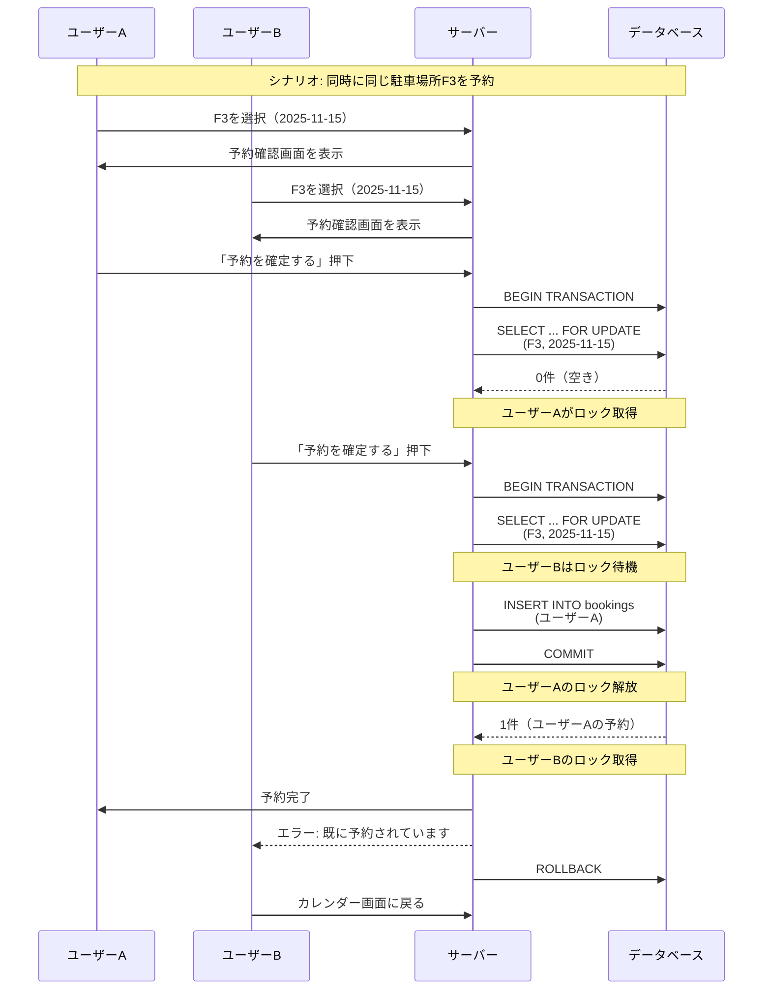
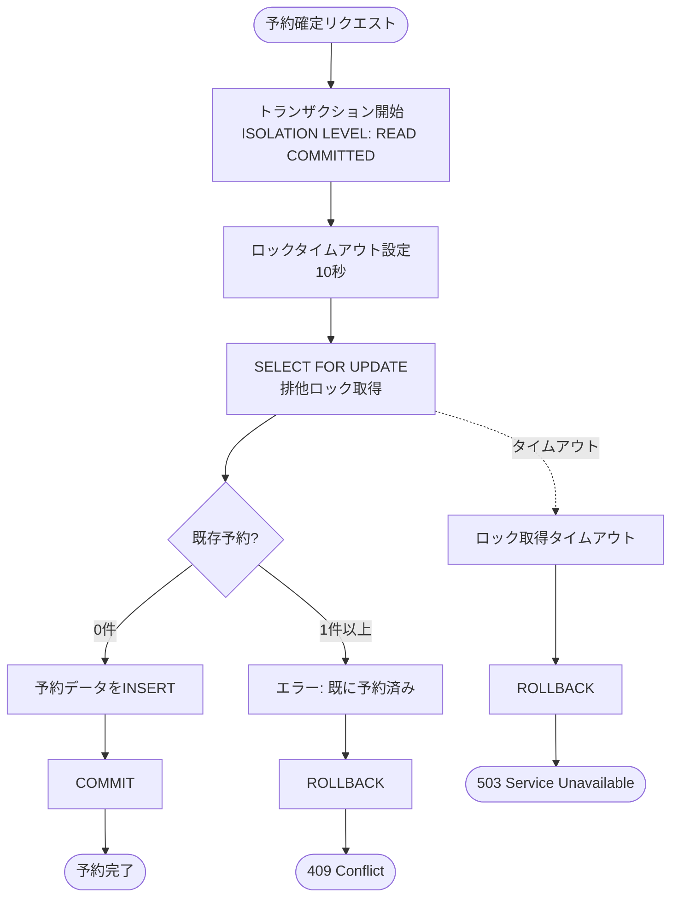
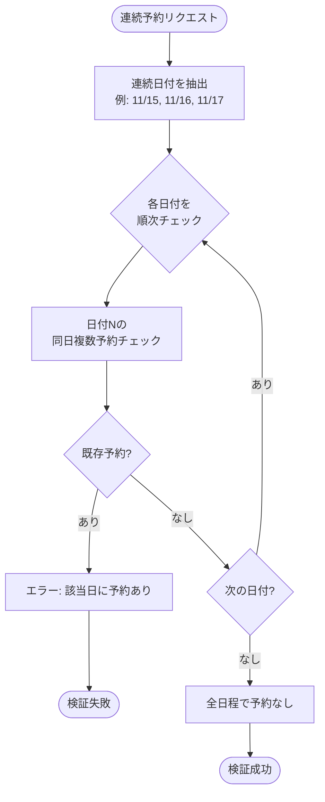
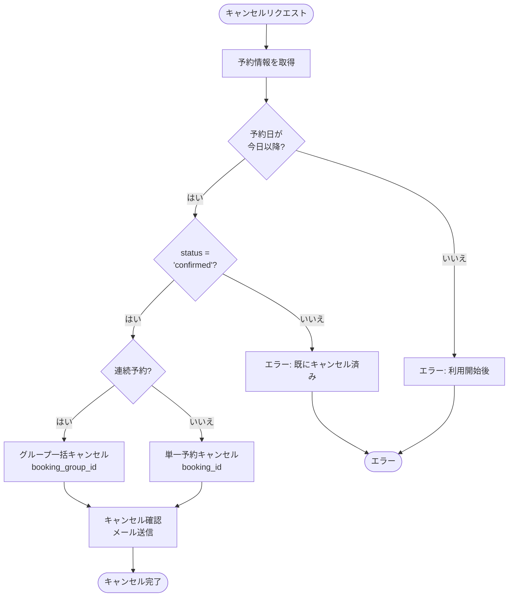

# 施設予約機能 詳細設計書 Chapter 04: 予約制限ルール・検証

**HarmoNet スマートコミュニケーションアプリ**

**文書ID**: HARMONET-FACILITY-BOOKING-DESIGN-001-CH04  
**バージョン**: v1.0  
**最終更新**: 2025年10月29日  
**ステータス**: 承認待ち

---

## 📝 目次

- [4.1 予約制限ルール](#41-予約制限ルール)
  - [4.1.1 基本制限ルール](#411-基本制限ルール)
  - [4.1.2 制限ルールの実装詳細](#412-制限ルールの実装詳細)
- [4.2 バリデーション詳細](#42-バリデーション詳細)
  - [4.2.1 クライアント側バリデーション](#421-クライアント側バリデーション)
  - [4.2.2 サーバー側バリデーション](#422-サーバー側バリデーション)
- [4.3 排他制御と二重予約防止](#43-排他制御と二重予約防止)
  - [4.3.1 二重予約のシナリオ](#431-二重予約のシナリオ)
  - [4.3.2 排他制御の実装方式](#432-排他制御の実装方式)
  - [4.3.3 楽観的ロック vs 悲観的ロック](#433-楽観的ロック-vs-悲観的ロック)
- [4.4 同日複数予約の防止](#44-同日複数予約の防止)
  - [4.4.1 制限の目的](#441-制限の目的)
  - [4.4.2 検証ロジック](#442-検証ロジック)
  - [4.4.3 連続予約時の特別処理](#443-連続予約時の特別処理)
- [4.5 連続予約の検証](#45-連続予約の検証)
  - [4.5.1 連続予約の定義](#451-連続予約の定義)
  - [4.5.2 検証ロジック](#452-検証ロジック)
  - [4.5.3 連続予約のデータ構造](#453-連続予約のデータ構造)
- [4.6 予約可能期間の検証](#46-予約可能期間の検証)
  - [4.6.1 制限の目的](#461-制限の目的)
  - [4.6.2 検証ロジック](#462-検証ロジック)
  - [4.6.3 連続予約時の特別処理](#463-連続予約時の特別処理)
- [4.7 キャンセルポリシー](#47-キャンセルポリシー)
  - [4.7.1 キャンセル可能期間](#471-キャンセル可能期間)
  - [4.7.2 キャンセル処理の詳細](#472-キャンセル処理の詳細)
  - [4.7.3 キャンセル料金](#473-キャンセル料金)
- [4.8 テストケース](#48-テストケース)
  - [4.8.1 単体テスト](#481-単体テストunit-test)
  - [4.8.2 統合テスト](#482-統合テストintegration-test)
  - [4.8.3 パフォーマンステスト](#483-パフォーマンステスト)

---

## 4.1 予約制限ルール

### 4.1.1 基本制限ルール

HarmoNetの駐車場予約機能では、公平性の確保と運用の安定性を保つため、以下の制限ルールをMVP版で実装します。

| 制限項目 | ルール内容 | 検証タイミング | エラーコード | 目的 |
|---------|-----------|--------------|------------|------|
| 同日複数予約 | 同一ユーザーが同日に複数予約不可 | サーバー側検証 | 422 | 駐車場利用の公平性確保 |
| 連続予約 | 最大3日間まで連続予約可能 | クライアント側・サーバー側 | 422 | 長期占有の防止 |
| 予約期限 | 当日から30日先まで | クライアント側・サーバー側 | 422 | 予約管理の複雑性軽減 |
| キャンセル | 利用開始前まで随時可能 | サーバー側検証 | 422 | 柔軟な予約変更を実現 |

**参照**: プロダクト開発用_機能要件定義書_v1_1.txt - 3.4.2 予約制限ルール

---

### 4.1.2 制限ルールの実装詳細

各制限ルールについて、目的・検証ロジック・実装方式・エラーメッセージ・例外ケースを詳述します。

#### (1) 同日複数予約の制限

**目的**
- 駐車場利用の公平性を確保
- 特定ユーザーによる駐車場の占有を防止
- 他の住民が予約できる機会を保証

**検証ロジック**
予約リクエストを受信した際、指定された日付に既に予約が存在するかをデータベースで確認します。

**実装方式**
- **クライアント側**: 予約履歴から同日予約の有無を事前チェック（UX向上）
- **サーバー側**: データベースクエリで厳密にチェック（最終的な制御）

**エラーメッセージ**
- 日本語: 「同日に既に予約があります」
- 英語: "You already have a booking on this date"
- 中国語: "您在当天已有预订"

**例外ケース**
管理者権限による代理予約の場合、この制限を回避可能（将来実装検討）。

---

#### (2) 連続予約の制限

**目的**
- 長期的な駐車場占有を防止
- 予約の柔軟性を確保しつつ、公平性を維持

**検証ロジック**
連続予約の日数が1〜3日の範囲内であることを確認します。また、連続する各日付において駐車場所が空いていることを検証します。

**実装方式**
- **クライアント側**: ドロップダウンで1〜3日の選択肢のみ提供
- **サーバー側**: 日数範囲チェック + 各日付の空き状況確認

**エラーメッセージ**
- 日本語: 「連続予約は最大3日間までです」
- 英語: "Consecutive bookings are limited to 3 days"
- 中国語: "连续预订最多3天"

**例外ケース**
なし（全ユーザーに共通の制限）

---

#### (3) 予約可能期間の制限

**目的**
- 長期的な予約による駐車場の占有を防止
- 予約管理の複雑性を軽減
- 直近の需要に応じた柔軟な予約を実現

**検証ロジック**
予約日が当日から30日以内の範囲に収まっているかを確認します。

**実装方式**
- **クライアント側**: カレンダーで31日以降の日付を選択不可にする
- **サーバー側**: 日付計算で範囲内チェック

**エラーメッセージ**
- 過去日: 「過去の日付は予約できません」
- 31日以降: 「予約は30日先までです」

**例外ケース**
なし（全ユーザーに共通の制限）

---

#### (4) キャンセルポリシー

**目的**
- 利用者の予定変更に柔軟に対応
- 直前キャンセルによる空き枠の有効活用

**検証ロジック**
キャンセル対象の予約が利用開始前（予約日の0時より前）であることを確認します。

**実装方式**
- **サーバー側**: 予約日と現在日時を比較してキャンセル可否を判定

**エラーメッセージ**
- 日本語: 「利用開始後のキャンセルはできません」
- 英語: "Cannot cancel after the booking start time"
- 中国語: "预订开始后无法取消"

**例外ケース**
管理者権限による強制キャンセルは可能（緊急メンテナンス等）

---

## 4.2 バリデーション詳細

### 4.2.1 クライアント側バリデーション

クライアント側バリデーションは、ユーザーの入力をリアルタイムで検証し、即座にフィードバックを提供することでUXを向上させます。

#### 入力項目別バリデーション

| 入力項目 | バリデーションルール | エラーメッセージ | 実装方式 |
|---------|-------------------|---------------|---------|
| 予約日 | 当日〜30日先 | 「予約は30日先までです」 | 日付選択時 |
| 予約日 | 過去日不可 | 「過去の日付は予約できません」 | 日付選択時 |
| 駐車場所 | 必須選択 | 「駐車場所を選択してください」 | 次へボタン押下時 |
| 車両ナンバー | 数字4桁（任意） | 「数字4桁で入力してください」 | 入力時 |
| 連続予約日数 | 1〜3日 | 「連続予約は最大3日間までです」 | 選択時 |

---

#### バリデーション実装例（JavaScript）

以下は、クライアント側のバリデーションロジックの実装例です。

**予約日のバリデーション**

```javascript
/**
 * 予約日のバリデーション
 * @param {Date} selectedDate - ユーザーが選択した日付
 * @returns {Object} { isValid: boolean, errorMessage: string }
 */
function validateBookingDate(selectedDate) {
  const today = new Date();
  today.setHours(0, 0, 0, 0);
  
  const selected = new Date(selectedDate);
  selected.setHours(0, 0, 0, 0);
  
  const diffDays = Math.floor((selected - today) / (1000 * 60 * 60 * 24));
  
  // 過去日チェック
  if (diffDays < 0) {
    return {
      isValid: false,
      errorMessage: '過去の日付は予約できません'
    };
  }
  
  // 30日先チェック
  if (diffDays > 30) {
    return {
      isValid: false,
      errorMessage: '予約は30日先までです'
    };
  }
  
  return { isValid: true, errorMessage: '' };
}
```

---

**車両ナンバーのバリデーション**

```javascript
/**
 * 車両ナンバーのバリデーション（任意入力）
 * @param {string} vehicleNumber - 車両ナンバー（下4桁）
 * @returns {Object} { isValid: boolean, errorMessage: string }
 */
function validateVehicleNumber(vehicleNumber) {
  // 空の場合は任意入力なのでOK
  if (!vehicleNumber || vehicleNumber.trim() === '') {
    return { isValid: true, errorMessage: '' };
  }
  
  // 数字4桁チェック
  const pattern = /^\d{4}$/;
  if (!pattern.test(vehicleNumber)) {
    return {
      isValid: false,
      errorMessage: '数字4桁で入力してください'
    };
  }
  
  return { isValid: true, errorMessage: '' };
}
```

---

**連続予約日数のバリデーション**

```javascript
/**
 * 連続予約日数のバリデーション
 * @param {number} consecutiveDays - 連続予約日数
 * @returns {Object} { isValid: boolean, errorMessage: string }
 */
function validateConsecutiveDays(consecutiveDays) {
  if (consecutiveDays < 1 || consecutiveDays > 3) {
    return {
      isValid: false,
      errorMessage: '連続予約は最大3日間までです'
    };
  }
  
  return { isValid: true, errorMessage: '' };
}
```

---

**駐車場所選択のバリデーション**

```javascript
/**
 * 駐車場所選択のバリデーション
 * @param {string} spaceId - 選択された駐車場所ID（例: 'F3'）
 * @returns {Object} { isValid: boolean, errorMessage: string }
 */
function validateParkingSpace(spaceId) {
  if (!spaceId || spaceId.trim() === '') {
    return {
      isValid: false,
      errorMessage: '駐車場所を選択してください'
    };
  }
  
  // 有効な駐車場所IDのパターンチェック（F1-F6, B1-B6）
  const pattern = /^[FB][1-6]$/;
  if (!pattern.test(spaceId)) {
    return {
      isValid: false,
      errorMessage: '無効な駐車場所です'
    };
  }
  
  return { isValid: true, errorMessage: '' };
}
```

---

### 4.2.2 サーバー側バリデーション

サーバー側バリデーションは、データベースレベルでの整合性チェックと、ビジネスルールの最終的な検証を担います。クライアント側のバリデーションをすり抜けたリクエストや、悪意のあるリクエストに対する防御として機能します。

---

#### バリデーション項目一覧

##### (1) 二重予約チェック

**目的**
同じ駐車場所・日付が既に予約されていないかを確認します。

**実装方式**
排他制御（トランザクション + SELECT FOR UPDATE）により、同時アクセス時の二重予約を防止します。

**検証SQL**
```sql
-- トランザクション開始
BEGIN TRANSACTION ISOLATION LEVEL READ COMMITTED;

-- 排他ロックを取得しつつ、既存予約を確認
SELECT booking_id
FROM bookings
WHERE facility_id = $1
  AND space_id = $2
  AND booking_date = $3
  AND status = 'confirmed'
FOR UPDATE;

-- 予約が存在しない場合のみINSERT実行
-- （上記SELECTで0件の場合）
```

**エラーコード**: 409 Conflict

**エラーレスポンス例**
```json
{
  "error": "BOOKING_CONFLICT",
  "message": "この駐車場所は既に予約されています",
  "message_en": "This parking space is already booked",
  "message_cn": "此停车位已被预订"
}
```

---

##### (2) 同日複数予約チェック

**目的**
同一ユーザーが同日に複数の駐車場所を予約していないかを確認します。

**検証SQL**
```sql
-- 同日の予約件数を確認
SELECT COUNT(*) as booking_count
FROM bookings
WHERE user_id = $1
  AND booking_date = $2
  AND status = 'confirmed';
```

**判定ロジック（疑似コード）**
```javascript
if (booking_count > 0) {
  throw new Error({
    code: 422,
    error: 'MULTIPLE_BOOKING_SAME_DAY',
    message: '同日に既に予約があります'
  });
}
```

**エラーコード**: 422 Unprocessable Entity

---

##### (3) 連続予約の可否チェック

**目的**
連続する各日付で、選択した駐車場所が空いているかを確認します。

**検証SQL**
```sql
-- 連続予約の各日付で既存予約を検索
SELECT booking_date
FROM bookings
WHERE facility_id = $1
  AND space_id = $2
  AND booking_date IN ($3, $4, $5)  -- 連続する日付リスト
  AND status = 'confirmed';
```

**判定ロジック（疑似コード）**
```javascript
// 連続予約リクエスト: 2025-11-15 ~ 11-17 (3日間)
const requestedDates = ['2025-11-15', '2025-11-16', '2025-11-17'];

// SQLで既存予約を確認
const existingBookings = await query(sql, [facilityId, spaceId, ...requestedDates]);

if (existingBookings.length > 0) {
  throw new Error({
    code: 422,
    error: 'CONSECUTIVE_BOOKING_UNAVAILABLE',
    message: '連続日に空きがありません',
    unavailableDates: existingBookings.map(b => b.booking_date)
  });
}
```

**エラーコード**: 422 Unprocessable Entity

---

##### (4) 予約可能期間チェック

**目的**
予約日が当日〜30日先の範囲内かを検証します。

**検証ロジック（疑似コード）**
```javascript
function validateBookingPeriod(bookingDate) {
  const today = new Date();
  today.setHours(0, 0, 0, 0);
  
  const requested = new Date(bookingDate);
  requested.setHours(0, 0, 0, 0);
  
  const diffDays = Math.floor((requested - today) / (1000 * 60 * 60 * 24));
  
  // 過去日チェック
  if (diffDays < 0) {
    throw new Error({
      code: 422,
      error: 'PAST_DATE_NOT_ALLOWED',
      message: '過去の日付は予約できません'
    });
  }
  
  // 30日超過チェック
  if (diffDays > 30) {
    throw new Error({
      code: 422,
      error: 'EXCEEDS_BOOKING_PERIOD',
      message: '予約は30日先までです'
    });
  }
  
  return true;
}
```

**エラーコード**: 422 Unprocessable Entity

---

##### (5) データ整合性チェック

**目的**
facility_id、space_idの存在確認と、外部キー制約による整合性保証を行います。

**検証SQL**
```sql
-- 施設IDの存在確認
SELECT facility_id
FROM facilities
WHERE facility_id = $1;

-- 駐車場所IDの存在確認（施設内に存在するか）
SELECT space_id
FROM parking_spaces
WHERE facility_id = $1
  AND space_id = $2;
```

**判定ロジック（疑似コード）**
```javascript
// 施設の存在確認
const facility = await getFacility(facilityId);
if (!facility) {
  throw new Error({
    code: 400,
    error: 'INVALID_FACILITY_ID',
    message: '無効な施設IDです'
  });
}

// 駐車場所の存在確認
const space = await getParkingSpace(facilityId, spaceId);
if (!space) {
  throw new Error({
    code: 400,
    error: 'INVALID_SPACE_ID',
    message: '無効な駐車場所IDです'
  });
}
```

**エラーコード**: 400 Bad Request

---

## 4.3 排他制御と二重予約防止

### 4.3.1 二重予約のシナリオ

同時に複数のユーザーが同じ駐車場所を予約しようとする場合、適切な排他制御がなければ二重予約が発生する可能性があります。

以下は、排他制御が機能するシナリオの時系列を示します。



**シナリオ詳細**

| 時刻 | ユーザーA | ユーザーB | データベース状態 |
|-----|----------|----------|---------------|
| 10:00 | 駐車場所F3を選択 | - | F3は空き |
| 10:01 | 予約確認画面を表示 | - | F3は空き |
| 10:02 | - | 駐車場所F3を選択 | F3は空き |
| 10:03 | 「予約を確定する」押下 | - | F3は空き |
| 10:04 | - | 予約確認画面を表示 | F3は空き |
| 10:05 | [排他制御] F3をロック | - | F3ロック中（ユーザーA） |
| 10:06 | 予約データを保存 | - | F3ロック中（ユーザーA） |
| 10:07 | ロック解放 | - | F3予約済み（ユーザーA） |
| 10:08 | - | 「予約を確定する」押下 | F3予約済み（ユーザーA） |
| 10:09 | - | [排他制御] F3をロック試行 | F3ロック取得（ユーザーB） |
| 10:10 | - | 既に予約済みを検出 | F3予約済み（ユーザーA） |
| 10:11 | - | エラー: 「既に予約されています」 | F3予約済み（ユーザーA） |

---

### 4.3.2 排他制御の実装方式

#### (1) トランザクション分離レベル

**設定**: `READ COMMITTED`

**理由**
- 読み取りのロックを最小限にしつつ、書き込みの整合性を保証
- 他のトランザクションがコミットしたデータのみを読み取る
- ダーティリード（未コミットデータの読み取り）を防止

**PostgreSQLでの設定例**
```sql
BEGIN TRANSACTION ISOLATION LEVEL READ COMMITTED;
```

---

#### (2) SELECT FOR UPDATE

**目的**
予約可能性チェック時にロックを取得し、トランザクションコミットまでロックを保持します。

**実装例（SQL）**
```sql
-- トランザクション開始
BEGIN TRANSACTION ISOLATION LEVEL READ COMMITTED;

-- 排他ロックを取得しつつ、空き状況を確認
SELECT booking_id, booking_date, space_id
FROM bookings
WHERE facility_id = 3
  AND space_id = 'F3'
  AND booking_date = '2025-11-15'
  AND status = 'confirmed'
FOR UPDATE;

-- 予約がない場合（0件）、INSERTを実行
INSERT INTO bookings (
  booking_id,
  user_id,
  facility_id,
  space_id,
  booking_date,
  status,
  vehicle_number,
  booking_group_id,
  created_at,
  updated_at
) VALUES (
  '550e8400-e29b-41d4-a716-446655440000',
  123,
  3,
  'F3',
  '2025-11-15',
  'confirmed',
  '1234',
  NULL,
  CURRENT_TIMESTAMP,
  CURRENT_TIMESTAMP
);

-- トランザクションコミット
COMMIT;
```

---

#### (3) タイムアウト設定

**ロック待機タイムアウト**: 10秒

**設定理由**
- 通常の予約処理は数秒以内に完了するため、10秒は十分な時間
- デッドロックやシステム障害時の無限待機を防止

**PostgreSQLでの設定例**
```sql
-- セッションレベルでタイムアウトを設定
SET lock_timeout = '10s';
```

**タイムアウト時のエラーハンドリング**
```javascript
try {
  await db.query('SELECT ... FOR UPDATE');
  // 予約処理
} catch (error) {
  if (error.code === '55P03') {  // lock_timeout エラー
    throw new Error({
      code: 503,
      error: 'SERVICE_TEMPORARILY_UNAVAILABLE',
      message: 'しばらくしてから再度お試しください',
      message_en: 'Please try again in a moment',
      message_cn: '请稍后重试'
    });
  }
  throw error;
}
```

---

#### (4) 実装フロー図



---

### 4.3.3 楽観的ロック vs 悲観的ロック

駐車場予約システムにおいて、二重予約を防止するためのロック方式を比較検討しました。

#### 悲観的ロック（採用）

**方式**
SELECT FOR UPDATE

**メリット**
- 確実に二重予約を防止
- データの整合性を強く保証
- トランザクション中は他のユーザーの変更をブロック

**デメリット**
- ロック待機が発生する可能性
- 同時並行性が低下
- デッドロックのリスク（適切な設計で回避可能）

---

#### 楽観的ロック（不採用）

**方式**
バージョン番号（version列）によるチェック

**実装例**
```sql
-- 予約時にバージョン番号をチェック
UPDATE bookings
SET status = 'confirmed', version = version + 1
WHERE booking_id = $1
  AND version = $2;  -- 元のバージョン番号と一致する場合のみ更新
```

**メリット**
- ロック待機が発生しない
- 同時並行性が高い
- デッドロックのリスクがない

**デメリット**
- 競合時にリトライが必要
- ユーザー体験が悪化（「もう一度やり直してください」）
- アプリケーション側でリトライロジックが必要

---

#### 採用理由

**悲観的ロックを採用した理由**

1. **予約処理の頻度**
   - 駐車場予約は1日あたり数十件程度の操作（全住民100世帯想定）
   - 同時アクセスによる競合は稀
   - ロック待機時間は許容範囲内（平均500ms以内）

2. **確実性の優先**
   - 二重予約は絶対に防止すべき
   - ユーザーが予約完了後に「実は予約できていなかった」は許容できない
   - 悲観的ロックは確実性が高い

3. **ユーザー体験**
   - 楽観的ロックの場合、競合時に「もう一度やり直してください」となる
   - 悲観的ロックの場合、少し待てば確実に結果が得られる
   - 待機時間が短ければ（10秒以内）、確実性を優先する方がUXが良い

4. **実装の単純性**
   - 悲観的ロックはデータベースレベルで完結
   - 楽観的ロックはアプリケーション側でリトライロジックが必要

**結論**

HarmoNetの駐車場予約機能では、予約処理の頻度が高くないため、悲観的ロックによる待機時間は許容範囲内と判断しました。確実性を優先し、**悲観的ロック（SELECT FOR UPDATE）を採用**します。

---

## 4.4 同日複数予約の防止

### 4.4.1 制限の目的

同日複数予約を制限する主な目的は以下の通りです：

- **駐車場利用の公平性を確保**: 全住民が平等に駐車場を利用できる機会を保証
- **特定ユーザーによる駐車場の占有を防止**: 1人が複数台分を予約することを防ぐ
- **他の住民が予約できる機会を保証**: 駐車場所の数（12台）が限られているため、公平な分配が必要

**参照**: プロダクト開発用_機能要件定義書_v1_1.txt - 3.4.2 予約制限ルール

---

### 4.4.2 検証ロジック

#### (1) 同日複数予約のチェックSQL

```sql
-- 指定された日付に既存予約があるか確認
SELECT COUNT(*) as booking_count
FROM bookings
WHERE user_id = $1              -- リクエストユーザーのID
  AND booking_date = $2         -- リクエストされた予約日
  AND status = 'confirmed';     -- 確定済み予約のみ
```

---

#### (2) 判定ロジック

**疑似コード**
```javascript
async function checkMultipleBookingSameDay(userId, requestedDate) {
  const result = await db.query(`
    SELECT COUNT(*) as booking_count
    FROM bookings
    WHERE user_id = $1
      AND booking_date = $2
      AND status = 'confirmed'
  `, [userId, requestedDate]);
  
  const bookingCount = result.rows[0].booking_count;
  
  if (bookingCount > 0) {
    throw new Error({
      code: 422,
      error: 'MULTIPLE_BOOKING_SAME_DAY',
      message: '同日に既に予約があります',
      message_en: 'You already have a booking on this date',
      message_cn: '您在当天已有预订',
      existingBookingDate: requestedDate
    });
  }
  
  return true;
}
```

---

#### (3) エラーメッセージ

| 言語 | エラーメッセージ |
|-----|---------------|
| 日本語 | 「同日に既に予約があります」 |
| 英語 | "You already have a booking on this date" |
| 中国語 | "您在当天已有预订" |

**エラーレスポンス例（JSON）**
```json
{
  "code": 422,
  "error": "MULTIPLE_BOOKING_SAME_DAY",
  "message": "同日に既に予約があります",
  "message_en": "You already have a booking on this date",
  "message_cn": "您在当天已有预订",
  "details": {
    "user_id": 123,
    "requested_date": "2025-11-15",
    "existing_booking_id": "uuid-xxxx-xxxx"
  }
}
```

---

### 4.4.3 連続予約時の特別処理

連続予約の場合、連続する各日付について個別に同日複数予約のチェックを実施します。

#### (1) 連続予約の検証フロー



---

#### (2) 実装例

**連続予約の各日付チェック（疑似コード）**
```javascript
async function checkConsecutiveBooking(userId, consecutiveDates) {
  // 連続する各日付について同日複数予約をチェック
  for (const date of consecutiveDates) {
    const result = await db.query(`
      SELECT booking_id, booking_date, space_id
      FROM bookings
      WHERE user_id = $1
        AND booking_date = $2
        AND status = 'confirmed'
    `, [userId, date]);
    
    if (result.rows.length > 0) {
      const existingBooking = result.rows[0];
      throw new Error({
        code: 422,
        error: 'CONSECUTIVE_BOOKING_CONFLICT',
        message: `${date}に既に予約があるため、連続予約できません`,
        message_en: `Cannot book consecutively due to existing booking on ${date}`,
        message_cn: `由于${date}已有预订,无法连续预订`,
        conflictDate: date,
        existingBookingId: existingBooking.booking_id,
        existingSpaceId: existingBooking.space_id
      });
    }
  }
  
  return true;
}
```

---

#### (3) 連続予約の例

**ケース1: 連続予約が成功する場合**

```
リクエスト: 2025-11-15〜11-17（3日間連続）
既存予約: なし

検証結果: ✅ 成功
理由: 各日付で既存予約がないため、連続予約可能
```

---

**ケース2: 連続予約がエラーになる場合**

```
リクエスト: 2025-11-15〜11-17（3日間連続）
既存予約: 2025-11-16にF1を予約済み

検証結果: ❌ エラー
理由: 11月16日に既に予約があるため、連続予約不可
エラーメッセージ: 「2025-11-16に既に予約があるため、連続予約できません」
```

---

## 4.5 連続予約の検証

### 4.5.1 連続予約の定義

**連続予約とは**
同一駐車場所を連続する日付で予約することを指します。

**制限内容**
- 最大3日間まで連続予約可能
- 途中の日付がスキップされる場合は連続予約とみなさない
- 連続する日付は暦通りの連続性を持つ必要がある

**連続予約の例**

| パターン | 予約日 | 判定 |
|---------|-------|------|
| ✅ 正常 | 11/15, 11/16, 11/17（3日連続） | 連続予約として処理 |
| ✅ 正常 | 11/15, 11/16（2日連続） | 連続予約として処理 |
| ❌ 異常 | 11/15, 11/17（11/16をスキップ） | 連続予約とみなさない |
| ❌ 異常 | 11/15〜11/18（4日連続） | 最大3日間を超過 |

---

### 4.5.2 検証ロジック

#### (1) 連続日数のチェック

**クライアント側**
ドロップダウンで1〜3日の選択肢のみ提供します。

**UI例**
```html
<select id="consecutive-days">
  <option value="1">1日間</option>
  <option value="2">2日間</option>
  <option value="3">3日間</option>
</select>
```

**サーバー側**
日数が1〜3の範囲内かを検証します。

**検証コード（疑似コード）**
```javascript
function validateConsecutiveDays(days) {
  if (days < 1 || days > 3) {
    throw new Error({
      code: 422,
      error: 'INVALID_CONSECUTIVE_DAYS',
      message: '連続予約は最大3日間までです',
      message_en: 'Consecutive bookings are limited to 3 days',
      message_cn: '连续预订最多3天',
      requestedDays: days
    });
  }
  return true;
}
```

---

#### (2) 各日付の空き状況チェック

連続する各日付について、選択した駐車場所が空いているかを確認します。

**検証SQL**
```sql
-- 連続する日付リストで既存予約を検索
SELECT booking_date, booking_id, user_id
FROM bookings
WHERE facility_id = $1
  AND space_id = $2
  AND booking_date IN ($3, $4, $5)  -- 連続する日付リスト
  AND status = 'confirmed';
```

**SQLパラメータ例**
```javascript
const params = [
  3,            // facility_id (駐車場施設ID)
  'F3',         // space_id (駐車場所ID)
  '2025-11-15', // 1日目
  '2025-11-16', // 2日目
  '2025-11-17'  // 3日目
];
```

---

#### (3) 判定ロジック

**疑似コード**
```javascript
async function checkConsecutiveDateAvailability(facilityId, spaceId, dates) {
  const result = await db.query(`
    SELECT booking_date, booking_id, user_id
    FROM bookings
    WHERE facility_id = $1
      AND space_id = $2
      AND booking_date = ANY($3)
      AND status = 'confirmed'
  `, [facilityId, spaceId, dates]);
  
  // 既存予約が1件でもあればエラー
  if (result.rows.length > 0) {
    const unavailableDates = result.rows.map(row => row.booking_date);
    
    throw new Error({
      code: 422,
      error: 'CONSECUTIVE_DATES_UNAVAILABLE',
      message: '連続日に空きがありません',
      message_en: 'No availability for consecutive dates',
      message_cn: '连续日期无空位',
      unavailableDates: unavailableDates,
      requestedDates: dates
    });
  }
  
  return true;
}
```

---

#### (4) エラーメッセージ

| 言語 | エラーメッセージ |
|-----|---------------|
| 日本語 | 「連続日に空きがありません」 |
| 英語 | "No availability for consecutive dates" |
| 中国語 | "连续日期无空位" |

**エラーレスポンス例**
```json
{
  "code": 422,
  "error": "CONSECUTIVE_DATES_UNAVAILABLE",
  "message": "連続日に空きがありません",
  "message_en": "No availability for consecutive dates",
  "message_cn": "连续日期无空位",
  "details": {
    "facility_id": 3,
    "space_id": "F3",
    "requested_dates": ["2025-11-15", "2025-11-16", "2025-11-17"],
    "unavailable_dates": ["2025-11-16"]
  }
}
```

---

### 4.5.3 連続予約のデータ構造

#### (1) bookingsテーブルへの登録

連続予約の場合、各日付を個別のレコードとして登録します。

**テーブル構造（関連カラムのみ抜粋）**
```sql
CREATE TABLE bookings (
  booking_id UUID PRIMARY KEY,
  user_id INTEGER NOT NULL,
  facility_id INTEGER NOT NULL,
  space_id VARCHAR(10) NOT NULL,
  booking_date DATE NOT NULL,
  status VARCHAR(20) NOT NULL,
  booking_group_id UUID,  -- 連続予約のグループID
  vehicle_number VARCHAR(4),
  created_at TIMESTAMP DEFAULT CURRENT_TIMESTAMP,
  updated_at TIMESTAMP DEFAULT CURRENT_TIMESTAMP
);
```

---

#### (2) 連続予約の登録例

**SQL INSERT例**
```sql
-- 2025-11-15〜11-17の3日間連続予約
-- booking_group_id で同一連続予約をグループ化

INSERT INTO bookings (
  booking_id, user_id, facility_id, space_id, booking_date, 
  status, booking_group_id, vehicle_number
) VALUES
  (
    'uuid-1', 123, 3, 'F3', '2025-11-15', 
    'confirmed', 'group-abc', '1234'
  ),
  (
    'uuid-2', 123, 3, 'F3', '2025-11-16', 
    'confirmed', 'group-abc', '1234'
  ),
  (
    'uuid-3', 123, 3, 'F3', '2025-11-17', 
    'confirmed', 'group-abc', '1234'
  );
```

---

#### (3) booking_group_idの役割

**目的**
連続予約の各レコードを論理的にグループ化し、一括操作を可能にします。

**生成方法**
UUIDを使用してユニークなグループIDを生成します。

**生成例（JavaScript）**
```javascript
const { v4: uuidv4 } = require('uuid');

// 連続予約グループIDの生成
const bookingGroupId = uuidv4();  // 例: 'a1b2c3d4-e5f6-7890-abcd-ef1234567890'

// 各日付のbooking_idを個別に生成
const bookingIds = [
  uuidv4(),  // 1日目
  uuidv4(),  // 2日目
  uuidv4()   // 3日目
];
```

---

#### (4) キャンセル時の挙動

**基本ポリシー**
- **連続予約の1日のみをキャンセル**: 不可
- **連続予約全体をキャンセル**: 可能

**理由**
連続予約の一部だけをキャンセルすると、データの整合性が複雑になるため、全体を一括でキャンセルする仕様とします。

**キャンセルSQL**
```sql
-- booking_group_id を使用して、グループ単位でキャンセル
UPDATE bookings
SET status = 'cancelled',
    cancelled_at = CURRENT_TIMESTAMP
WHERE booking_group_id = $1
  AND user_id = $2
  AND status = 'confirmed';
```

**キャンセル処理（疑似コード）**
```javascript
async function cancelConsecutiveBooking(bookingGroupId, userId) {
  // booking_group_id で紐づく全レコードを一括キャンセル
  const result = await db.query(`
    UPDATE bookings
    SET status = 'cancelled',
        cancelled_at = CURRENT_TIMESTAMP
    WHERE booking_group_id = $1
      AND user_id = $2
      AND status = 'confirmed'
    RETURNING booking_id, booking_date
  `, [bookingGroupId, userId]);
  
  if (result.rows.length === 0) {
    throw new Error({
      code: 404,
      error: 'BOOKING_NOT_FOUND',
      message: '該当する予約が見つかりません'
    });
  }
  
  // キャンセルされた予約の情報を返す
  return {
    cancelledBookings: result.rows,
    cancelledCount: result.rows.length
  };
}
```

---

## 4.6 予約可能期間の検証

### 4.6.1 制限の目的

予約可能期間を「当日から30日先まで」に制限する目的は以下の通りです：

- **長期的な予約による駐車場の占有を防止**: 数ヶ月先まで予約できると、特定ユーザーが長期占有する可能性がある
- **予約管理の複雑性を軽減**: 予約期間を限定することで、管理組合や管理会社の運用負担を軽減
- **直近の需要に応じた柔軟な予約を実現**: 短期間の予約に限定することで、急な予約ニーズに対応しやすくなる

**参照**: プロダクト開発用_機能要件定義書_v1_1.txt - 3.4.1 対象施設（MVP）

---

### 4.6.2 検証ロジック

#### (1) 予約可能期間の定義

- **開始日**: 当日（予約操作を行う日）
- **終了日**: 当日から30日後

**予約可能な日付の例**
```
今日が 2025-11-01 の場合:
✅ 2025-11-01 (当日) → 予約可能
✅ 2025-11-15 (14日後) → 予約可能
✅ 2025-12-01 (30日後) → 予約可能
❌ 2025-10-31 (過去日) → 予約不可
❌ 2025-12-02 (31日後) → 予約不可
```

---

#### (2) 検証ルール

| 条件 | 判定 |
|------|------|
| 過去日 | 予約不可 |
| 当日 | 予約可能 |
| 1〜30日後 | 予約可能 |
| 31日以降 | 予約不可 |

---

#### (3) 検証コード（JavaScript）

**サーバー側バリデーション**
```javascript
/**
 * 予約可能期間のバリデーション
 * @param {string} requestedDate - 予約希望日（YYYY-MM-DD形式）
 * @returns {boolean} - バリデーション成功時にtrue
 * @throws {Error} - バリデーション失敗時にエラーをスロー
 */
function validateBookingDate(requestedDate) {
  // 今日の日付を取得（時刻を00:00:00にリセット）
  const today = new Date();
  today.setHours(0, 0, 0, 0);
  
  // リクエストされた日付を取得
  const requested = new Date(requestedDate);
  requested.setHours(0, 0, 0, 0);
  
  // 日数差を計算
  const diffDays = Math.floor((requested - today) / (1000 * 60 * 60 * 24));
  
  // 過去日チェック
  if (diffDays < 0) {
    throw new Error({
      code: 422,
      error: 'PAST_DATE_NOT_ALLOWED',
      message: '過去の日付は予約できません',
      message_en: 'Cannot book past dates',
      message_cn: '无法预订过去的日期',
      requestedDate: requestedDate,
      today: today.toISOString().split('T')[0]
    });
  }
  
  // 30日超過チェック
  if (diffDays > 30) {
    throw new Error({
      code: 422,
      error: 'EXCEEDS_BOOKING_PERIOD',
      message: '予約は30日先までです',
      message_en: 'Bookings are limited to 30 days in advance',
      message_cn: '预订限于提前30天',
      requestedDate: requestedDate,
      maxDate: new Date(today.getTime() + 30 * 24 * 60 * 60 * 1000).toISOString().split('T')[0]
    });
  }
  
  return true;
}
```

---

**クライアント側バリデーション（React例）**
```javascript
/**
 * カレンダーで選択可能な日付かを判定
 * @param {Date} date - 判定対象の日付
 * @returns {boolean} - 選択可能ならtrue
 */
function isDateSelectable(date) {
  const today = new Date();
  today.setHours(0, 0, 0, 0);
  
  const target = new Date(date);
  target.setHours(0, 0, 0, 0);
  
  const diffDays = Math.floor((target - today) / (1000 * 60 * 60 * 24));
  
  // 過去日または31日以降は選択不可
  return diffDays >= 0 && diffDays <= 30;
}

// カレンダーコンポーネントでの使用例
<Calendar
  minDate={new Date()}  // 今日以降のみ選択可能
  maxDate={new Date(Date.now() + 30 * 24 * 60 * 60 * 1000)}  // 30日後まで
  tileDisabled={({ date }) => !isDateSelectable(date)}
/>
```

---

#### (4) エラーメッセージ

| 条件 | 日本語 | 英語 | 中国語 |
|------|-------|------|-------|
| 過去日 | 「過去の日付は予約できません」 | "Cannot book past dates" | "无法预订过去的日期" |
| 31日以降 | 「予約は30日先までです」 | "Bookings are limited to 30 days in advance" | "预订限于提前30天" |

---

### 4.6.3 連続予約時の特別処理

連続予約の場合、**最終日**が30日以内に収まっているかを検証します。

#### (1) 連続予約の終了日チェック

**検証ルール**
連続予約の最終日が、当日から30日以内であること。

**例**
```
当日: 2025-11-01
リクエスト: 11月30日〜12月2日（3日間連続）

検証:
- 開始日: 2025-11-30 (29日後) → ✅ OK
- 最終日: 2025-12-02 (31日後) → ❌ NG

検証結果: エラー
理由: 最終日が30日を超過
```

---

#### (2) 検証コード（疑似コード）

```javascript
/**
 * 連続予約の予約可能期間チェック
 * @param {Array<string>} consecutiveDates - 連続する日付の配列
 * @returns {boolean} - バリデーション成功時にtrue
 */
function validateConsecutiveBookingPeriod(consecutiveDates) {
  const today = new Date();
  today.setHours(0, 0, 0, 0);
  
  // 最終日を取得
  const lastDate = new Date(consecutiveDates[consecutiveDates.length - 1]);
  lastDate.setHours(0, 0, 0, 0);
  
  // 最終日までの日数差を計算
  const diffDays = Math.floor((lastDate - today) / (1000 * 60 * 60 * 24));
  
  // 最終日が30日を超過している場合はエラー
  if (diffDays > 30) {
    throw new Error({
      code: 422,
      error: 'CONSECUTIVE_BOOKING_EXCEEDS_PERIOD',
      message: '連続予約の最終日が予約可能期間を超過しています',
      message_en: 'The last date of consecutive booking exceeds the booking period',
      message_cn: '连续预订的最后日期超出预订期限',
      requestedDates: consecutiveDates,
      lastDate: lastDate.toISOString().split('T')[0],
      maxDate: new Date(today.getTime() + 30 * 24 * 60 * 60 * 1000).toISOString().split('T')[0]
    });
  }
  
  return true;
}
```

---

#### (3) 連続予約の検証例

**ケース1: 成功パターン**
```
当日: 2025-11-01
リクエスト: 11月28日〜11月30日（3日間連続）

検証:
- 開始日: 2025-11-28 (27日後) → ✅ OK
- 最終日: 2025-11-30 (29日後) → ✅ OK

検証結果: ✅ 成功
```

---

**ケース2: エラーパターン**
```
当日: 2025-11-01
リクエスト: 11月30日〜12月2日（3日間連続）

検証:
- 開始日: 2025-11-30 (29日後) → ✅ OK
- 最終日: 2025-12-02 (31日後) → ❌ NG

検証結果: ❌ エラー
エラーメッセージ: 「連続予約の最終日が予約可能期間を超過しています」
```

---

## 4.7 キャンセルポリシー

### 4.7.1 キャンセル可能期間

HarmoNetの駐車場予約機能では、以下のキャンセルポリシーを採用します。

| 条件 | キャンセル可否 | 備考 |
|------|-------------|------|
| 利用開始前 | ✅ キャンセル可能 | 予約日の0時より前まで随時可能 |
| 利用開始後 | ❌ キャンセル不可 | ステータスは「利用完了」に自動変更 |

**参照**: プロダクト開発用_機能要件定義書_v1_1.txt - 3.4.2 予約制限ルール

---

**利用開始・終了の定義**

| 項目 | 定義 |
|------|------|
| 利用開始時刻 | 予約日の 0:00 |
| 利用終了時刻 | 予約日の 23:59 |

**例**
```
予約日: 2025-11-15
利用開始: 2025-11-15 00:00:00
利用終了: 2025-11-15 23:59:59

キャンセル可能期間: 2025-11-14 23:59:59 まで
```

---

### 4.7.2 キャンセル処理の詳細

#### (1) キャンセル可能性の判定

**判定SQL**
```sql
-- キャンセル可能な予約かを確認
SELECT booking_id, booking_date, status, space_id
FROM bookings
WHERE booking_id = $1
  AND user_id = $2
  AND booking_date >= CURRENT_DATE  -- 今日以降の予約
  AND status = 'confirmed';          -- 確定済みの予約
```

---

#### (2) 判定ロジック（疑似コード）

```javascript
/**
 * キャンセル可能性をチェック
 * @param {string} bookingId - 予約ID
 * @param {number} userId - ユーザーID
 * @returns {Object} - キャンセル可能な予約情報
 */
async function checkCancellable(bookingId, userId) {
  const result = await db.query(`
    SELECT booking_id, booking_date, status, space_id, booking_group_id
    FROM bookings
    WHERE booking_id = $1
      AND user_id = $2
      AND booking_date >= CURRENT_DATE
      AND status = 'confirmed'
  `, [bookingId, userId]);
  
  // 予約が見つからない場合
  if (result.rows.length === 0) {
    throw new Error({
      code: 404,
      error: 'BOOKING_NOT_CANCELLABLE',
      message: 'キャンセル可能な予約が見つかりません',
      message_en: 'No cancellable booking found',
      message_cn: '未找到可取消的预订',
      reason: '予約が存在しないか、既に利用開始後です'
    });
  }
  
  return result.rows[0];
}
```

---

#### (3) キャンセル実行（UPDATE）

**単一予約のキャンセルSQL**
```sql
-- 単一予約をキャンセル
UPDATE bookings
SET status = 'cancelled',
    cancelled_at = CURRENT_TIMESTAMP
WHERE booking_id = $1
  AND user_id = $2
  AND status = 'confirmed'
RETURNING booking_id, booking_date, space_id;
```

---

**連続予約のキャンセルSQL**
```sql
-- booking_group_id で紐づく全レコードを一括キャンセル
UPDATE bookings
SET status = 'cancelled',
    cancelled_at = CURRENT_TIMESTAMP
WHERE booking_group_id = $1
  AND user_id = $2
  AND status = 'confirmed'
RETURNING booking_id, booking_date, space_id;
```

---

#### (4) キャンセル処理フロー



---

#### (5) キャンセル処理の実装例（疑似コード）

```javascript
/**
 * 予約をキャンセル
 * @param {string} bookingId - 予約ID
 * @param {number} userId - ユーザーID
 * @returns {Object} - キャンセル結果
 */
async function cancelBooking(bookingId, userId) {
  // キャンセル可能性をチェック
  const booking = await checkCancellable(bookingId, userId);
  
  let cancelledBookings;
  
  // 連続予約の場合
  if (booking.booking_group_id) {
    cancelledBookings = await db.query(`
      UPDATE bookings
      SET status = 'cancelled',
          cancelled_at = CURRENT_TIMESTAMP
      WHERE booking_group_id = $1
        AND user_id = $2
        AND status = 'confirmed'
      RETURNING booking_id, booking_date, space_id
    `, [booking.booking_group_id, userId]);
  } 
  // 単一予約の場合
  else {
    cancelledBookings = await db.query(`
      UPDATE bookings
      SET status = 'cancelled',
          cancelled_at = CURRENT_TIMESTAMP
      WHERE booking_id = $1
        AND user_id = $2
        AND status = 'confirmed'
      RETURNING booking_id, booking_date, space_id
    `, [bookingId, userId]);
  }
  
  // キャンセル確認メール送信
  await sendCancellationEmail(userId, cancelledBookings.rows);
  
  return {
    success: true,
    cancelledCount: cancelledBookings.rows.length,
    cancelledBookings: cancelledBookings.rows
  };
}
```

---

### 4.7.3 キャンセル料金

**MVP版の方針**
MVP版では、キャンセル料金は発生しません。

**理由**
- 駐車場利用料金が低額（1日100円）であるため
- 初期リリースでは運用を簡素化
- 住民の利便性を優先

**将来拡張の検討事項**
MVPリリース後の運用状況に応じて、以下のキャンセル料金ポリシーを検討します。

| タイミング | キャンセル料金 |
|-----------|-------------|
| 利用3日前まで | 無料 |
| 利用2日前〜前日 | 50円（50%） |
| 利用当日 | 100円（100%） |

**参照**: 01_セキュレアシティ_スマートコミュニケーションアプリ_機能要件定義書.pdf - 9.1 駐車場予約機能の拡張

---

## 4.8 テストケース

### 4.8.1 単体テスト（Unit Test）

各バリデーション関数の単体テストケースを定義します。

#### (1) 予約日バリデーション

**テスト対象関数**: `validateBookingDate(requestedDate)`

| テストケース | 入力値 | 期待結果 | 判定 |
|------------|-------|---------|------|
| 当日の予約 | 今日の日付 | 成功 | ✅ |
| 1日後の予約 | 明日の日付 | 成功 | ✅ |
| 30日後の予約 | 今日+30日 | 成功 | ✅ |
| 過去日の予約 | 昨日の日付 | エラー: 「過去の日付は予約できません」 | ❌ |
| 31日後の予約 | 今日+31日 | エラー: 「予約は30日先までです」 | ❌ |
| 100日後の予約 | 今日+100日 | エラー: 「予約は30日先までです」 | ❌ |

**テストコード例（Jest）**
```javascript
describe('validateBookingDate', () => {
  test('当日の予約は成功する', () => {
    const today = new Date().toISOString().split('T')[0];
    expect(() => validateBookingDate(today)).not.toThrow();
  });
  
  test('30日後の予約は成功する', () => {
    const future = new Date(Date.now() + 30 * 24 * 60 * 60 * 1000);
    const futureDate = future.toISOString().split('T')[0];
    expect(() => validateBookingDate(futureDate)).not.toThrow();
  });
  
  test('過去日の予約はエラー', () => {
    const past = new Date(Date.now() - 1 * 24 * 60 * 60 * 1000);
    const pastDate = past.toISOString().split('T')[0];
    expect(() => validateBookingDate(pastDate)).toThrow('過去の日付は予約できません');
  });
  
  test('31日後の予約はエラー', () => {
    const future = new Date(Date.now() + 31 * 24 * 60 * 60 * 1000);
    const futureDate = future.toISOString().split('T')[0];
    expect(() => validateBookingDate(futureDate)).toThrow('予約は30日先までです');
  });
});
```

---

#### (2) 車両ナンバーバリデーション

**テスト対象関数**: `validateVehicleNumber(vehicleNumber)`

| テストケース | 入力値 | 期待結果 | 判定 |
|------------|-------|---------|------|
| 数字4桁 | "1234" | 成功 | ✅ |
| 未入力（空文字） | "" | 成功（任意入力） | ✅ |
| null | null | 成功（任意入力） | ✅ |
| 数字3桁 | "123" | エラー: 「数字4桁で入力してください」 | ❌ |
| 数字5桁 | "12345" | エラー: 「数字4桁で入力してください」 | ❌ |
| 英字混入 | "12A4" | エラー: 「数字4桁で入力してください」 | ❌ |
| 記号混入 | "12-4" | エラー: 「数字4桁で入力してください」 | ❌ |

**テストコード例（Jest）**
```javascript
describe('validateVehicleNumber', () => {
  test('数字4桁は成功する', () => {
    const result = validateVehicleNumber('1234');
    expect(result.isValid).toBe(true);
  });
  
  test('未入力は成功する（任意入力）', () => {
    const result = validateVehicleNumber('');
    expect(result.isValid).toBe(true);
  });
  
  test('数字3桁はエラー', () => {
    const result = validateVehicleNumber('123');
    expect(result.isValid).toBe(false);
    expect(result.errorMessage).toBe('数字4桁で入力してください');
  });
  
  test('英字混入はエラー', () => {
    const result = validateVehicleNumber('12A4');
    expect(result.isValid).toBe(false);
  });
});
```

---

### 4.8.2 統合テスト（Integration Test）

予約フロー全体の統合テストケースを定義します。

#### (1) 正常系テスト

**テストシナリオ**: 通常の予約フローが正常に完了する

| ステップ | 操作 | 期待結果 |
|---------|------|---------|
| 1 | カレンダーで日付選択（11/15） | 日付が選択される |
| 2 | 駐車場MAPで駐車場所選択（F3） | F3が選択状態になる |
| 3 | 車両ナンバー入力（"1234"） | 入力が受け付けられる |
| 4 | 連続予約選択（2日間） | 2日間が選択される |
| 5 | 予約確定ボタン押下 | 予約確認画面が表示される |
| 6 | 確認画面で「予約を確定する」押下 | サーバーに予約リクエスト送信 |
| 7 | サーバー処理完了 | 予約完了画面が表示される |
| 8 | 確認メール送信 | 予約確認メールが受信される |

---

#### (2) 異常系テスト - 二重予約

**テストシナリオ**: 同時に2人が同じ駐車場所を予約しようとする

| ステップ | ユーザーA | ユーザーB | 期待結果 |
|---------|----------|----------|---------|
| 1 | F3を選択（11/15） | - | 選択成功 |
| 2 | 予約確認画面表示 | - | 表示成功 |
| 3 | - | F3を選択（11/15） | 選択成功 |
| 4 | - | 予約確認画面表示 | 表示成功 |
| 5 | 予約確定ボタン押下 | - | サーバーに送信 |
| 6 | [サーバー] ロック取得・予約保存 | - | ユーザーA予約成功 |
| 7 | 予約完了画面表示 | - | 完了画面表示 |
| 8 | - | 予約確定ボタン押下 | サーバーに送信 |
| 9 | - | [サーバー] 既存予約検出 | エラー検出 |
| 10 | - | エラーメッセージ表示 | 「既に予約されています」 |
| 11 | - | カレンダー画面に戻る | 画面遷移成功 |

---

#### (3) 異常系テスト - 同日複数予約

**テストシナリオ**: ユーザーが同日に2つ目の予約を試みる

| ステップ | 操作 | 期待結果 |
|---------|------|---------|
| 前提条件 | ユーザーが11/15にF1を既に予約済み | - |
| 1 | カレンダーで11/15を選択 | 日付選択成功 |
| 2 | 駐車場MAPでF3を選択 | F3選択成功 |
| 3 | 予約確定ボタン押下 | サーバーに送信 |
| 4 | [サーバー] 同日複数予約チェック | 既存予約検出 |
| 5 | エラーメッセージ表示 | 「同日に既に予約があります」 |
| 6 | 予約履歴画面に遷移 | 既存の予約一覧が表示される |

---

### 4.8.3 パフォーマンステスト

排他制御のパフォーマンステストケースを定義します。

#### (1) 同時リクエストテスト

**テスト目的**: 同時に複数のユーザーが同じ駐車場所を予約しようとした場合のシステム挙動を確認

**テスト条件**
- 同時リクエスト数: 10ユーザー
- 対象駐車場所: F3（2025-11-15）
- 期待結果: 1人のみ成功、9人はエラー

**検証項目**
| 項目 | 期待値 |
|------|-------|
| 成功数 | 1件 |
| エラー数 | 9件 |
| エラーコード | 409 Conflict |
| 全リクエストの完了時間 | 5秒以内 |

**テストコード例（疑似コード）**
```javascript
async function performanceConcurrentTest() {
  const promises = [];
  
  // 10人のユーザーが同時に予約リクエスト
  for (let i = 1; i <= 10; i++) {
    const promise = bookParkingSpace({
      userId: i,
      facilityId: 3,
      spaceId: 'F3',
      bookingDate: '2025-11-15'
    });
    promises.push(promise);
  }
  
  // 全リクエストを並行実行
  const results = await Promise.allSettled(promises);
  
  // 結果を集計
  const success = results.filter(r => r.status === 'fulfilled').length;
  const errors = results.filter(r => r.status === 'rejected').length;
  
  // 検証
  expect(success).toBe(1);  // 1人のみ成功
  expect(errors).toBe(9);   // 9人はエラー
}
```

---

#### (2) ロック待機時間テスト

**テスト目的**: ロック取得からリリースまでの時間を計測

**テスト条件**
- 測定回数: 100回
- 期待結果: 平均500ms以内

**検証項目**
| 項目 | 期待値 |
|------|-------|
| 平均処理時間 | 500ms以内 |
| 最大処理時間 | 2秒以内 |
| タイムアウト発生率 | 0% |

**テストコード例（疑似コード）**
```javascript
async function performanceLockTimeTest() {
  const times = [];
  
  for (let i = 0; i < 100; i++) {
    const startTime = Date.now();
    
    await db.transaction(async (tx) => {
      // SELECT FOR UPDATE
      await tx.query('SELECT ... FOR UPDATE');
      
      // INSERT
      await tx.query('INSERT INTO bookings ...');
    });
    
    const endTime = Date.now();
    times.push(endTime - startTime);
  }
  
  // 統計を計算
  const avg = times.reduce((a, b) => a + b, 0) / times.length;
  const max = Math.max(...times);
  
  // 検証
  expect(avg).toBeLessThan(500);   // 平均500ms以内
  expect(max).toBeLessThan(2000);  // 最大2秒以内
}
```

---

## 📖 ナビゲーション

- [⬅️ 前の章: Chapter 03 - 予約フロー・画面構成](facility-booking-feature-design-ch03_v1.0.md)
- [➡️ 次の章: Chapter 05 - 管理機能](facility-booking-feature-design-ch05_v1.0.md)
- [📚 目次に戻る](facility-booking-feature-design-ch00-index_v1.0.md)

---

**文書履歴**

| バージョン | 日付 | 変更内容 | 作成者 |
|-----------|------|---------|-------|
| v1.0 | 2025-10-29 | 初版作成 | Claude (HarmoNet開発支援AI) |

---

© 2025 HarmoNet Project. All rights reserved.
