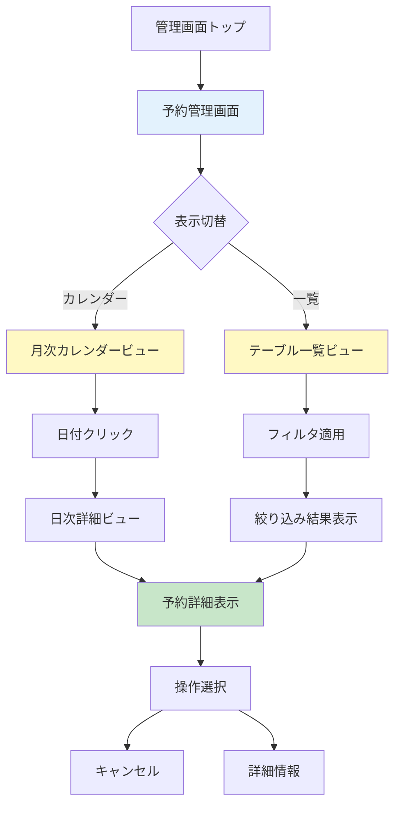
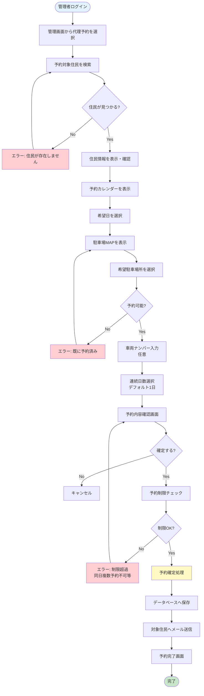
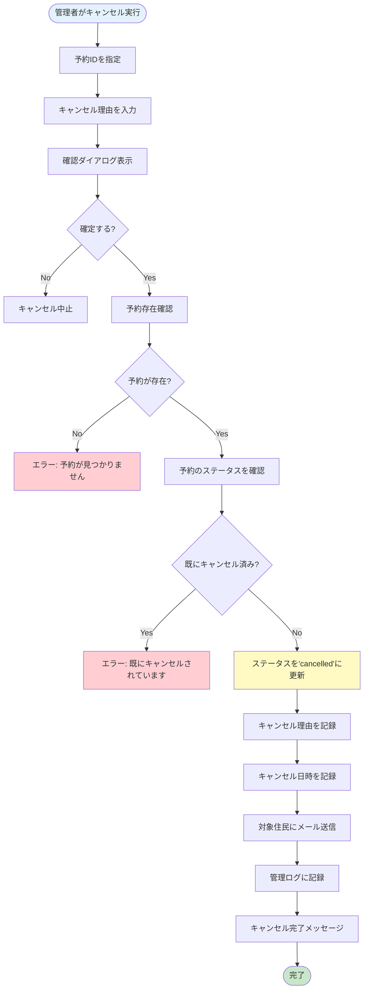
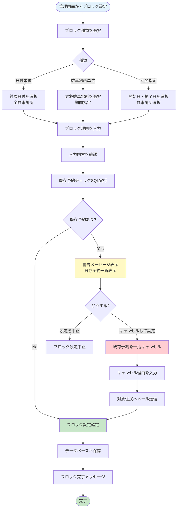
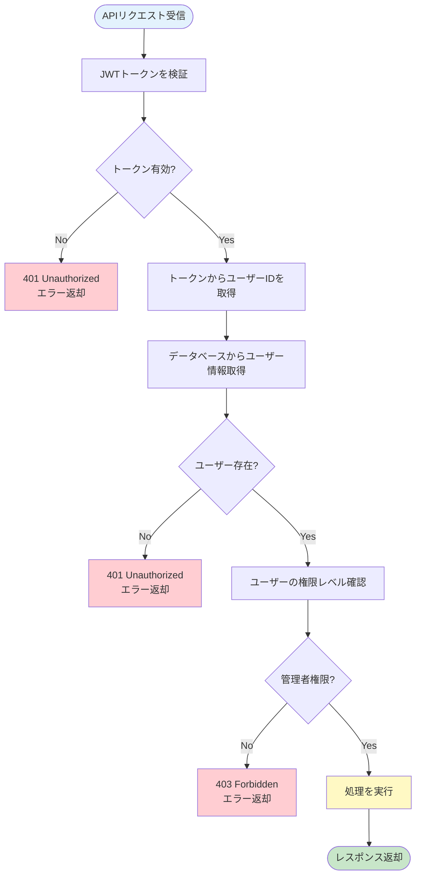
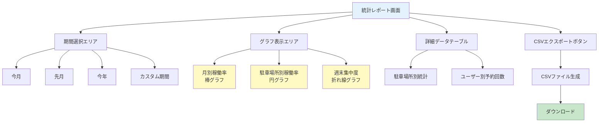

# 施設予約機能 詳細設計書 Chapter 05: 管理機能

**HarmoNet スマートコミュニケーションアプリ**

**文書ID**: HARMONET-FACILITY-BOOKING-DESIGN-001-CH05  
**バージョン**: v1.0  
**最終更新**: 2025年10月29日  
**ステータス**: 承認待ち

---

## 📑 目次

- [5.1 管理機能概要](#51-管理機能概要)
  - [5.1.1 管理者の役割](#511-管理者の役割)
  - [5.1.2 管理機能の目的](#512-管理機能の目的)
- [5.2 全予約状況の確認](#52-全予約状況の確認)
  - [5.2.1 カレンダー形式表示](#521-カレンダー形式表示)
  - [5.2.2 一覧形式表示](#522-一覧形式表示)
  - [5.2.3 検索・フィルタ機能](#523-検索フィルタ機能)
  - [5.2.4 画面設計（Wireframe）](#524-画面設計wireframe)
- [5.3 代理予約](#53-代理予約)
  - [5.3.1 代理予約の目的](#531-代理予約の目的)
  - [5.3.2 代理予約の操作フロー](#532-代理予約の操作フロー)
  - [5.3.3 代理予約の制限](#533-代理予約の制限)
  - [5.3.4 実装詳細](#534-実装詳細)
- [5.4 予約のキャンセル・変更](#54-予約のキャンセル変更)
  - [5.4.1 管理者によるキャンセル](#541-管理者によるキャンセル)
  - [5.4.2 キャンセル処理の実装](#542-キャンセル処理の実装)
  - [5.4.3 予約変更（将来実装）](#543-予約変更将来実装)
- [5.5 予約ブロック設定](#55-予約ブロック設定)
  - [5.5.1 予約ブロックの目的](#551-予約ブロックの目的)
  - [5.5.2 ブロック設定の種類](#552-ブロック設定の種類)
  - [5.5.3 ブロック設定の操作フロー](#553-ブロック設定の操作フロー)
  - [5.5.4 既存予約との競合処理](#554-既存予約との競合処理)
  - [5.5.5 データモデル](#555-データモデル)
  - [5.5.6 実装詳細](#556-実装詳細)
- [5.6 利用統計レポート](#56-利用統計レポート)
  - [5.6.1 統計レポートの目的](#561-統計レポートの目的)
  - [5.6.2 統計項目](#562-統計項目)
  - [5.6.3 レポート画面構成](#563-レポート画面構成)
  - [5.6.4 CSVエクスポート機能](#564-csvエクスポート機能)
  - [5.6.5 実装詳細（将来実装）](#565-実装詳細将来実装)
- [5.7 管理ログ機能](#57-管理ログ機能)
  - [5.7.1 ログ記録の目的](#571-ログ記録の目的)
  - [5.7.2 ログ記録項目](#572-ログ記録項目)
  - [5.7.3 ログ保持期間](#573-ログ保持期間)
  - [5.7.4 ログ閲覧機能](#574-ログ閲覧機能)
- [5.8 権限管理](#58-権限管理)
  - [5.8.1 権限レベル](#581-権限レベル)
  - [5.8.2 権限チェック](#582-権限チェック)
- [5.9 管理機能の画面設計](#59-管理機能の画面設計)
  - [5.9.1 管理画面トップ](#591-管理画面トップ)
  - [5.9.2 予約管理画面](#592-予約管理画面)
  - [5.9.3 代理予約画面](#593-代理予約画面)
  - [5.9.4 ブロック設定画面](#594-ブロック設定画面)
  - [5.9.5 統計レポート画面](#595-統計レポート画面)
- [5.10 エラーハンドリング](#510-エラーハンドリング)
  - [5.10.1 管理機能固有のエラー](#5101-管理機能固有のエラー)

---

## 5.1 管理機能概要

管理機能は、管理組合理事および管理会社担当者が駐車場予約を効率的に管理するための機能群です。住民の予約状況の把握、代理予約、キャンセル処理、施設メンテナンス時のブロック設定など、運用に必要な機能を提供します。

### 5.1.1 管理者の役割

**管理組合理事**
- 住民からの予約に関する問い合わせ対応
- 高齢者や外国人住民への予約サポート
- 予約状況の把握と公平性の確認
- 駐車場利用に関するトラブル対応

**管理会社担当者**
- 駐車場のメンテナンス計画に基づくブロック設定
- 施設修繕時の予約制限管理
- 利用統計の分析と報告
- システム運用の技術的サポート

**権限レベルの定義**
- **一般住民**: 自分の予約のみ操作可能
- **管理者**: 全予約の閲覧・操作、代理予約、ブロック設定が可能
- **スーパー管理者**: 全機能 + ユーザー管理 + 権限設定（将来実装）

### 5.1.2 管理機能の目的

**予約状況の把握**
- カレンダー形式およびリスト形式での全予約状況の可視化
- リアルタイムでの稼働率確認
- 予約傾向の分析による運用改善

**住民サポート（代理予約・キャンセル）**
- 電話や窓口での予約依頼への対応
- 高齢者や外国人住民のデジタルデバイド解消
- 緊急時の柔軟な予約対応

**施設メンテナンス対応（予約ブロック）**
- 定期メンテナンス時の予約制限
- 突発的な修繕工事への対応
- イベント開催時の駐車場確保

**利用統計の確認**
- 月別・駐車場所別の稼働率分析
- 人気駐車場所の把握
- 今後の施設計画への活用

**参照**: プロダクト開発用_機能要件定義書_v1_1.txt - 3.4.6 予約管理（管理者側）

---

## 5.2 全予約状況の確認

管理者は、全住民の予約状況を一元的に確認できます。カレンダー形式と一覧形式の2つのビューを提供し、用途に応じて使い分けが可能です。

### 5.2.1 カレンダー形式表示

**月次カレンダービュー**

月単位のカレンダー形式で予約状況を表示します。各日付セルには、その日の予約件数と稼働率を表示します。

表示要素：
- 日付（YYYY-MM-DD）
- 予約件数 / 総駐車場数（例: 8/12）
- 稼働率バー（視覚的表示）
- 色分け:
  - 白: 予約可能枠あり
  - 黄: 70%以上の稼働率
  - 赤: 満車（100%稼働）
  - グレー: 過去日

**日次詳細ビュー**

カレンダーの日付をクリックすると、その日の予約詳細を表示します。

表示項目：
- 予約日
- 駐車場所（F1〜F6, B1〜B6）
- 予約者名（または住戸番号）
- 車両ナンバー（下4桁）
- ステータス（予約済み/利用完了/キャンセル済み）
- 予約日時（登録日時）
- 操作ボタン（キャンセル/詳細）

**予約状況の色分け表示**

駐車場MAPと連動した色分け表示:
- 青（予約可能）: 予約可能な駐車場所
- グレー（予約済み）: 既に予約が入っている駐車場所
- 赤（ブロック中）: メンテナンス等でブロックされている駐車場所

### 5.2.2 一覧形式表示

テーブル形式で全予約を一覧表示します。ソート・フィルタ機能により、必要な情報を素早く検索できます。

**表示項目**

| 項目 | 内容 | ソート | フィルタ |
|------|------|--------|---------|
| 予約日 | YYYY-MM-DD | ✅ | ✅ |
| 駐車場所 | F1〜F6, B1〜B6 | ✅ | ✅ |
| 予約者 | 氏名/住戸番号 | ✅ | ✅ |
| 車両ナンバー | 下4桁 | - | ✅ |
| ステータス | 予約済み/利用完了/キャンセル | ✅ | ✅ |
| 予約日時 | 登録日時 | ✅ | - |
| 操作 | キャンセル/詳細ボタン | - | - |

**ページネーション**

- 1ページあたり20件表示
- ページ送りボタン（前へ/次へ）
- ページ番号選択
- 総件数表示（例: 1-20件 / 全156件）

### 5.2.3 検索・フィルタ機能

**日付範囲検索**

開始日と終了日を指定して、期間内の予約を検索します。

入力項目：
- 開始日（YYYY-MM-DD）
- 終了日（YYYY-MM-DD）
- デフォルト: 今月（月初〜月末）

**駐車場所フィルタ**

チェックボックスで駐車場所を選択し、絞り込みます。

選択肢：
- 表側（F1〜F6）: 個別選択または一括選択
- 裏側（B1〜B6）: 個別選択または一括選択
- デフォルト: 全選択

**予約者検索**

予約者の氏名または住戸番号で部分一致検索します。

入力項目：
- 検索キーワード（氏名または住戸番号）
- 例: "田中" / "A-101"

**ステータスフィルタ**

予約のステータスで絞り込みます。

選択肢：
- 予約済み
- 利用完了
- キャンセル済み
- デフォルト: 全選択

### 5.2.4 画面設計（Wireframe）



**画面レイアウト（予約管理画面）**

```
┌─────────────────────────────────────────────────────────┐
│ ヘッダー                                [JA/EN/CN] 🔔 👤│
├─────────────────────────────────────────────────────────┤
│ 予約管理                                                │
│ [カレンダー] [一覧]  [検索・フィルタ ▼]                │
├─────────────────────────────────────────────────────────┤
│                                                         │
│  【カレンダービュー】                                   │
│  ┌──────────────────────────────────────────┐          │
│  │  2025年11月        < 今月 >             │          │
│  ├──────────────────────────────────────────┤          │
│  │ 日 月 火 水 木 金 土                     │          │
│  │          1  2  3  4  5  6               │          │
│  │  7  8  9 10 11 12 13                    │          │
│  │ 14 15 16 17 18 19 20                    │          │
│  │ 21 22 23 24 25 26 27                    │          │
│  │ 28 29 30                                │          │
│  └──────────────────────────────────────────┘          │
│                                                         │
│  ※各日付セルに稼働率バー表示                           │
│    例: 11/15 [████████░░] 8/12                         │
│                                                         │
├─────────────────────────────────────────────────────────┤
│ フッター: [ホーム] [お知らせ] [掲示板] [予約] [管理]   │
└─────────────────────────────────────────────────────────┘
```

---

## 5.3 代理予約

管理者が住民に代わって予約を実施する機能です。高齢者や外国人住民、デジタルデバイスの利用が困難な住民へのサポートとして提供されます。

### 5.3.1 代理予約の目的

**高齢者や外国人住民のサポート**
- スマートフォン操作が苦手な高齢者への支援
- アプリの言語対応が不十分な場合のサポート
- デジタルデバイスを所有していない住民への対応

**電話・窓口での予約依頼対応**
- 管理組合事務所への電話予約
- 窓口での対面予約
- 書面での予約申請

**緊急時の柔軟な対応**
- 急な来客時の緊急予約
- システムトラブル時の手動予約
- 特別な事情による例外対応

### 5.3.2 代理予約の操作フロー



**STEP 1: 管理画面から代理予約を選択**
- 管理画面メニューから「代理予約」を選択
- 代理予約画面に遷移

**STEP 2: 予約対象住民を検索**
- 住戸番号またはユーザーID、氏名で検索
- 検索結果から対象住民を選択

入力例：
- 住戸番号: "A-105"
- 氏名: "田中太郎"
- ユーザーID: "user_12345"

**STEP 3: 予約対象住民の確認**
- 選択した住民の情報を表示
- 氏名、住戸番号、過去の予約履歴を確認

**STEP 4〜7: 通常の予約フローと同様**
- Chapter 03（予約フロー）と同じ手順で予約を実施
- カレンダー選択 → 駐車場所選択 → 車両ナンバー入力 → 連続日数選択

**STEP 8: 予約確定処理**
- 予約制限ルールを自動チェック（同日複数予約不可、連続3日間まで等）
- 排他制御による二重予約防止
- データベースへ保存

**STEP 9: 予約完了通知**
- 対象住民にメール送信
- メール件名: "[HarmoNet] 駐車場予約完了のお知らせ（管理者代理予約）"
- メール本文: 予約日時、駐車場所、予約者（管理者名）、問い合わせ先

### 5.3.3 代理予約の制限

**制限ルールは通常予約と同一**

管理者権限であっても、以下の制限ルールは適用されます（公平性確保のため）：

- 同日複数予約不可: 同一住民が同日に複数の駐車場所を予約できない
- 連続予約制限: 最大3日間まで連続予約可能
- 予約期限: 当日から30日先まで
- 駐車場所の重複予約不可: 既に予約済みの駐車場所は選択不可

**例外対応が必要な場合**

特別な事情により制限を超える予約が必要な場合：

1. 該当日の予約ブロックを一時的に解除
2. 通常の代理予約を実施
3. ブロックを再設定（必要に応じて）

注意事項：
- 制限回避は管理組合理事会の承認が必要
- 操作ログに記録され、監査対象となる
- 公平性を損なわないよう慎重に判断

### 5.3.4 実装詳細

**APIエンドポイント**

```
POST /admin/bookings/proxy
```

**リクエストパラメータ**

```json
{
  "target_user_id": 123,
  "facility_id": 3,
  "space_id": "F1",
  "booking_date": "2025-11-15",
  "vehicle_number": "1234",
  "consecutive_days": 1,
  "note": "電話予約対応"
}
```

パラメータ詳細：

| パラメータ | 型 | 必須 | 説明 |
|-----------|---|------|------|
| target_user_id | integer | ✅ | 予約対象ユーザーのID |
| facility_id | integer | ✅ | 施設ID（3: ゲスト用駐車場） |
| space_id | string | ✅ | 駐車場所ID（F1〜F6, B1〜B6） |
| booking_date | date | ✅ | 予約日（YYYY-MM-DD） |
| vehicle_number | string | - | 車両ナンバー下4桁（任意） |
| consecutive_days | integer | - | 連続日数（デフォルト: 1、最大: 3） |
| note | string | - | 備考（代理予約理由等） |

**レスポンス**

成功時（HTTP 201 Created）:
```json
{
  "success": true,
  "booking_id": "bk_a1b2c3d4",
  "bookings": [
    {
      "booking_id": "bk_a1b2c3d4",
      "user_id": 123,
      "facility_id": 3,
      "space_id": "F1",
      "booking_date": "2025-11-15",
      "vehicle_number": "1234",
      "status": "confirmed",
      "created_by": 1,
      "created_by_role": "admin",
      "created_at": "2025-11-01T10:30:00Z"
    }
  ],
  "message": "代理予約が完了しました"
}
```

エラー時（HTTP 400/404/409）:
```json
{
  "success": false,
  "error": "TARGET_USER_NOT_FOUND",
  "message": "対象ユーザーが見つかりません"
}
```

**処理フロー**

```javascript
// 疑似コード: 代理予約処理
async function createProxyBooking(adminUserId, targetUserId, bookingData) {
  // 1. 管理者権限チェック
  await checkAdminPermission(adminUserId);
  
  // 2. 対象ユーザーの存在確認
  const targetUser = await findUserById(targetUserId);
  if (!targetUser) {
    throw new Error('TARGET_USER_NOT_FOUND');
  }
  
  // 3. 予約制限チェック（通常予約と同じ）
  await validateBookingRules(targetUserId, bookingData);
  
  // 4. 排他制御で予約実行
  const booking = await createBookingWithLock({
    ...bookingData,
    user_id: targetUserId,
    created_by: adminUserId,
    created_by_role: 'admin'
  });
  
  // 5. メール通知送信
  await sendProxyBookingEmail(targetUser, booking, adminUserId);
  
  // 6. 管理ログ記録
  await logAdminAction({
    action: 'proxy_booking',
    admin_user_id: adminUserId,
    target_user_id: targetUserId,
    booking_id: booking.id
  });
  
  return booking;
}
```

**データベース設計**

bookingsテーブルに管理者操作を記録するカラムを追加：

```sql
ALTER TABLE bookings
ADD COLUMN created_by INTEGER REFERENCES users(user_id),
ADD COLUMN created_by_role VARCHAR(20) DEFAULT 'user';

-- created_by: 予約を作成したユーザーのID（通常は本人、代理予約時は管理者）
-- created_by_role: 'user' または 'admin'
```

---

## 5.4 予約のキャンセル・変更

管理者は、全ての予約をキャンセルする権限を持ちます。緊急メンテナンスや住民からの依頼に対応するため、利用開始後の予約もキャンセル可能です。

### 5.4.1 管理者によるキャンセル

**権限**

- 管理者は全ての予約をキャンセル可能
- 自分の予約だけでなく、全住民の予約をキャンセル可能
- 利用開始後（過去日）の予約もキャンセル可能（緊急メンテナンス等）

**キャンセル理由の記録**

キャンセル実行時、理由を必須入力します。透明性を確保し、後日の問い合わせに備えます。

理由カテゴリ：
- 住民からの依頼
- 施設メンテナンス
- 緊急対応
- その他

自由記述欄：
- 詳細理由を200文字以内で入力
- 例: "駐車場舗装工事のため、該当期間の予約を一括キャンセル"

**通知**

キャンセル実行時、対象住民にメールを自動送信します。

メール内容：
- 件名: "[HarmoNet] 駐車場予約のキャンセルについて"
- 本文:
  - キャンセルされた予約の詳細（予約日、駐車場所）
  - キャンセル理由
  - 問い合わせ先（管理組合事務所）

### 5.4.2 キャンセル処理の実装

**APIエンドポイント**

```
DELETE /admin/bookings/:bookingId
```

**リクエストパラメータ**

URLパラメータ：
- `bookingId`: 予約ID（例: bk_a1b2c3d4）

リクエストボディ：
```json
{
  "reason_category": "maintenance",
  "reason_detail": "駐車場舗装工事のため使用不可"
}
```

パラメータ詳細：

| パラメータ | 型 | 必須 | 説明 |
|-----------|---|------|------|
| reason_category | string | ✅ | キャンセル理由カテゴリ |
| reason_detail | string | ✅ | 詳細理由（200文字以内） |

reason_categoryの選択肢：
- `resident_request`: 住民からの依頼
- `maintenance`: 施設メンテナンス
- `emergency`: 緊急対応
- `other`: その他

**処理フロー**



1. 予約存在確認
2. ステータス更新（'cancelled'）
3. キャンセル理由を記録
4. 対象住民にメール送信
5. 管理ログに記録

**SQLサンプル**

```sql
-- キャンセル処理
UPDATE bookings
SET status = 'cancelled',
    cancelled_at = CURRENT_TIMESTAMP,
    cancelled_by = $1,  -- 管理者のユーザーID
    cancel_reason_category = $2,
    cancel_reason_detail = $3,
    updated_at = CURRENT_TIMESTAMP
WHERE booking_id = $4
  AND status != 'cancelled';  -- 既にキャンセル済みでない

-- 戻り値: 更新件数（0の場合はエラー）
```

**レスポンス**

成功時（HTTP 200 OK）:
```json
{
  "success": true,
  "booking_id": "bk_a1b2c3d4",
  "message": "予約をキャンセルしました",
  "cancelled_at": "2025-11-01T10:45:00Z"
}
```

エラー時（HTTP 404/409）:
```json
{
  "success": false,
  "error": "BOOKING_NOT_FOUND",
  "message": "予約が見つかりません"
}
```

### 5.4.3 予約変更（将来実装）

MVP版では予約変更機能は非対応です。住民および管理者は「キャンセル→再予約」の手順で対応します。

**将来実装時の検討事項**

日付変更：
- 変更前の予約をキャンセル
- 新しい日付で予約を作成
- 変更履歴を保持

駐車場所変更：
- 同日内で駐車場所のみ変更
- 変更理由の記録
- 変更回数の制限（無制限変更防止）

変更履歴の保持：
- 変更前の情報を履歴テーブルに保存
- 変更日時、変更者、変更内容を記録
- 監査証跡として活用

---

## 5.5 予約ブロック設定

特定の日付や駐車場所を予約不可にする機能です。施設メンテナンス、工事、イベント等で駐車場を使用できない場合に設定します。

### 5.5.1 予約ブロックの目的

**施設メンテナンス時の予約防止**
- 定期清掃やメンテナンス作業時の駐車場確保
- 安全確保のための立入禁止措置
- 作業車両の駐車スペース確保

**工事・イベント時の駐車場確保**
- 外壁修繕工事時の足場設置スペース
- 大規模修繕時の作業エリア確保
- マンション内イベント（防災訓練等）での駐車場利用

**特定駐車場所の一時的な使用停止**
- 舗装の劣化や破損時の立入禁止
- 設備故障（ゲート、照明等）時の使用停止
- 緊急修繕が必要な箇所の封鎖

### 5.5.2 ブロック設定の種類

**日付単位ブロック**

全駐車場所を一括でブロックします。

適用例：
- "2025-12-01は全駐車場メンテナンスのため予約不可"
- マンション全体の大規模清掃日
- 防災訓練実施日

設定内容：
- 対象日: 単日または期間指定
- 対象: 全駐車場所（F1〜F6, B1〜B6）
- ブロック理由: 必須入力

**駐車場所単位ブロック**

特定の駐車場所のみブロックします。

適用例：
- "F3は舗装工事のため11/15〜11/20まで予約不可"
- 特定駐車場所の部分修繕
- 個別設備（照明、ゲート）の故障対応

設定内容：
- 対象日: 単日または期間指定
- 対象: 特定駐車場所（例: F3のみ）
- ブロック理由: 必須入力

**期間指定ブロック**

開始日〜終了日の期間を指定してブロックします。

適用例：
- "B1〜B3は12/10〜12/15まで工事のため予約不可"
- 長期修繕工事
- 連続した複数日のイベント

設定内容：
- 対象日: 開始日〜終了日（最大90日間）
- 対象: 全駐車場所または特定駐車場所
- ブロック理由: 必須入力

### 5.5.3 ブロック設定の操作フロー



**STEP 1: ブロック設定画面にアクセス**
- 管理画面メニューから「予約ブロック設定」を選択

**STEP 2: ブロック種類を選択**
- 日付単位ブロック
- 駐車場所単位ブロック
- 期間指定ブロック

**STEP 3: 対象日付・駐車場所を選択**

日付単位ブロックの場合：
- 対象日: カレンダーから選択
- 駐車場所: 全駐車場所（自動設定）

駐車場所単位ブロックの場合：
- 対象駐車場所: チェックボックスで選択（F1〜F6, B1〜B6）
- 対象日: 単日または期間

期間指定ブロックの場合：
- 開始日: カレンダーから選択
- 終了日: カレンダーから選択（最大90日間）
- 駐車場所: 全駐車場所または特定駐車場所

**STEP 4: ブロック理由を入力**
- 理由カテゴリ: メンテナンス / 工事 / イベント / その他
- 詳細理由: 自由記述（200文字以内）

**STEP 5: 確認画面で内容を確認**
- 設定内容のサマリー表示
- 「ブロック設定」ボタン押下

**STEP 6: 既存予約との競合チェック**
- システムが自動的に既存予約をチェック
- 既存予約がある場合は警告表示

**STEP 7: 既存予約がある場合の対応**
- 既存予約の一覧を表示
- 選択肢を提示:
  - 既存予約をキャンセルしてブロック実行
  - ブロック設定を中止

**STEP 8: ブロック実行**
- データベースへ保存
- 該当日付・駐車場所は予約不可に変更
- 完了メッセージ表示

### 5.5.4 既存予約との競合処理

**ケース1: ブロック対象期間に既存予約がある場合**

警告メッセージ:
```
⚠️ 注意
指定期間に既存の予約が3件あります。
ブロック設定を続行すると、これらの予約は自動的にキャンセルされます。
```

既存予約の一覧表示:

| 予約日 | 駐車場所 | 予約者 | 車両ナンバー |
|--------|---------|--------|-------------|
| 2025-12-10 | F3 | 田中太郎（A-105） | 1234 |
| 2025-12-12 | F3 | 佐藤花子（B-201） | 5678 |
| 2025-12-14 | F3 | 山田次郎（C-303） | 9012 |

管理者に以下の選択肢を提示:
- **既存予約をキャンセルしてブロック実行**: 予約を一括キャンセルし、ブロックを設定
- **ブロック設定を中止**: 何も変更せずに戻る

**ケース2: ブロック解除**

ブロック一覧画面から対象ブロックを選択:
- ブロックID: blk_a1b2c3d4
- 期間: 2025-12-10 〜 2025-12-15
- 駐車場所: F3
- 理由: 舗装工事

「ブロック解除」ボタン押下:
- 確認ダイアログ表示
- 確定すると、該当日付・駐車場所は予約可能に戻る

### 5.5.5 データモデル

**parking_blocksテーブル**

```sql
CREATE TABLE parking_blocks (
  block_id UUID PRIMARY KEY DEFAULT gen_random_uuid(),
  facility_id INTEGER NOT NULL REFERENCES facilities(facility_id),
  space_id VARCHAR(10),  -- NULL の場合は全駐車場所
  block_start_date DATE NOT NULL,
  block_end_date DATE NOT NULL,
  reason_category VARCHAR(50) NOT NULL,
  reason_detail TEXT,
  created_by INTEGER NOT NULL REFERENCES users(user_id),
  created_at TIMESTAMP DEFAULT CURRENT_TIMESTAMP,
  deleted_at TIMESTAMP,  -- 論理削除
  CONSTRAINT check_date_range CHECK (block_end_date >= block_start_date)
);

-- インデックス
CREATE INDEX idx_parking_blocks_facility_date 
  ON parking_blocks(facility_id, block_start_date, block_end_date)
  WHERE deleted_at IS NULL;

CREATE INDEX idx_parking_blocks_space 
  ON parking_blocks(facility_id, space_id, block_start_date)
  WHERE deleted_at IS NULL;
```

カラム説明:

| カラム | 型 | 説明 |
|--------|---|------|
| block_id | UUID | ブロックID（主キー） |
| facility_id | INTEGER | 施設ID（3: ゲスト用駐車場） |
| space_id | VARCHAR(10) | 駐車場所ID（NULLの場合は全駐車場所） |
| block_start_date | DATE | ブロック開始日 |
| block_end_date | DATE | ブロック終了日 |
| reason_category | VARCHAR(50) | 理由カテゴリ |
| reason_detail | TEXT | 詳細理由 |
| created_by | INTEGER | 作成者（管理者のユーザーID） |
| created_at | TIMESTAMP | 作成日時 |
| deleted_at | TIMESTAMP | 削除日時（論理削除） |

### 5.5.6 実装詳細

**APIエンドポイント（ブロック設定）**

```
POST /admin/parking-blocks
```

**リクエストパラメータ**

```json
{
  "facility_id": 3,
  "space_id": "F3",
  "block_start_date": "2025-11-15",
  "block_end_date": "2025-11-20",
  "reason_category": "maintenance",
  "reason_detail": "舗装工事のため使用不可"
}
```

パラメータ詳細:

| パラメータ | 型 | 必須 | 説明 |
|-----------|---|------|------|
| facility_id | integer | ✅ | 施設ID（3: ゲスト用駐車場） |
| space_id | string | - | 駐車場所ID（NULLの場合は全駐車場所） |
| block_start_date | date | ✅ | ブロック開始日（YYYY-MM-DD） |
| block_end_date | date | ✅ | ブロック終了日（YYYY-MM-DD） |
| reason_category | string | ✅ | 理由カテゴリ |
| reason_detail | string | ✅ | 詳細理由（200文字以内） |

reason_categoryの選択肢:
- `maintenance`: メンテナンス
- `construction`: 工事
- `event`: イベント
- `other`: その他

**既存予約チェックSQL**

```sql
-- ブロック対象期間に既存予約があるかチェック
SELECT 
  booking_id,
  booking_date,
  user_id,
  space_id,
  u.name AS user_name,
  u.unit_number
FROM bookings b
JOIN users u ON b.user_id = u.user_id
WHERE b.facility_id = $1
  AND (b.space_id = $2 OR $2 IS NULL)  -- space_idがNULLの場合は全駐車場所
  AND b.booking_date BETWEEN $3 AND $4
  AND b.status = 'confirmed'
ORDER BY b.booking_date, b.space_id;

-- パラメータ:
-- $1: facility_id
-- $2: space_id (NULLの場合は全駐車場所)
-- $3: block_start_date
-- $4: block_end_date
```

**レスポンス**

既存予約がない場合（HTTP 201 Created）:
```json
{
  "success": true,
  "block_id": "blk_a1b2c3d4",
  "message": "ブロック設定が完了しました",
  "conflicting_bookings": []
}
```

既存予約がある場合（HTTP 409 Conflict）:
```json
{
  "success": false,
  "error": "BLOCK_CONFLICT",
  "message": "既存予約と競合しています",
  "conflicting_bookings": [
    {
      "booking_id": "bk_x1y2z3",
      "booking_date": "2025-12-10",
      "space_id": "F3",
      "user_name": "田中太郎",
      "unit_number": "A-105"
    }
  ]
}
```

**既存予約の一括キャンセル処理**

```sql
-- 既存予約を一括キャンセル
UPDATE bookings
SET status = 'cancelled',
    cancelled_at = CURRENT_TIMESTAMP,
    cancelled_by = $1,  -- 管理者のユーザーID
    cancel_reason_category = 'maintenance',
    cancel_reason_detail = $2,  -- ブロック設定の理由
    updated_at = CURRENT_TIMESTAMP
WHERE facility_id = $3
  AND (space_id = $4 OR $4 IS NULL)
  AND booking_date BETWEEN $5 AND $6
  AND status = 'confirmed'
RETURNING booking_id, user_id, booking_date, space_id;

-- 戻り値: キャンセルされた予約のリスト
-- 各予約者にメール送信
```

---

## 5.6 利用統計レポート

駐車場の利用状況を分析し、稼働率や人気駐車場所を可視化します。今後の施設計画や運用改善に活用できます。

### 5.6.1 統計レポートの目的

**駐車場の稼働率把握**
- 月別・年別の稼働率推移
- 繁忙期・閑散期の特定
- 需要予測への活用

**人気駐車場所の分析**
- 表側（F1〜F6）と裏側（B1〜B6）の利用比較
- 個別駐車場所の予約頻度
- 駐車場所の適正配置検討

**今後の施設計画に活用**
- 駐車場増設の必要性判断
- 駐車場利用ルールの見直し
- 管理組合総会での報告資料

### 5.6.2 統計項目

**月別稼働率**

計算式:
```
稼働率(%) = (予約件数 / 利用可能日数 × 駐車場所数) × 100
```

例:
- 11月の予約件数: 240件
- 利用可能日数: 30日
- 駐車場所数: 12台
- 稼働率: (240 / (30 × 12)) × 100 = 66.7%

グラフ表示: 棒グラフ（月次）

```
稼働率(%)
100 ┤
 90 ┤
 80 ┤        ██
 70 ┤     ██ ██
 60 ┤  ██ ██ ██ ██
 50 ┤  ██ ██ ██ ██ ██
 40 ┤  ██ ██ ██ ██ ██
 30 ┤  ██ ██ ██ ██ ██
 20 ┤  ██ ██ ██ ██ ██
 10 ┤  ██ ██ ██ ██ ██
  0 ┼──────────────────
     1月 2月 3月 4月 5月
```

**駐車場所別稼働率**

各駐車場所（F1〜F6, B1〜B6）の予約件数を集計します。

表示形式: 円グラフ

```
       F1: 15% (45件)
       F2: 12% (36件)
       F3: 10% (30件)
       F4: 8% (24件)
       F5: 11% (33件)
       F6: 9% (27件)
       B1: 7% (21件)
       B2: 6% (18件)
       B3: 8% (24件)
       B4: 5% (15件)
       B5: 5% (15件)
       B6: 4% (12件)
```

**時期別予約傾向**

週末の予約集中度:
- 平日（月〜木）: 平均3.5件/日
- 週末（金〜日）: 平均8.2件/日
- 週末集中率: 234%（週末が平日の2.3倍）

連休前後の予約傾向:
- 連休前3日間: 平均7.8件/日
- 連休中: 平均9.5件/日
- 連休後3日間: 平均4.2件/日

**ユーザー別予約回数**

上位予約者ランキング（月次）:

| 順位 | 氏名 | 住戸番号 | 予約回数 | 稼働率 |
|------|------|---------|---------|--------|
| 1 | 田中太郎 | A-105 | 8回 | 26.7% |
| 2 | 佐藤花子 | B-201 | 7回 | 23.3% |
| 3 | 山田次郎 | C-303 | 6回 | 20.0% |
| 4 | 鈴木一郎 | D-402 | 5回 | 16.7% |
| 5 | 高橋美咲 | A-203 | 5回 | 16.7% |

公平性の確認:
- 特定ユーザーへの予約集中を監視
- 公平性指標: 上位10%のユーザーが全予約の30%以内

### 5.6.3 レポート画面構成

**期間指定**

選択肢:
- 月単位: 2025年11月
- 年単位: 2025年
- カスタム期間: 開始日〜終了日

**グラフ表示エリア**

表示内容:
- 月別稼働率（棒グラフ）
- 駐車場所別稼働率（円グラフ）
- 週末集中度（折れ線グラフ）

**詳細データテーブル**

表形式で詳細データを表示:

| 駐車場所 | 予約件数 | 稼働率 | 人気度 |
|---------|---------|--------|--------|
| F1 | 45件 | 75% | ★★★★☆ |
| F2 | 36件 | 60% | ★★★☆☆ |
| F3 | 30件 | 50% | ★★★☆☆ |
| ... | ... | ... | ... |

**CSVエクスポートボタン**

ボタン配置:
- 画面右上に「CSVエクスポート」ボタン
- クリックでダウンロード開始

### 5.6.4 CSVエクスポート機能

**エクスポート項目**

```csv
予約日,駐車場所,予約者名,住戸番号,車両ナンバー,予約日時,ステータス,キャンセル日時,キャンセル理由
2025-11-01,F1,田中太郎,A-105,1234,2025-10-25 10:30:00,予約済み,,
2025-11-02,F2,佐藤花子,B-201,5678,2025-10-26 14:15:00,利用完了,,
2025-11-03,F3,山田次郎,C-303,9012,2025-10-27 09:20:00,キャンセル済み,2025-10-28 16:45:00,住民からの依頼
```

**ファイル形式**

- エンコーディング: UTF-8 BOM付き（Excel互換）
- 区切り文字: カンマ（,）
- 改行コード: CRLF（Windows互換）
- ファイル名: `parking_bookings_YYYYMMDD_HHmmss.csv`
  - 例: `parking_bookings_20251101_143000.csv`

**実装サンプル**

```javascript
// CSVエクスポート処理
async function exportBookingsCSV(startDate, endDate) {
  // 1. データベースから予約データを取得
  const bookings = await fetchBookings(startDate, endDate);
  
  // 2. CSVヘッダー
  const headers = [
    '予約日',
    '駐車場所',
    '予約者名',
    '住戸番号',
    '車両ナンバー',
    '予約日時',
    'ステータス',
    'キャンセル日時',
    'キャンセル理由'
  ];
  
  // 3. CSV行データ
  const rows = bookings.map(booking => [
    booking.booking_date,
    booking.space_id,
    booking.user_name,
    booking.unit_number,
    booking.vehicle_number || '',
    booking.created_at,
    booking.status_label,
    booking.cancelled_at || '',
    booking.cancel_reason_detail || ''
  ]);
  
  // 4. CSV文字列生成
  const csv = [headers, ...rows]
    .map(row => row.map(cell => `"${cell}"`).join(','))
    .join('\r\n');
  
  // 5. BOM付きUTF-8で出力
  const bom = '\uFEFF';
  const csvWithBOM = bom + csv;
  
  // 6. ファイル名生成
  const timestamp = new Date().toISOString().replace(/[-:T]/g, '').slice(0, 14);
  const filename = `parking_bookings_${timestamp}.csv`;
  
  // 7. ダウンロード
  downloadFile(csvWithBOM, filename, 'text/csv;charset=utf-8');
}
```

### 5.6.5 実装詳細（将来実装）

MVP版では基本的なレポート表示のみ実装します。詳細な統計分析機能は将来実装として検討します。

**将来実装候補機能**

高度な分析:
- 予約キャンセル率の分析
- 予約〜利用開始までのリードタイム分析
- 連続予約の傾向分析

予測機能:
- 機械学習による需要予測
- 繁忙期の自動検出
- 予約集中アラート

レポート自動生成:
- 月次レポートの自動生成
- 管理組合理事へのメール送信
- PDFレポート生成

**参照**: プロダクト開発用_機能要件定義書_v1_1.txt - 3.4.6 予約管理（管理者側）

---

## 5.7 管理ログ機能

管理者の操作を記録し、追跡可能性を確保します。不正操作の防止とトラブル時の原因調査に活用します。

### 5.7.1 ログ記録の目的

**管理者操作の追跡**
- 誰が、いつ、何を操作したかを記録
- 操作の時系列把握
- 責任の所在明確化

**不正操作の防止**
- 権限の不正利用の抑止
- 操作ログの定期レビュー
- 疑わしい操作パターンの検出

**トラブル時の原因調査**
- 予約トラブル発生時の経緯確認
- データ不整合の原因特定
- 住民からの問い合わせへの迅速な回答

### 5.7.2 ログ記録項目

| 項目 | 内容 | 例 |
|------|------|---|
| 操作日時 | YYYY-MM-DD HH:mm:ss | 2025-11-01 10:30:15 |
| 管理者ID | 操作実行者のユーザーID | 1 |
| 管理者名 | 操作実行者の氏名 | 山田管理太郎 |
| 操作種別 | 代理予約/キャンセル/ブロック設定/ブロック解除 | 代理予約 |
| 対象予約ID | 操作対象の予約ID（該当する場合） | bk_a1b2c3d4 |
| 対象ユーザーID | 操作対象の住民ID | 123 |
| 操作内容 | 詳細な操作内容（JSON形式） | {"action":"proxy_booking","target_user":123,...} |
| IPアドレス | 操作元IPアドレス | 192.168.1.100 |

**操作種別の詳細**

- `proxy_booking`: 代理予約
- `admin_cancel`: 管理者によるキャンセル
- `block_create`: ブロック設定
- `block_delete`: ブロック解除
- `booking_modify`: 予約変更（将来実装）

**操作内容（JSON形式）の例**

代理予約の場合:
```json
{
  "action": "proxy_booking",
  "target_user_id": 123,
  "target_user_name": "田中太郎",
  "facility_id": 3,
  "space_id": "F1",
  "booking_date": "2025-11-15",
  "vehicle_number": "1234",
  "note": "電話予約対応"
}
```

キャンセルの場合:
```json
{
  "action": "admin_cancel",
  "booking_id": "bk_a1b2c3d4",
  "target_user_id": 123,
  "reason_category": "maintenance",
  "reason_detail": "駐車場舗装工事のため"
}
```

### 5.7.3 ログ保持期間

**保持期間: 3年間**

理由:
- 法的要件への対応
- 長期的なトラブル対応
- 監査証跡の確保

**3年経過後は自動削除（論理削除）**

削除処理:
- 毎日深夜2:00に自動実行
- 3年以上前のログを論理削除（deleted_atを更新）
- 完全削除は行わず、論理削除で保持（復元可能性確保）

**データベース設計**

```sql
CREATE TABLE admin_logs (
  log_id UUID PRIMARY KEY DEFAULT gen_random_uuid(),
  admin_user_id INTEGER NOT NULL REFERENCES users(user_id),
  admin_user_name VARCHAR(100) NOT NULL,
  action_type VARCHAR(50) NOT NULL,
  target_booking_id UUID REFERENCES bookings(booking_id),
  target_user_id INTEGER REFERENCES users(user_id),
  action_detail JSONB NOT NULL,
  ip_address INET,
  created_at TIMESTAMP DEFAULT CURRENT_TIMESTAMP,
  deleted_at TIMESTAMP  -- 論理削除
);

-- インデックス
CREATE INDEX idx_admin_logs_admin_user 
  ON admin_logs(admin_user_id, created_at DESC)
  WHERE deleted_at IS NULL;

CREATE INDEX idx_admin_logs_target_user 
  ON admin_logs(target_user_id, created_at DESC)
  WHERE deleted_at IS NULL;

CREATE INDEX idx_admin_logs_created_at 
  ON admin_logs(created_at DESC)
  WHERE deleted_at IS NULL;
```

**自動削除SQL**

```sql
-- 3年以上前のログを論理削除
UPDATE admin_logs
SET deleted_at = CURRENT_TIMESTAMP
WHERE created_at < CURRENT_DATE - INTERVAL '3 years'
  AND deleted_at IS NULL;
```

### 5.7.4 ログ閲覧機能

管理者のみがログを閲覧可能です。一般住民は閲覧できません。

**検索・フィルタ機能**

日付範囲検索:
- 開始日: カレンダーから選択
- 終了日: カレンダーから選択
- デフォルト: 過去1ヶ月

管理者フィルタ:
- ドロップダウンで管理者を選択
- 全管理者 / 特定管理者

操作種別フィルタ:
- チェックボックスで選択
- 代理予約 / キャンセル / ブロック設定 / ブロック解除

対象ユーザー検索:
- 氏名または住戸番号で検索
- 部分一致検索

**画面構成**

ログ一覧テーブル:

| 操作日時 | 管理者 | 操作種別 | 対象ユーザー | 対象予約 | 詳細 |
|---------|--------|---------|------------|---------|------|
| 2025-11-01 10:30 | 山田管理太郎 | 代理予約 | 田中太郎（A-105） | bk_a1b2c3d4 | [詳細] |
| 2025-11-01 14:15 | 佐藤管理花子 | キャンセル | 鈴木一郎（B-201） | bk_x1y2z3a4 | [詳細] |
| 2025-11-02 09:00 | 山田管理太郎 | ブロック設定 | - | - | [詳細] |

詳細表示モーダル:
- ログIDをクリックでモーダル表示
- 操作内容の詳細（JSON形式を見やすく整形）
- IPアドレス、操作時刻等の追加情報

CSVエクスポート:
- 画面右上に「CSVエクスポート」ボタン
- フィルタ条件に応じたログをエクスポート
- ファイル名: `admin_logs_YYYYMMDD_HHmmss.csv`

---

## 5.8 権限管理

管理機能へのアクセスを制御し、権限レベルに応じた機能制限を実装します。

### 5.8.1 権限レベル

| 権限レベル | 説明 | 機能アクセス |
|-----------|------|------------|
| 一般住民 | 通常のアプリユーザー | 自分の予約のみ閲覧・操作可能 |
| 管理者 | 管理組合理事・管理会社担当者 | 全予約閲覧、代理予約、キャンセル、ブロック設定 |
| スーパー管理者 | システム管理者 | 全機能 + ユーザー管理 + 権限設定 |

**一般住民**

アクセス可能な機能:
- 自分の予約の閲覧
- 自分の予約のキャンセル（利用開始前）
- 新規予約の作成

アクセス不可な機能:
- 他住民の予約閲覧
- 代理予約
- 予約ブロック設定
- 管理ログ閲覧

**管理者**

アクセス可能な機能:
- 全予約状況の確認（カレンダー/一覧）
- 代理予約
- 全予約のキャンセル（理由記録必須）
- 予約ブロック設定・解除
- 利用統計レポート閲覧
- 管理ログ閲覧（自分の操作履歴）
- CSVエクスポート

アクセス不可な機能:
- ユーザー管理（追加/編集/削除）
- 権限設定の変更
- 他管理者の操作履歴削除

**スーパー管理者（将来実装）**

アクセス可能な機能:
- 管理者機能の全て
- ユーザー管理（追加/編集/削除）
- 権限レベルの設定・変更
- 全管理ログの閲覧・削除
- システム設定の変更

### 5.8.2 権限チェック

全ての管理機能APIに対して、リクエスト元ユーザーの権限をチェックします。

**認証フロー**



1. JWTトークンからユーザーIDを取得
2. データベースからユーザー権限を取得
3. 権限不足の場合は403 Forbiddenを返す

**実装例（疑似コード）**

```javascript
// 管理者権限チェック関数
async function checkAdminPermission(userId) {
  // 1. ユーザー情報を取得
  const user = await db.query(
    'SELECT user_id, name, role FROM users WHERE user_id = $1',
    [userId]
  );
  
  // 2. ユーザーが存在しない場合
  if (!user) {
    throw new Error({
      code: 401,
      error: 'UNAUTHORIZED',
      message: '認証が必要です'
    });
  }
  
  // 3. 管理者権限チェック
  if (user.role !== 'admin' && user.role !== 'super_admin') {
    throw new Error({
      code: 403,
      error: 'FORBIDDEN',
      message: '管理者権限が必要です'
    });
  }
  
  // 4. 権限OK
  return {
    userId: user.user_id,
    userName: user.name,
    role: user.role
  };
}

// APIエンドポイントでの使用例
app.post('/admin/bookings/proxy', async (req, res) => {
  try {
    // JWTトークンからユーザーIDを取得
    const userId = extractUserIdFromToken(req.headers.authorization);
    
    // 管理者権限チェック
    const admin = await checkAdminPermission(userId);
    
    // 代理予約処理
    const booking = await createProxyBooking(
      admin.userId,
      req.body.target_user_id,
      req.body
    );
    
    res.status(201).json({ success: true, booking });
  } catch (error) {
    res.status(error.code || 500).json({
      success: false,
      error: error.error || 'INTERNAL_ERROR',
      message: error.message
    });
  }
});
```

**データベース設計**

usersテーブルにroleカラムを追加:

```sql
ALTER TABLE users
ADD COLUMN role VARCHAR(20) DEFAULT 'user';

-- roleの値:
-- 'user': 一般住民
-- 'admin': 管理者
-- 'super_admin': スーパー管理者（将来実装）

-- チェック制約
ALTER TABLE users
ADD CONSTRAINT check_role 
  CHECK (role IN ('user', 'admin', 'super_admin'));

-- インデックス
CREATE INDEX idx_users_role 
  ON users(role)
  WHERE role IN ('admin', 'super_admin');
```

---

## 5.9 管理機能の画面設計

管理者向けの画面構成を定義します。使いやすさと効率性を重視した設計とします。

### 5.9.1 管理画面トップ

ダッシュボード形式で、管理者が必要な情報を一目で把握できるようにします。

**表示要素**

今日の予約状況:
- 本日の予約件数 / 総駐車場数
- 稼働率バー
- 本日の予約一覧（簡易表示）

今週の予約件数:
- 月曜〜日曜の予約件数グラフ
- 週間稼働率

未処理の通報（将来実装）:
- 掲示板の通報件数
- 設備故障報告件数

最近のアクティビティ:
- 過去24時間の管理者操作履歴
- 最新5件を表示

**画面レイアウト**

```
┌─────────────────────────────────────────────────────────┐
│ 管理画面                            [JA/EN/CN] 🔔 👤    │
├─────────────────────────────────────────────────────────┤
│ ダッシュボード                                          │
├─────────────────────────────────────────────────────────┤
│                                                         │
│ 【今日の予約状況】        【今週の予約件数】           │
│ ┌──────────────────┐    ┌──────────────────┐         │
│ │ 8 / 12台          │    │ 月: 3件          │         │
│ │ [████████░░░░]    │    │ 火: 5件          │         │
│ │ 稼働率: 66.7%     │    │ 水: 4件          │         │
│ │                   │    │ 木: 6件          │         │
│ │ F1: 田中太郎       │    │ 金: 8件          │         │
│ │ F2: 佐藤花子       │    │ 土: 9件          │         │
│ │ F3: 山田次郎       │    │ 日: 7件          │         │
│ │ ...               │    │ 週間稼働率: 58%  │         │
│ └──────────────────┘    └──────────────────┘         │
│                                                         │
│ 【最近のアクティビティ】                                │
│ ┌─────────────────────────────────────────┐           │
│ │ 11/01 10:30  山田管理  代理予約  田中太郎  │           │
│ │ 11/01 14:15  佐藤管理  キャンセル 鈴木一郎 │           │
│ │ 11/02 09:00  山田管理  ブロック設定       │           │
│ │ 11/02 16:45  佐藤管理  代理予約  高橋美咲  │           │
│ │ 11/03 11:20  山田管理  ブロック解除       │           │
│ └─────────────────────────────────────────┘           │
│                                                         │
│ [予約管理] [代理予約] [ブロック設定] [統計レポート]    │
│                                                         │
├─────────────────────────────────────────────────────────┤
│ フッター: [ホーム] [お知らせ] [掲示板] [予約] [管理]   │
└─────────────────────────────────────────────────────────┘
```

### 5.9.2 予約管理画面

**カレンダービュー**

月次カレンダー:
- 月単位でカレンダー表示
- 各日付セルに稼働率バー
- 日付クリックで日次詳細ビュー

日次詳細ビュー:
- 選択日の予約一覧
- 駐車場MAPと連動
- 各予約の詳細情報

**一覧ビュー**

テーブル形式:
- ページネーション（20件/ページ）
- ソート機能（全カラム）
- フィルタ機能（日付、駐車場所、予約者、ステータス）

操作ボタン:
- 各行に「キャンセル」「詳細」ボタン
- 一括操作（複数選択でまとめてキャンセル）

### 5.9.3 代理予約画面

**住民検索**

検索フォーム:
- 住戸番号入力欄
- 氏名入力欄
- 「検索」ボタン

検索結果:
- 該当住民の一覧表示
- 氏名、住戸番号、過去の予約回数
- 「この住民で予約」ボタン

**予約フォーム**

通常の予約フローと同様:
- カレンダー選択
- 駐車場MAP表示
- 駐車場所選択
- 車両ナンバー入力（任意）
- 連続日数選択

**確認画面**

予約内容の確認:
- 予約対象住民
- 予約日、駐車場所
- 車両ナンバー
- 連続日数
- 「予約を確定する」ボタン

### 5.9.4 ブロック設定画面

**ブロック一覧**

既存ブロックの一覧:

| ブロックID | 期間 | 駐車場所 | 理由 | 操作 |
|-----------|------|---------|------|------|
| blk_001 | 2025-12-10 〜 12-15 | F3 | 舗装工事 | [解除] |
| blk_002 | 2025-12-20 〜 12-21 | 全駐車場所 | 大掃除 | [解除] |

**ブロック設定フォーム**

ブロック種類選択:
- ラジオボタン: 日付単位 / 駐車場所単位 / 期間指定

対象選択:
- 日付: カレンダーから選択
- 駐車場所: チェックボックスで選択（F1〜F6, B1〜B6）

理由入力:
- 理由カテゴリ: ドロップダウン
- 詳細理由: テキストエリア（200文字以内）

**既存予約の警告表示**

警告メッセージ:
```
⚠️ 注意
指定期間に既存の予約が3件あります。
ブロック設定を続行すると、これらの予約は自動的にキャンセルされます。
```

既存予約一覧:
- テーブル形式で表示
- 予約日、駐車場所、予約者、車両ナンバー

選択肢:
- 「既存予約をキャンセルしてブロック実行」ボタン
- 「ブロック設定を中止」ボタン

### 5.9.5 統計レポート画面

**期間選択**

ドロップダウン:
- 今月
- 先月
- 今年
- カスタム期間（開始日〜終了日）

**グラフエリア**

月別稼働率（棒グラフ）:
- 横軸: 月
- 縦軸: 稼働率（%）

駐車場所別稼働率（円グラフ）:
- F1〜F6, B1〜B6の予約件数比率

**詳細データテーブル**

駐車場所別統計:

| 駐車場所 | 予約件数 | 稼働率 | 人気度 |
|---------|---------|--------|--------|
| F1 | 45件 | 75% | ★★★★☆ |
| F2 | 36件 | 60% | ★★★☆☆ |
| ... | ... | ... | ... |

**CSVエクスポートボタン**

画面右上に配置:
- 「CSVエクスポート」ボタン
- クリックでダウンロード開始

**画面ワイヤーフレーム（統計レポート）**



---

## 5.10 エラーハンドリング

管理機能固有のエラーを定義し、適切なエラーメッセージとHTTPステータスコードを返却します。

### 5.10.1 管理機能固有のエラー

| エラーコード | エラー内容 | HTTPステータス | メッセージ |
|------------|-----------|--------------|-----------|
| ADMIN_PERMISSION_REQUIRED | 管理者権限不足 | 403 | 「管理者権限が必要です」 |
| TARGET_USER_NOT_FOUND | 代理予約対象ユーザーが存在しない | 404 | 「対象ユーザーが見つかりません」 |
| BOOKING_NOT_FOUND | 対象予約が存在しない | 404 | 「予約が見つかりません」 |
| BLOCK_CONFLICT | ブロック設定時に既存予約と競合 | 409 | 「既存予約と競合しています」 |
| INVALID_BLOCK_PERIOD | ブロック期間が不正 | 422 | 「ブロック期間が不正です」 |
| ALREADY_CANCELLED | 既にキャンセル済みの予約 | 409 | 「既にキャンセルされています」 |
| INVALID_REASON_CATEGORY | キャンセル理由カテゴリが不正 | 422 | 「理由カテゴリが不正です」 |
| LOG_ACCESS_DENIED | ログ閲覧権限なし | 403 | 「ログ閲覧権限がありません」 |

**エラーレスポンス形式**

```json
{
  "success": false,
  "error": "ADMIN_PERMISSION_REQUIRED",
  "message": "管理者権限が必要です",
  "details": {
    "required_role": "admin",
    "current_role": "user"
  }
}
```

**エラーハンドリング実装例**

```javascript
// エラーハンドリングミドルウェア
function errorHandler(error, req, res, next) {
  // ログ記録
  console.error('Error:', error);
  
  // エラーコードに応じた処理
  const errorMap = {
    'ADMIN_PERMISSION_REQUIRED': { status: 403, message: '管理者権限が必要です' },
    'TARGET_USER_NOT_FOUND': { status: 404, message: '対象ユーザーが見つかりません' },
    'BOOKING_NOT_FOUND': { status: 404, message: '予約が見つかりません' },
    'BLOCK_CONFLICT': { status: 409, message: '既存予約と競合しています' },
    'INVALID_BLOCK_PERIOD': { status: 422, message: 'ブロック期間が不正です' },
    'ALREADY_CANCELLED': { status: 409, message: '既にキャンセルされています' },
    'INVALID_REASON_CATEGORY': { status: 422, message: '理由カテゴリが不正です' },
    'LOG_ACCESS_DENIED': { status: 403, message: 'ログ閲覧権限がありません' }
  };
  
  const errorInfo = errorMap[error.code] || { 
    status: 500, 
    message: 'サーバーエラーが発生しました' 
  };
  
  res.status(errorInfo.status).json({
    success: false,
    error: error.code || 'INTERNAL_ERROR',
    message: errorInfo.message,
    details: error.details || {}
  });
}
```

**フロントエンド側のエラー表示**

```javascript
// エラーメッセージの表示
function displayError(error) {
  // エラーコードに応じたユーザーフレンドリーなメッセージ
  const userMessages = {
    'ADMIN_PERMISSION_REQUIRED': '管理者権限が必要です。管理者にお問い合わせください。',
    'TARGET_USER_NOT_FOUND': '対象のユーザーが見つかりません。住戸番号または氏名を確認してください。',
    'BOOKING_NOT_FOUND': '予約が見つかりません。既にキャンセルされている可能性があります。',
    'BLOCK_CONFLICT': '既存の予約と競合しています。既存予約をキャンセルしてから設定してください。',
    'INVALID_BLOCK_PERIOD': 'ブロック期間が不正です。開始日と終了日を確認してください。',
    'ALREADY_CANCELLED': 'この予約は既にキャンセルされています。',
    'INVALID_REASON_CATEGORY': 'キャンセル理由のカテゴリが不正です。',
    'LOG_ACCESS_DENIED': 'ログの閲覧権限がありません。管理者にお問い合わせください。'
  };
  
  const message = userMessages[error.error] || error.message || 'エラーが発生しました';
  
  // UIにエラーメッセージを表示
  showNotification(message, 'error');
}
```

---

## 📖 ナビゲーション

- [⬅️ 前の章: Chapter 04 - 予約制限ルール・検証](facility-booking-feature-design-ch04_v1.0.md)
- [➡️ 次の章: Chapter 06 - 多言語対応・通知機能](facility-booking-feature-design-ch06_v1.0.md)
- [📚 目次に戻る](facility-booking-feature-design-ch00-index_v1.0.md)

---

**文書管理情報**

- **文書ID**: HARMONET-FACILITY-BOOKING-DESIGN-001-CH05
- **バージョン**: v1.0
- **最終更新**: 2025年10月29日
- **作成者**: TKD
- **承認者**: （承認待ち）
- **次回レビュー**: 実装フェーズ開始時

---

**変更履歴**

| バージョン | 日付 | 変更内容 | 変更者 |
|-----------|------|---------|--------|
| v1.0 | 2025-10-29 | 初版作成 | TKD |

---

© 2025 HarmoNet Project. All rights reserved.
