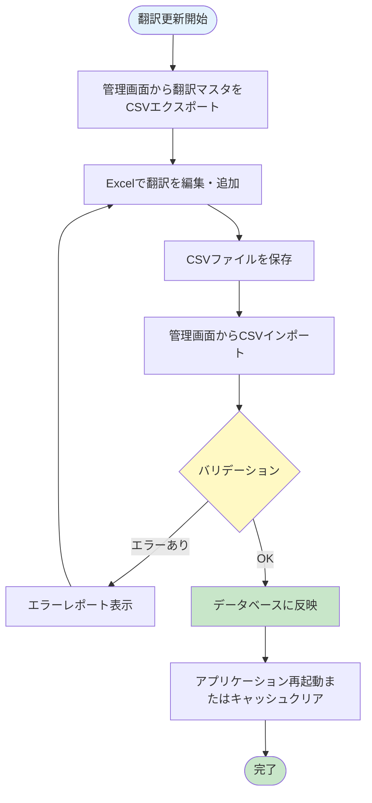
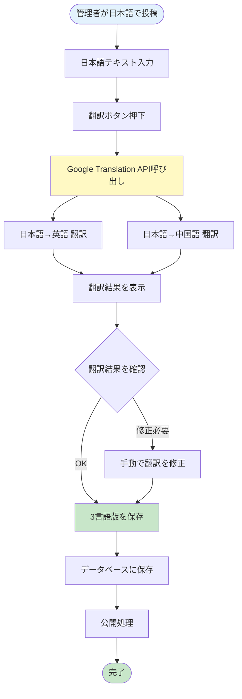
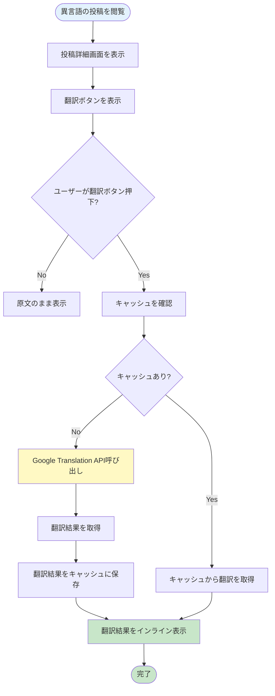
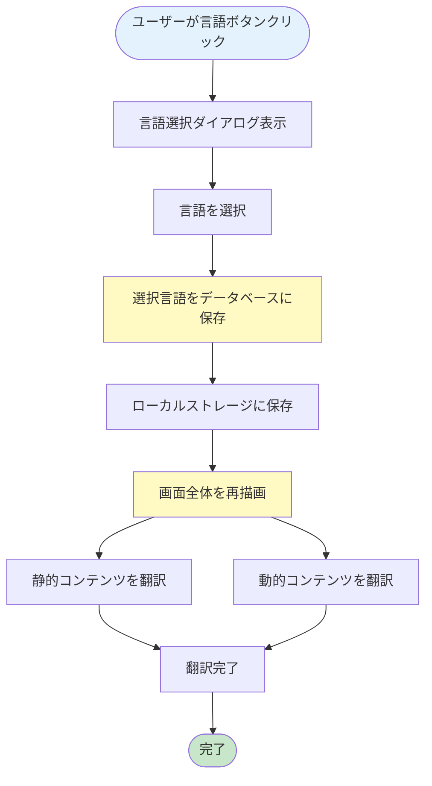

# 施設予約機能 詳細設計書 Chapter 06: 多言語対応・通知機能

**HarmoNet スマートコミュニケーションアプリ**

**文書ID**: HARMONET-FACILITY-BOOKING-DESIGN-001-CH06  
**バージョン**: v1.0  
**最終更新**: 2025年10月29日  
**ステータス**: 承認待ち

---

## 📑 目次

- [6.1 多言語対応概要](#61-多言語対応概要)
  - [6.1.1 対応言語](#611-対応言語)
  - [6.1.2 多言語対応の範囲](#612-多言語対応の範囲)
  - [6.1.3 翻訳方式の2層構造](#613-翻訳方式の2層構造)
- [6.2 静的コンテンツの多言語対応](#62-静的コンテンツの多言語対応)
  - [6.2.1 翻訳マスタテーブル](#621-翻訳マスタテーブル)
  - [6.2.2 翻訳キーの命名規則](#622-翻訳キーの命名規則)
  - [6.2.3 翻訳データの管理](#623-翻訳データの管理)
- [6.3 動的コンテンツの多言語対応](#63-動的コンテンツの多言語対応)
  - [6.3.1 Google Cloud Translation API の利用](#631-google-cloud-translation-api-の利用)
  - [6.3.2 管理者投稿時の翻訳フロー](#632-管理者投稿時の翻訳フロー)
  - [6.3.3 住民側の掲示板投稿翻訳](#633-住民側の掲示板投稿翻訳)
  - [6.3.4 翻訳の最適化](#634-翻訳の最適化)
- [6.4 メール通知の多言語対応](#64-メール通知の多言語対応)
  - [6.4.1 メール通知の種類](#641-メール通知の種類)
  - [6.4.2 メールテンプレートの多言語化](#642-メールテンプレートの多言語化)
  - [6.4.3 メール送信処理](#643-メール送信処理)
- [6.5 言語切替機能](#65-言語切替機能)
  - [6.5.1 言語切替ボタンの実装](#651-言語切替ボタンの実装)
  - [6.5.2 言語切替の動作フロー](#652-言語切替の動作フロー)
  - [6.5.3 言語設定の保存](#653-言語設定の保存)
- [6.6 通知機能](#66-通知機能)
  - [6.6.1 通知の種類](#661-通知の種類)
  - [6.6.2 通知設定](#662-通知設定)
  - [6.6.3 プッシュ通知の実装](#663-プッシュ通知の実装)
  - [6.6.4 メール通知の実装](#664-メール通知の実装)
- [6.7 翻訳品質の向上](#67-翻訳品質の向上)
  - [6.7.1 翻訳精度の検証](#671-翻訳精度の検証)
  - [6.7.2 固有名詞の取り扱い](#672-固有名詞の取り扱い)
- [6.8 エラーハンドリング](#68-エラーハンドリング)
  - [6.8.1 翻訳失敗時の対応](#681-翻訳失敗時の対応)
  - [6.8.2 メール送信失敗時の対応](#682-メール送信失敗時の対応)
- [📖 ナビゲーション](#-ナビゲーション)

---

## 6.1 多言語対応概要

HarmoNetでは、日本人住民と外国人住民のコミュニケーション障壁を解消するため、包括的な多言語対応を実装します。

### 6.1.1 対応言語

| 言語 | 言語コード | 文字種 | 対象ユーザー |
|------|-----------|--------|-------------|
| 日本語 | `ja` / `JP` | - | 日本人住民 |
| 英語 | `en` / `EN` | - | 英語圏住民 |
| 中国語（簡体字） | `zh-CN` / `CN` | 簡体字 | 中国本土出身住民 |

**注記**: 繁体字対応は将来検討

### 6.1.2 多言語対応の範囲

多言語対応は、アプリケーション全体に適用されます。

| 対象 | 翻訳方式 | 説明 |
|------|----------|------|
| ボタン・ラベル・メニュー | 翻訳マスタ | 事前定義された静的翻訳 |
| エラーメッセージ | 翻訳マスタ | 事前定義された静的翻訳 |
| システム通知 | 翻訳マスタ | 定型文として事前定義 |
| お知らせ・イベント情報 | Google Translation API | 管理者投稿時に動的翻訳 |
| 利用規約・ヘルプ | Google Translation API | 初回作成時に翻訳、以降は固定 |
| 掲示板投稿 | Google Translation API | 住民が「翻訳」ボタン押下時 |
| メール通知本文 | 翻訳マスタ + 動的挿入 | テンプレートは翻訳マスタ、可変部分は変数 |

**参照**: プロダクト開発用_機能要件定義書_v1_1.txt - 3.8.4 多言語対応

### 6.1.3 翻訳方式の2層構造

HarmoNetでは、翻訳方式を2層構造で実装し、コストと品質のバランスを最適化します。

#### 第1層: 静的コンテンツの翻訳

**対象**: UI要素（ボタン、ラベル、メッセージ等）

**実装方式**: 翻訳マスタテーブル

- 事前に人手で翻訳した高品質な文言を管理
- データベースから高速に取得
- 翻訳コスト: ゼロ（初回作成時のみ）

#### 第2層: 動的コンテンツの翻訳

**対象**: お知らせ、掲示板投稿等

**実装方式**: Google Cloud Translation API (Basic v2)

- 投稿時または閲覧時にリアルタイム翻訳
- キャッシュ機構により再翻訳を削減
- 月間使用量: 約36,500文字（無料枠50万文字内）

---

## 6.2 静的コンテンツの多言語対応

静的コンテンツ（UI要素、エラーメッセージ等）は、翻訳マスタテーブルで管理します。

### 6.2.1 翻訳マスタテーブル

#### テーブル構造

```sql
CREATE TABLE translations (
  translation_key VARCHAR(100) PRIMARY KEY,
  ja_text TEXT NOT NULL,
  en_text TEXT NOT NULL,
  cn_text TEXT NOT NULL,
  category VARCHAR(50),
  updated_at TIMESTAMP DEFAULT CURRENT_TIMESTAMP,
  CONSTRAINT chk_translation_key CHECK (translation_key ~ '^[a-z0-9._]+$')
);

-- インデックス
CREATE INDEX idx_translations_category ON translations(category);

-- サンプルデータ
INSERT INTO translations (translation_key, ja_text, en_text, cn_text, category) VALUES
('booking.button.reserve', '予約する', 'Reserve', '预订', 'ui.button'),
('booking.label.parking_space', '駐車場所', 'Parking Space', '停车位', 'ui.label'),
('booking.message.reserve_success', '予約が完了しました', 'Reservation completed successfully', '预订成功', 'ui.message'),
('booking.error.already_booked', 'この駐車場所は既に予約されています', 'This parking space is already booked', '此停车位已被预订', 'ui.error');
```

#### カラム説明

| カラム名 | データ型 | 説明 |
|---------|---------|------|
| `translation_key` | VARCHAR(100) | 翻訳キー（主キー） |
| `ja_text` | TEXT | 日本語テキスト |
| `en_text` | TEXT | 英語テキスト |
| `cn_text` | TEXT | 中国語テキスト |
| `category` | VARCHAR(50) | カテゴリ分類 |
| `updated_at` | TIMESTAMP | 更新日時 |

#### カテゴリ分類

| カテゴリ | 説明 | 例 |
|----------|------|-----|
| `ui.button` | ボタン要素 | 予約する、キャンセル、確定 |
| `ui.label` | ラベル要素 | 駐車場所、予約日、車両ナンバー |
| `ui.message` | システムメッセージ | 予約完了、処理中です |
| `ui.error` | エラーメッセージ | 予約済み、入力エラー |
| `facility.booking` | 施設予約関連 | 予約可能、満車、予約不可 |

### 6.2.2 翻訳キーの命名規則

翻訳キーは、機能・要素種別・要素名の階層構造で命名します。

#### 命名規則

```
[機能].[要素種別].[要素名]
```

#### 命名例

| 翻訳キー | 説明 | 日本語 | 英語 | 中国語 |
|---------|------|--------|------|--------|
| `booking.button.reserve` | 予約ボタン | 予約する | Reserve | 预订 |
| `booking.button.cancel` | キャンセルボタン | キャンセル | Cancel | 取消 |
| `booking.label.parking_space` | 駐車場所ラベル | 駐車場所 | Parking Space | 停车位 |
| `booking.label.date` | 日付ラベル | 予約日 | Date | 日期 |
| `booking.message.reserve_success` | 予約成功メッセージ | 予約が完了しました | Reservation completed | 预订成功 |
| `booking.error.already_booked` | 予約済みエラー | 既に予約されています | Already booked | 已被预订 |
| `booking.error.invalid_date` | 日付エラー | 無効な日付です | Invalid date | 日期无效 |

#### 命名ガイドライン

1. **小文字のみ使用**: `booking.button.reserve` (正) / `Booking.Button.Reserve` (誤)
2. **ドット区切り**: 階層を明確に表現
3. **具体的な名前**: `booking.button.action1` (誤) / `booking.button.reserve` (正)
4. **動詞は原形**: `reserving` (誤) / `reserve` (正)

**参照**: code-generation-rules-v2_1_EN.md - Rule 2: Translation Keys

### 6.2.3 翻訳データの管理

翻訳マスタは、CSV形式でエクスポート・インポートできる仕組みを提供します。

#### CSV エクスポート/インポート機能

**管理画面の実装**:
- 翻訳マスタ一覧画面から「CSVエクスポート」ボタンでダウンロード
- Excelで編集後、「CSVインポート」ボタンでアップロード
- バージョン管理（Git等で管理）

**CSVフォーマット例**:

```csv
translation_key,ja_text,en_text,cn_text,category
booking.button.reserve,予約する,Reserve,预订,ui.button
booking.button.cancel,キャンセル,Cancel,取消,ui.button
booking.label.parking_space,駐車場所,Parking Space,停车位,ui.label
booking.message.reserve_success,予約が完了しました,Reservation completed successfully,预订成功,ui.message
```

#### 翻訳データの更新フロー



**STEP 1: CSVエクスポート**
- 管理画面の「翻訳マスタ管理」から「CSVエクスポート」ボタンをクリック
- 現在のマスタデータをCSV形式でダウンロード

**STEP 2: Excelで編集**
- ダウンロードしたCSVをExcelで開く
- 翻訳を編集・追加（translation_keyは変更禁止）
- UTF-8形式で保存

**STEP 3: CSVインポート**
- 管理画面の「CSVインポート」ボタンからファイルをアップロード
- バリデーション実行（重複キー、必須項目チェック）

**STEP 4: データベースに反映**
- バリデーション成功後、データベースに一括更新
- 更新履歴をログに記録

**STEP 5: アプリケーション再起動**
- 翻訳キャッシュをクリア
- アプリケーション再起動（またはキャッシュ無効化）

#### バージョン管理

翻訳マスタCSVをGitでバージョン管理することを推奨します。

```bash
# Git管理例
HarmoNet/
└── translations/
    ├── translations_v1.0.csv
    ├── translations_v1.1.csv
    └── translations_v1.2.csv
```

**変更履歴の記録**:
- コミットメッセージで変更内容を明記
- レビュープロセスを経て本番環境に反映

---

## 6.3 動的コンテンツの多言語対応

管理者投稿や掲示板投稿など、動的に生成されるコンテンツは、Google Cloud Translation APIを使用して翻訳します。

### 6.3.1 Google Cloud Translation API の利用

#### API選定理由

HarmoNetでは、Google Cloud Translation API (Basic v2) を採用します。

| 評価項目 | 評価内容 |
|---------|----------|
| **1. サービスの持続性** | Googleの中核サービスの一つとして13年以上の実績。サービス終了リスクが極めて低い。API仕様が安定しており、破壊的変更が少ない。 |
| **2. コストの優位性** | 月間50万文字まで無料。マンション規模での利用（月3.6万文字想定）は無料枠内で運用可能。超過時も100万文字あたり$20（約3,000円）と低コスト。 |
| **3. 技術的優位性** | APIが非常にシンプルで実装が容易。130言語以上に対応（将来の拡張性）。高速レスポンス、高い稼働率。豊富なドキュメントと実装事例。 |

**参照**: プロダクト開発用_機能要件定義書_v1_1.txt - 3.8.4 多言語対応

#### API仕様（Basic v2）

**エンドポイント**:
```
POST https://translation.googleapis.com/language/translate/v2
```

**リクエストヘッダー**:
```http
Content-Type: application/json
```

**リクエストボディ**:
```json
{
  "q": "駐車場の予約が完了しました",
  "source": "ja",
  "target": "en",
  "format": "text"
}
```

**レスポンス**:
```json
{
  "data": {
    "translations": [
      {
        "translatedText": "Your parking reservation has been completed",
        "detectedSourceLanguage": "ja"
      }
    ]
  }
}
```

#### パラメータ説明

| パラメータ | 説明 | 例 |
|-----------|------|-----|
| `q` | 翻訳対象テキスト | "駐車場の予約が完了しました" |
| `source` | 元言語コード | "ja", "en", "zh-CN" |
| `target` | 翻訳先言語コード | "en", "zh-CN", "ja" |
| `format` | テキスト形式 | "text" (プレーンテキスト) / "html" |

#### エラーレスポンス

```json
{
  "error": {
    "code": 400,
    "message": "Invalid Value",
    "errors": [
      {
        "message": "Invalid Value",
        "domain": "global",
        "reason": "invalid"
      }
    ]
  }
}
```

### 6.3.2 管理者投稿時の翻訳フロー

管理者がお知らせやイベント情報を投稿する際、日本語で入力した内容を自動翻訳し、3言語版を一括保存します。



#### STEP 1: 日本語で入力

管理者は、お知らせ投稿画面で日本語でコンテンツを作成します。

**入力項目**:
- タイトル（50文字以内）
- 本文（2000文字以内）
- カテゴリ選択
- 公開日時設定

#### STEP 2: 「翻訳」ボタン押下

画面上の「翻訳」ボタンをクリックすると、Google Translation APIにリクエストが送信されます。

**処理フロー**:
```javascript
// 疑似コード: 翻訳リクエスト
async function translateContent(japaneseText) {
  // 英語翻訳
  const englishTranslation = await translateAPI({
    q: japaneseText,
    source: 'ja',
    target: 'en',
    format: 'text'
  });
  
  // 中国語翻訳
  const chineseTranslation = await translateAPI({
    q: japaneseText,
    source: 'ja',
    target: 'zh-CN',
    format: 'text'
  });
  
  return {
    ja: japaneseText,
    en: englishTranslation.data.translations[0].translatedText,
    cn: chineseTranslation.data.translations[0].translatedText
  };
}
```

#### STEP 3: 翻訳結果を表示

APIからの翻訳結果を画面に表示します。3言語を並べて表示することで、管理者が一目で確認できます。

**画面レイアウト**:
```
┌─────────────────────────────────────────┐
│ 日本語（原文）                            │
│ 駐車場の予約が完了しました                │
├─────────────────────────────────────────┤
│ 英語（English）                          │
│ Your parking reservation has been       │
│ completed                                │
├─────────────────────────────────────────┤
│ 中国語（中文）                            │
│ 您的停车预订已完成                        │
└─────────────────────────────────────────┘
```

#### STEP 4: 翻訳結果を確認・修正

自動翻訳の精度を確認し、必要に応じて手動修正します。

**チェックポイント**:
- 専門用語の正確性（駐車場、予約、完了など）
- 固有名詞の保持（F1、B1など）
- 敬語・丁寧語のレベル
- 文脈に応じた表現

**修正例**:
- 自動翻訳: "Parking lot reservation is done"
- 修正後: "Your parking reservation has been completed"

#### STEP 5: 3言語版を保存

翻訳結果を確認後、「保存」ボタンをクリックすると、3言語版がデータベースに一括保存されます。

**データベース保存**:
```sql
INSERT INTO announcement_contents 
  (announcement_id, language, title, body, created_at)
VALUES
  (1, 'ja', '駐車場予約完了', '駐車場の予約が完了しました', NOW()),
  (1, 'en', 'Parking Reservation Completed', 'Your parking reservation has been completed', NOW()),
  (1, 'zh-CN', '停车预订完成', '您的停车预订已完成', NOW());
```

#### STEP 6: 公開処理

保存後、公開処理を実行すると、全住民に通知が送信されます。

**通知送信**:
- プッシュ通知（設定ON時）
- メール通知（設定ON時）
- アプリ内通知バッジ更新

### 6.3.3 住民側の掲示板投稿翻訳

住民が自分と異なる言語の投稿を閲覧する際、「翻訳」ボタンで翻訳結果をインライン表示します。



#### STEP 1: 異言語の投稿を閲覧

掲示板で自分と異なる言語の投稿を表示します。

**例**:
- 日本人住民が英語の投稿を閲覧
- 中国人住民が日本語の投稿を閲覧

**画面表示**:
```
┌─────────────────────────────────────────┐
│ 投稿者: John Smith                       │
│ 投稿日: 2025-10-15 14:30               │
├─────────────────────────────────────────┤
│ I found a lost key near the entrance.   │
│ Please contact me if it's yours.        │
├─────────────────────────────────────────┤
│ [翻訳] [返信]                            │
└─────────────────────────────────────────┘
```

#### STEP 2: 「翻訳」ボタン押下

投稿の下部に表示された「翻訳」ボタンをクリックします。

**ボタン表示条件**:
- 投稿言語 ≠ ユーザー言語設定
- 例: 英語投稿を日本語ユーザーが閲覧 → 翻訳ボタン表示

#### STEP 3: 翻訳処理

まずキャッシュを確認し、キャッシュがなければGoogle Translation APIを呼び出します。

**キャッシュキーの生成**:
```javascript
// 疑似コード: キャッシュキー生成
function generateCacheKey(text, sourceLang, targetLang) {
  const hash = sha256(text); // SHA-256ハッシュ
  return `translation:${sourceLang}:${targetLang}:${hash}`;
}

// 例: translation:en:ja:a1b2c3d4e5f6...
```

**キャッシュ確認**:
```javascript
// 疑似コード: 翻訳取得（キャッシュ優先）
async function getTranslation(text, sourceLang, targetLang) {
  // キャッシュ確認
  const cacheKey = generateCacheKey(text, sourceLang, targetLang);
  const cached = await redis.get(cacheKey);
  
  if (cached) {
    // キャッシュヒット
    return JSON.parse(cached);
  }
  
  // キャッシュミス → API呼び出し
  const translation = await translateAPI({
    q: text,
    source: sourceLang,
    target: targetLang,
    format: 'text'
  });
  
  // キャッシュに保存（TTL: 7日間）
  await redis.set(cacheKey, JSON.stringify(translation), 'EX', 604800);
  
  return translation;
}
```

#### STEP 4: 翻訳結果をインライン表示

原文の下に翻訳テキストを表示します。背景色を変えて区別します。

**画面表示（翻訳後）**:
```
┌─────────────────────────────────────────┐
│ 投稿者: John Smith                       │
│ 投稿日: 2025-10-15 14:30               │
├─────────────────────────────────────────┤
│ I found a lost key near the entrance.   │
│ Please contact me if it's yours.        │
├─────────────────────────────────────────┤
│ [翻訳済み]                               │
│ 玄関近くで鍵を拾いました。               │
│ お心当たりのある方はご連絡ください。     │
│ [原文を表示] [返信]                     │
└─────────────────────────────────────────┘
```

**CSS例**:
```css
.translated-text {
  background-color: #f5f5f5;
  padding: 12px;
  border-left: 4px solid #3B82F6;
  margin-top: 12px;
  border-radius: 4px;
}
```

#### STEP 5: 翻訳結果をキャッシュ

翻訳結果をRedisにキャッシュし、同じ投稿の再翻訳リクエストを削減します。

**キャッシュ仕様**:
- **キーフォーマット**: `translation:{source_lang}:{target_lang}:{hash}`
- **TTL**: 7日間（604,800秒）
- **キャッシュヒット率目標**: 70%以上

### 6.3.4 翻訳の最適化

コスト削減と応答速度向上のため、複数の最適化施策を実装します。

#### 翻訳キャッシュ（再翻訳防止）

**目的**: 同じテキストの再翻訳を防止

**実装方式**: Redisでキャッシュ管理

```javascript
// 疑似コード: キャッシュ管理
class TranslationCache {
  constructor(redis) {
    this.redis = redis;
    this.ttl = 604800; // 7日間
  }
  
  // キャッシュキー生成
  generateKey(text, sourceLang, targetLang) {
    const hash = crypto.createHash('sha256').update(text).digest('hex');
    return `translation:${sourceLang}:${targetLang}:${hash}`;
  }
  
  // キャッシュ取得
  async get(text, sourceLang, targetLang) {
    const key = this.generateKey(text, sourceLang, targetLang);
    const cached = await this.redis.get(key);
    return cached ? JSON.parse(cached) : null;
  }
  
  // キャッシュ保存
  async set(text, sourceLang, targetLang, translation) {
    const key = this.generateKey(text, sourceLang, targetLang);
    await this.redis.set(key, JSON.stringify(translation), 'EX', this.ttl);
  }
}
```

**キャッシュヒット率の計測**:
```javascript
// 疑似コード: キャッシュヒット率
class CacheMetrics {
  constructor() {
    this.hits = 0;
    this.misses = 0;
  }
  
  recordHit() {
    this.hits++;
  }
  
  recordMiss() {
    this.misses++;
  }
  
  getHitRate() {
    const total = this.hits + this.misses;
    return total > 0 ? (this.hits / total) * 100 : 0;
  }
}
```

#### 差分翻訳（変更部分のみ）

**目的**: お知らせ編集時、変更部分のみ翻訳

**実装方式**: テキスト差分検出 + 部分翻訳

```javascript
// 疑似コード: 差分翻訳
async function translateDiff(oldText, newText, sourceLang, targetLang) {
  // テキスト差分を検出
  const diff = calculateDiff(oldText, newText);
  
  // 変更された部分のみ翻訳
  const changedParts = diff.filter(part => part.added || part.removed);
  
  if (changedParts.length === 0) {
    // 変更なし → 既存翻訳を返す
    return await getExistingTranslation(oldText, sourceLang, targetLang);
  }
  
  // 変更部分のみ翻訳
  const translatedParts = await Promise.all(
    changedParts.map(part => translateAPI({
      q: part.value,
      source: sourceLang,
      target: targetLang
    }))
  );
  
  // 翻訳結果をマージ
  return mergeDiff(diff, translatedParts);
}
```

#### バッチ処理（まとめて翻訳）

**目的**: 複数のテキストを一度のAPIリクエストで翻訳

**実装方式**: Google Translation APIのバッチ翻訳機能

```javascript
// 疑似コード: バッチ翻訳
async function translateBatch(texts, sourceLang, targetLang) {
  // 最大100件まで一括翻訳
  const batchSize = 100;
  const batches = chunkArray(texts, batchSize);
  
  const results = await Promise.all(
    batches.map(batch => translateAPI({
      q: batch, // 配列で複数テキストを送信
      source: sourceLang,
      target: targetLang,
      format: 'text'
    }))
  );
  
  return results.flat();
}
```

**適用例**:
- お知らせ一覧画面: 10件のタイトルを一括翻訳
- 掲示板一覧画面: 20件の投稿タイトルを一括翻訳

#### 使用量モニタリング

**目的**: 無料枠超過を防止

**実装方式**: 使用量カウンター + アラート

```javascript
// 疑似コード: 使用量モニタリング
class TranslationUsageMonitor {
  constructor() {
    this.monthlyLimit = 500000; // 無料枠: 50万文字
    this.alertThreshold = 0.8; // アラート閾値: 80%
  }
  
  // 使用量記録
  async recordUsage(characterCount) {
    const currentMonth = new Date().toISOString().slice(0, 7); // YYYY-MM
    const key = `translation_usage:${currentMonth}`;
    
    await redis.incrBy(key, characterCount);
    
    // 使用量チェック
    const totalUsage = await redis.get(key);
    if (totalUsage > this.monthlyLimit * this.alertThreshold) {
      await this.sendAlert(totalUsage);
    }
  }
  
  // アラート送信
  async sendAlert(usage) {
    const usagePercent = (usage / this.monthlyLimit) * 100;
    await sendEmail({
      to: 'admin@harmonet.example.com',
      subject: '[HarmoNet] 翻訳API使用量アラート',
      body: `翻訳API使用量が${usagePercent.toFixed(1)}%に達しました。`
    });
  }
  
  // 月次レポート
  async getMonthlyReport() {
    const currentMonth = new Date().toISOString().slice(0, 7);
    const key = `translation_usage:${currentMonth}`;
    const usage = await redis.get(key) || 0;
    
    return {
      month: currentMonth,
      usage: parseInt(usage),
      limit: this.monthlyLimit,
      usagePercent: (usage / this.monthlyLimit) * 100
    };
  }
}
```

**アラート設定**:
- 80%到達: メールアラート送信
- 90%到達: プッシュ通知 + メールアラート
- 95%到達: 翻訳機能を一時制限（管理者のみ使用可能）

---

## 6.4 メール通知の多言語対応

メール通知は、ユーザーの言語設定に応じて適切な言語で送信されます。

### 6.4.1 メール通知の種類

HarmoNetでは、以下のメール通知を送信します。

#### 予約完了通知

**送信タイミング**: 予約完了時（即時）

**件名**:
- 日本語: `[HarmoNet] 駐車場予約完了のお知らせ`
- 英語: `[HarmoNet] Parking Reservation Confirmation`
- 中国語: `[HarmoNet] 停车预订确认`

**本文内容**:
- 予約日時
- 駐車場所（F1〜F6, B1〜B6）
- 利用料金（100円）
- 車両ナンバー（任意）
- 注意事項（利用時間、車高制限）
- 問い合わせ先

#### 予約キャンセル通知

**送信タイミング**: 予約キャンセル時（即時）

**件名**:
- 日本語: `[HarmoNet] 駐車場予約のキャンセルについて`
- 英語: `[HarmoNet] Parking Reservation Cancellation`
- 中国語: `[HarmoNet] 停车预订取消`

**本文内容**:
- キャンセルされた予約の詳細
- キャンセル日時
- キャンセル理由（任意）
- 問い合わせ先

#### 代理予約完了通知

**送信タイミング**: 管理者が代理予約を完了時（即時）

**件名**:
- 日本語: `[HarmoNet] 駐車場予約完了のお知らせ（管理者代理予約）`
- 英語: `[HarmoNet] Parking Reservation Confirmation (Admin Booking)`
- 中国語: `[HarmoNet] 停车预订确认（管理员代理预订）`

**本文内容**:
- 予約日時
- 駐車場所
- 予約者（管理者名）
- 注意事項
- 問い合わせ先

#### リマインダー通知（将来実装）

**送信タイミング**: 予約日の前日20:00

**件名**:
- 日本語: `[HarmoNet] 駐車場予約のリマインダー`
- 英語: `[HarmoNet] Parking Reservation Reminder`
- 中国語: `[HarmoNet] 停车预订提醒`

**本文内容**:
- 予約日時（翌日）
- 駐車場所
- 注意事項
- 問い合わせ先

### 6.4.2 メールテンプレートの多言語化

メールテンプレートは、Handlebars形式で作成し、3言語版を管理します。

#### テンプレートエンジン: Handlebars

Handlebarsを使用することで、変数の埋め込みと条件分岐を簡潔に記述できます。

**日本語テンプレート** (`booking_confirmation_ja.hbs`):

```handlebars
{{user_name}}様

駐車場の予約が完了しました。

【予約内容】
予約日: {{booking_date}}
駐車場所: {{space_id}}
車両ナンバー: {{vehicle_number}}
利用料金: {{fee}}円

注意事項:
- 利用時間: 0:00〜23:59
- 車高制限: 2.1m以下
- 予約の変更・キャンセルは前日までにお願いいたします

お問い合わせ:
管理組合事務所
電話: 03-xxxx-xxxx
メール: info@harmonet.example.com

HarmoNet
```

**英語テンプレート** (`booking_confirmation_en.hbs`):

```handlebars
Dear {{user_name}},

Your parking reservation has been completed.

【Reservation Details】
Date: {{booking_date}}
Parking Space: {{space_id}}
Vehicle Number: {{vehicle_number}}
Fee: {{fee}} yen

Notes:
- Operating Hours: 0:00-23:59
- Height Limit: 2.1m or less
- Please cancel or modify your reservation by the day before

Contact:
Management Office
Phone: 03-xxxx-xxxx
Email: info@harmonet.example.com

HarmoNet
```

**中国語テンプレート** (`booking_confirmation_cn.hbs`):

```handlebars
{{user_name}} 您好，

您的停车预订已完成。

【预订详情】
日期: {{booking_date}}
停车位: {{space_id}}
车辆号码: {{vehicle_number}}
费用: {{fee}}日元

注意事项:
- 使用时间: 0:00〜23:59
- 车高限制: 2.1米以下
- 请在前一天前取消或修改预订

联系方式:
管理组合事务所
电话: 03-xxxx-xxxx
邮箱: info@harmonet.example.com

HarmoNet
```

#### 変数一覧

| 変数名 | 説明 | 例 |
|--------|------|-----|
| `{{user_name}}` | ユーザー名 | 山田太郎, John Smith, 张三 |
| `{{booking_date}}` | 予約日 | 2025-11-15 |
| `{{space_id}}` | 駐車場所 | F1, B3 |
| `{{vehicle_number}}` | 車両ナンバー | 1234, N/A |
| `{{fee}}` | 利用料金 | 100 |

### 6.4.3 メール送信処理

メール送信は、SendGridを使用して実装します。

#### 送信タイミング

| イベント | 送信タイミング | 送信先 |
|---------|--------------|--------|
| 予約完了 | 即時送信 | 予約者 |
| 予約キャンセル | 即時送信 | 予約者 |
| 代理予約完了 | 即時送信 | 予約対象者 |
| リマインダー | 予約日の前日20:00 | 予約者 |

#### 送信フロー

```javascript
// 疑似コード: メール送信処理
async function sendBookingConfirmationEmail(booking, user) {
  // 1. ユーザーの言語設定を取得
  const userLanguage = user.language_preference; // 'ja', 'en', 'zh'
  
  // 2. 言語に応じたテンプレートを選択
  const template = await loadEmailTemplate('booking_confirmation', userLanguage);
  
  // 3. テンプレートに変数を埋め込み
  const emailContent = template.render({
    user_name: user.name,
    booking_date: formatDate(booking.booking_date, userLanguage),
    space_id: booking.space_id,
    vehicle_number: booking.vehicle_number || 'N/A',
    fee: booking.fee
  });
  
  // 4. メール送信
  await sendEmail({
    to: user.email,
    subject: getSubject('booking_confirmation', userLanguage),
    body: emailContent
  });
  
  // 5. 送信ログ記録
  await logEmailSent({
    user_id: user.user_id,
    email_type: 'booking_confirmation',
    language: userLanguage,
    sent_at: new Date()
  });
}
```

#### 日付フォーマット

ユーザーの言語設定に応じて、日付フォーマットを変更します。

```javascript
// 疑似コード: 日付フォーマット
function formatDate(date, language) {
  const d = new Date(date);
  
  switch (language) {
    case 'ja':
      return `${d.getFullYear()}年${d.getMonth() + 1}月${d.getDate()}日`;
    case 'en':
      const monthNames = ['January', 'February', 'March', 'April', 'May', 'June',
                          'July', 'August', 'September', 'October', 'November', 'December'];
      return `${monthNames[d.getMonth()]} ${d.getDate()}, ${d.getFullYear()}`;
    case 'zh':
      return `${d.getFullYear()}年${d.getMonth() + 1}月${d.getDate()}日`;
    default:
      return d.toISOString().split('T')[0]; // YYYY-MM-DD
  }
}
```

**フォーマット例**:
- 日本語: `2025年11月15日`
- 英語: `November 15, 2025`
- 中国語: `2025年11月15日`

---

## 6.5 言語切替機能

ユーザーは、アプリ内で任意のタイミングで言語を切り替えることができます。

### 6.5.1 言語切替ボタンの実装

#### ヘッダー右上に配置

言語切替ボタンは、全画面共通のヘッダー右上に配置します。

**表示形式**:
- ボタンラベル: `JA` / `EN` / `CN`
- 選択中の言語は青色でハイライト
- クリックで言語選択ダイアログ表示

**HTML例**:
```html
<header class="header">
  <div class="header__logo">HarmoNet</div>
  <div class="header__actions">
    <button class="header__notification-button">🔔</button>
    <button class="header__language-button" id="languageButton">
      <span class="language-button__current">JA</span>
    </button>
  </div>
</header>
```

**CSS例**:
```css
.header__language-button {
  padding: 8px 16px;
  background-color: #E3F2FD;
  color: #1976D2;
  border: 1px solid #1976D2;
  border-radius: 4px;
  cursor: pointer;
}

.header__language-button:hover {
  background-color: #BBDEFB;
}
```

#### 言語選択ダイアログ

ボタンをクリックすると、モーダル形式の言語選択ダイアログが表示されます。

**ダイアログ構成**:
```html
<div class="language-dialog" id="languageDialog">
  <div class="language-dialog__overlay"></div>
  <div class="language-dialog__content">
    <h3>言語選択 / Language / 语言选择</h3>
    <ul class="language-list">
      <li class="language-list__item" data-lang="ja">
        🇯🇵 日本語 (Japanese)
      </li>
      <li class="language-list__item" data-lang="en">
        🇺🇸 English (英語)
      </li>
      <li class="language-list__item" data-lang="zh">
        🇨🇳 中文（简体）(中国語)
      </li>
    </ul>
    <button class="language-dialog__close">閉じる / Close / 关闭</button>
  </div>
</div>
```

### 6.5.2 言語切替の動作フロー



#### STEP 1: 言語ボタンをタップ

ヘッダー右上の言語ボタン（JA/EN/CN）をタップします。

#### STEP 2: 言語選択ダイアログ表示

モーダルで言語選択ダイアログを表示します。

**表示内容**:
- 日本語 (Japanese)
- English (英語)
- 中文（简体）(中国語)

#### STEP 3: 言語を選択

希望の言語を選択し、「確定」ボタンをクリックします。

**JavaScript例**:
```javascript
// 疑似コード: 言語選択処理
document.querySelectorAll('.language-list__item').forEach(item => {
  item.addEventListener('click', async (e) => {
    const selectedLang = e.target.dataset.lang;
    
    // 選択言語をハイライト
    document.querySelectorAll('.language-list__item').forEach(el => {
      el.classList.remove('language-list__item--selected');
    });
    e.target.classList.add('language-list__item--selected');
    
    // 言語切替処理
    await switchLanguage(selectedLang);
  });
});
```

#### STEP 4: データベースに保存

ユーザーの言語設定をデータベースに保存します。

**SQL例**:
```sql
UPDATE users
SET language_preference = $1,
    updated_at = CURRENT_TIMESTAMP
WHERE user_id = $2;

-- $1: 'ja' / 'en' / 'zh'
-- $2: ユーザーID
```

#### STEP 5: ローカルストレージに保存

ブラウザのローカルストレージに言語設定を保存します。次回アクセス時に自動的に適用されます。

**JavaScript例**:
```javascript
// 言語設定をローカルストレージに保存
localStorage.setItem('user_language', 'ja'); // 'ja', 'en', 'zh'

// 言語設定を取得
const userLanguage = localStorage.getItem('user_language') || 'ja';
```

#### STEP 6: 画面全体を再描画

現在表示中の画面を選択言語で再描画します。

**処理内容**:
- 静的コンテンツ: 翻訳マスタから取得
- 動的コンテンツ: データベースから該当言語版を取得

**JavaScript例**:
```javascript
// 疑似コード: 画面再描画
async function switchLanguage(newLanguage) {
  // 1. 言語設定を保存
  await updateUserLanguage(newLanguage);
  localStorage.setItem('user_language', newLanguage);
  
  // 2. 翻訳マスタを再読み込み
  await loadTranslations(newLanguage);
  
  // 3. 画面を再描画
  await reloadCurrentPage();
}
```

### 6.5.3 言語設定の保存

言語設定は、データベースとローカルストレージの両方に保存します。

#### データベース

**テーブル**: `users`

**SQL例**:
```sql
UPDATE users
SET language_preference = $1,
    updated_at = CURRENT_TIMESTAMP
WHERE user_id = $2;

-- $1: 'ja' / 'en' / 'zh'
-- $2: ユーザーID
```

**言語設定の取得**:
```sql
SELECT language_preference
FROM users
WHERE user_id = $1;
```

#### ローカルストレージ

**JavaScript例**:
```javascript
// 言語設定をローカルストレージに保存
localStorage.setItem('user_language', 'ja'); // 'ja', 'en', 'zh'

// 言語設定を取得
const userLanguage = localStorage.getItem('user_language') || 'ja';

// 初回起動時の言語判定
function detectInitialLanguage() {
  // 1. ローカルストレージを確認
  const stored = localStorage.getItem('user_language');
  if (stored) return stored;
  
  // 2. データベースから取得（ログイン済みの場合）
  const dbLanguage = await getUserLanguage();
  if (dbLanguage) return dbLanguage;
  
  // 3. ブラウザの言語設定から判定
  const browserLang = navigator.language.toLowerCase();
  if (browserLang.startsWith('ja')) return 'ja';
  if (browserLang.startsWith('zh')) return 'zh';
  return 'en'; // デフォルトは英語
}
```

---

## 6.6 通知機能

HarmoNetでは、プッシュ通知、メール通知、アプリ内通知の3種類の通知機能を提供します。

### 6.6.1 通知の種類

#### プッシュ通知（Firebase Cloud Messaging）

**対象イベント**:
- お知らせ公開時
- 予約完了時
- 予約キャンセル時
- リマインダー（予約日前日）

**配信プラットフォーム**:
- iOS（APNs経由）
- Android（FCM経由）
- Web（ブラウザ通知）

#### メール通知（SendGrid / Amazon SES）

**対象イベント**:
- お知らせ公開時
- 予約完了時
- 予約キャンセル時
- リマインダー（予約日前日）
- マジックリンク送信（認証用）

#### アプリ内通知

**表示方法**:
- 通知一覧画面で確認
- ヘッダーのベルアイコンに未読バッジ表示
- タップで詳細画面へ遷移

### 6.6.2 通知設定

ユーザーは、受け取る通知を機能別に制御できます。

#### ユーザーごとの通知設定

**基本設定**:
- プッシュ通知: ON/OFF（全体）
- メール通知: ON/OFF（全体）

**機能別設定**:
- お知らせ: ON/OFF
- 掲示板: ON/OFF
- 施設予約: ON/OFF
- リマインダー: ON/OFF

**テーブル構造**:
```sql
CREATE TABLE notification_settings (
  user_id INTEGER PRIMARY KEY REFERENCES users(user_id),
  push_enabled BOOLEAN DEFAULT TRUE,
  email_enabled BOOLEAN DEFAULT TRUE,
  push_announcement BOOLEAN DEFAULT TRUE,
  push_board BOOLEAN DEFAULT TRUE,
  push_booking BOOLEAN DEFAULT TRUE,
  push_reminder BOOLEAN DEFAULT TRUE,
  email_announcement BOOLEAN DEFAULT TRUE,
  email_board BOOLEAN DEFAULT TRUE,
  email_booking BOOLEAN DEFAULT TRUE,
  email_reminder BOOLEAN DEFAULT TRUE,
  updated_at TIMESTAMP DEFAULT CURRENT_TIMESTAMP
);
```

### 6.6.3 プッシュ通知の実装

Firebase Cloud Messagingを使用してプッシュ通知を実装します。

#### 送信フロー

1. **予約完了時、バックエンドでFCMに送信リクエスト**
2. **FCMが各デバイスにプッシュ通知を配信**
3. **ユーザーがプッシュ通知をタップ**
4. **アプリが起動し、該当画面に遷移**

#### 通知ペイロード

```json
{
  "notification": {
    "title": "駐車場予約完了",
    "body": "2025-11-15 F1の予約が完了しました"
  },
  "data": {
    "type": "booking_confirmation",
    "booking_id": "bk_a1b2c3d4",
    "screen": "booking_detail"
  }
}
```

#### 送信処理

```javascript
// 疑似コード: FCMプッシュ通知送信
async function sendPushNotification(user, notificationType, data) {
  // 通知設定を確認
  const settings = await getNotificationSettings(user.user_id);
  if (!settings.push_enabled || !settings[`push_${notificationType}`]) {
    return; // 通知OFFの場合は送信しない
  }
  
  // ユーザーのデバイストークンを取得
  const deviceTokens = await getDeviceTokens(user.user_id);
  
  // 言語に応じた通知テキストを取得
  const message = await getNotificationMessage(notificationType, user.language_preference, data);
  
  // FCMに送信
  const fcmMessage = {
    notification: {
      title: message.title,
      body: message.body
    },
    data: {
      type: notificationType,
      ...data
    },
    tokens: deviceTokens
  };
  
  await fcm.sendMulticast(fcmMessage);
}
```

### 6.6.4 メール通知の実装

SendGridを使用してメール通知を実装します。

#### 送信API

**エンドポイント**:
```
POST https://api.sendgrid.com/v3/mail/send
```

**リクエストヘッダー**:
```http
Authorization: Bearer YOUR_API_KEY
Content-Type: application/json
```

**リクエストボディ**:
```json
{
  "personalizations": [
    {
      "to": [{"email": "user@example.com"}],
      "subject": "[HarmoNet] 駐車場予約完了のお知らせ"
    }
  ],
  "from": {"email": "noreply@harmonet.example.com"},
  "content": [
    {
      "type": "text/html",
      "value": "<html>...</html>"
    }
  ]
}
```

#### 送信処理

```javascript
// 疑似コード: SendGridメール送信
async function sendEmailNotification(user, emailType, data) {
  // 通知設定を確認
  const settings = await getNotificationSettings(user.user_id);
  if (!settings.email_enabled || !settings[`email_${emailType}`]) {
    return; // 通知OFFの場合は送信しない
  }
  
  // テンプレートをレンダリング
  const template = await loadEmailTemplate(emailType, user.language_preference);
  const emailContent = template.render(data);
  
  // SendGridに送信
  const message = {
    personalizations: [
      {
        to: [{ email: user.email }],
        subject: getEmailSubject(emailType, user.language_preference)
      }
    ],
    from: { email: 'noreply@harmonet.example.com' },
    content: [
      {
        type: 'text/html',
        value: emailContent
      }
    ]
  };
  
  await sendgrid.send(message);
  
  // 送信ログ記録
  await logEmailSent({
    user_id: user.user_id,
    email_type: emailType,
    language: user.language_preference,
    sent_at: new Date()
  });
}
```

---

## 6.7 翻訳品質の向上

自動翻訳の品質を高めるため、複数の施策を実装します。

### 6.7.1 翻訳精度の検証

#### 手動レビュー

管理者投稿時、翻訳結果を確認・修正できる仕組みを提供します。

**レビュープロセス**:
1. Google Translation APIで自動翻訳
2. 翻訳結果を画面に表示
3. 管理者が確認・修正
4. 3言語版を保存

**チェックポイント**:
- 専門用語の正確性
- 固有名詞の保持
- 敬語・丁寧語のレベル
- 文脈に応じた表現

#### 機械学習による品質向上（将来実装）

GPT-4等の高精度翻訳モデルを活用し、コンテキストを考慮した翻訳を実現します。

**実装案**:
- Google Translation APIの代わりにGPT-4 APIを使用
- プロンプトで専門用語辞書を参照
- 翻訳履歴を学習データとして活用

### 6.7.2 固有名詞の取り扱い

駐車場所名（F1〜F6, B1〜B6）などの固有名詞は、翻訳せずそのまま保持します。

#### 固有名詞辞書の作成

**辞書データ**:
```javascript
const properNouns = [
  'F1', 'F2', 'F3', 'F4', 'F5', 'F6',
  'B1', 'B2', 'B3', 'B4', 'B5', 'B6',
  'HarmoNet',
  'セキュレアシティ',
  'SECUREA City'
];
```

#### 翻訳前処理

固有名詞を一時的にプレースホルダーに置換してから翻訳します。

```javascript
// 疑似コード: 固有名詞の保護
function preprocessText(text) {
  // 固有名詞を一時的にプレースホルダーに置換
  const placeholders = [];
  const protectedTerms = ['F1', 'F2', 'F3', 'F4', 'F5', 'F6', 
                          'B1', 'B2', 'B3', 'B4', 'B5', 'B6'];
  
  let processedText = text;
  protectedTerms.forEach((term, index) => {
    const placeholder = `__PLACEHOLDER_${index}__`;
    processedText = processedText.replace(new RegExp(term, 'g'), placeholder);
    placeholders.push({ placeholder, term });
  });
  
  return { processedText, placeholders };
}

// 翻訳後処理
function postprocessText(translatedText, placeholders) {
  let finalText = translatedText;
  placeholders.forEach(({ placeholder, term }) => {
    finalText = finalText.replace(new RegExp(placeholder, 'g'), term);
  });
  return finalText;
}

// 使用例
async function translateWithProperNouns(text, sourceLang, targetLang) {
  // 前処理: 固有名詞をプレースホルダーに置換
  const { processedText, placeholders } = preprocessText(text);
  
  // 翻訳実行
  const translated = await translateAPI({
    q: processedText,
    source: sourceLang,
    target: targetLang
  });
  
  // 後処理: プレースホルダーを元に戻す
  const finalText = postprocessText(translated.data.translations[0].translatedText, placeholders);
  
  return finalText;
}
```

**実行例**:
```javascript
// 入力: "F1の予約が完了しました"
// 前処理: "__PLACEHOLDER_0__の予約が完了しました"
// 翻訳: "Reservation for __PLACEHOLDER_0__ has been completed"
// 後処理: "Reservation for F1 has been completed"
```

---

## 6.8 エラーハンドリング

翻訳やメール送信の失敗時に適切に対応し、ユーザー体験を損なわないようにします。

### 6.8.1 翻訳失敗時の対応

#### Google Translation API エラー

| エラーコード | エラー内容 | 対応方法 |
|------------|-----------|---------|
| `429 Too Many Requests` | レート制限超過 | エクスポネンシャルバックオフでリトライ（最大3回） |
| `403 Forbidden` | API キー無効 | エラーログ記録、管理者へアラート送信 |
| `500 Internal Server Error` | API側エラー | リトライ（最大3回）、失敗時はフォールバック |

#### エラーハンドリング実装

```javascript
// 疑似コード: リトライ処理
async function translateWithRetry(text, sourceLang, targetLang, maxRetries = 3) {
  let retries = 0;
  let delay = 1000; // 初回1秒
  
  while (retries < maxRetries) {
    try {
      const result = await translateAPI({
        q: text,
        source: sourceLang,
        target: targetLang
      });
      return result.data.translations[0].translatedText;
      
    } catch (error) {
      retries++;
      
      if (error.status === 429) {
        // レート制限: エクスポネンシャルバックオフ
        await sleep(delay);
        delay *= 2; // 2倍ずつ遅延
        
      } else if (error.status === 403) {
        // API キー無効: 管理者へアラート
        await sendAlert('Translation API key is invalid');
        throw error;
        
      } else if (error.status >= 500) {
        // サーバーエラー: リトライ
        await sleep(delay);
        
      } else {
        // その他のエラー: リトライせず例外スロー
        throw error;
      }
    }
  }
  
  // 最大リトライ回数超過
  throw new Error('Translation failed after maximum retries');
}
```

#### フォールバック処理

翻訳失敗時は原文を表示し、エラーメッセージを表示します。

```javascript
// 疑似コード: フォールバック処理
async function getTranslationOrFallback(text, sourceLang, targetLang) {
  try {
    return await translateWithRetry(text, sourceLang, targetLang);
  } catch (error) {
    // 翻訳失敗: 原文を返す
    console.error('Translation failed:', error);
    
    // ユーザーにエラーメッセージを表示
    showErrorMessage('翻訳に失敗しました。しばらくしてから再度お試しください。');
    
    return text; // 原文を返す
  }
}
```

### 6.8.2 メール送信失敗時の対応

#### SendGrid エラー

メール送信失敗時は、送信キューに保存して後で再送信します。

**再送信ロジック**:
1. 送信失敗時、送信キューに保存
2. 5分後に再送信（最大3回）
3. 3回失敗した場合は管理者へアラート

#### 送信キューの実装

```javascript
// 疑似コード: メール送信キュー
class EmailQueue {
  async add(emailData) {
    await db.insert('email_queue', {
      user_id: emailData.user_id,
      email_type: emailData.email_type,
      to_email: emailData.to_email,
      subject: emailData.subject,
      body: emailData.body,
      retry_count: 0,
      status: 'pending',
      created_at: new Date()
    });
  }
  
  async process() {
    // 送信待ちのメールを取得
    const emails = await db.query(`
      SELECT * FROM email_queue
      WHERE status = 'pending'
      AND retry_count < 3
      ORDER BY created_at ASC
      LIMIT 10
    `);
    
    for (const email of emails) {
      try {
        // メール送信
        await sendgrid.send({
          to: email.to_email,
          subject: email.subject,
          html: email.body
        });
        
        // 送信成功: ステータス更新
        await db.update('email_queue', {
          status: 'sent',
          sent_at: new Date()
        }, { id: email.id });
        
      } catch (error) {
        // 送信失敗: リトライカウント増加
        await db.update('email_queue', {
          retry_count: email.retry_count + 1,
          last_error: error.message
        }, { id: email.id });
        
        // 最大リトライ回数到達
        if (email.retry_count + 1 >= 3) {
          await db.update('email_queue', {
            status: 'failed'
          }, { id: email.id });
          
          // 管理者へアラート
          await sendAlert(`Email failed after 3 retries: ${email.id}`);
        }
      }
    }
  }
}

// 5分ごとに送信キューを処理
setInterval(() => {
  emailQueue.process();
}, 5 * 60 * 1000);
```

#### ログ記録

すべてのメール送信を記録し、送信状況を追跡できるようにします。

**テーブル構造**:
```sql
CREATE TABLE email_logs (
  log_id UUID PRIMARY KEY DEFAULT gen_random_uuid(),
  user_id INTEGER NOT NULL REFERENCES users(user_id),
  email_type VARCHAR(50) NOT NULL,
  language VARCHAR(10) NOT NULL,
  to_email VARCHAR(255) NOT NULL,
  subject TEXT,
  status VARCHAR(20) NOT NULL,  -- 'sent', 'failed', 'pending'
  error_message TEXT,
  retry_count INTEGER DEFAULT 0,
  sent_at TIMESTAMP,
  created_at TIMESTAMP DEFAULT CURRENT_TIMESTAMP,
  INDEX idx_email_logs_user_id (user_id),
  INDEX idx_email_logs_status (status),
  INDEX idx_email_logs_created_at (created_at)
);
```

**ログクエリ例**:
```sql
-- 特定ユーザーの送信履歴
SELECT * FROM email_logs
WHERE user_id = $1
ORDER BY created_at DESC
LIMIT 20;

-- 送信失敗一覧
SELECT * FROM email_logs
WHERE status = 'failed'
ORDER BY created_at DESC;

-- 日別送信数
SELECT DATE(created_at) AS date, COUNT(*) AS count
FROM email_logs
WHERE status = 'sent'
GROUP BY DATE(created_at)
ORDER BY date DESC;
```

---

## 📖 ナビゲーション

- [⬅️ 前の章: Chapter 05 - 管理機能](facility-booking-feature-design-ch05_v1.0.md)
- [➡️ 次の章: Chapter 07 - 将来拡張・補足](facility-booking-feature-design-ch07_v1.0.md)
- [📚 目次に戻る](facility-booking-feature-design-ch00-index_v1.0.md)

---

**文書管理情報**

| 項目 | 内容 |
|------|------|
| 文書ID | HARMONET-FACILITY-BOOKING-DESIGN-001-CH06 |
| バージョン | v1.0 |
| 作成日 | 2025年10月29日 |
| 最終更新 | 2025年10月29日 |
| ステータス | 承認待ち |
| 作成者 | HarmoNet開発チーム |
| 承認者 | （未承認） |

**変更履歴**

| バージョン | 日付 | 変更内容 | 変更者 |
|-----------|------|----------|--------|
| v1.0 | 2025-10-29 | 初版作成 | HarmoNet開発チーム |

---

© 2025 HarmoNet Project. All rights reserved.
